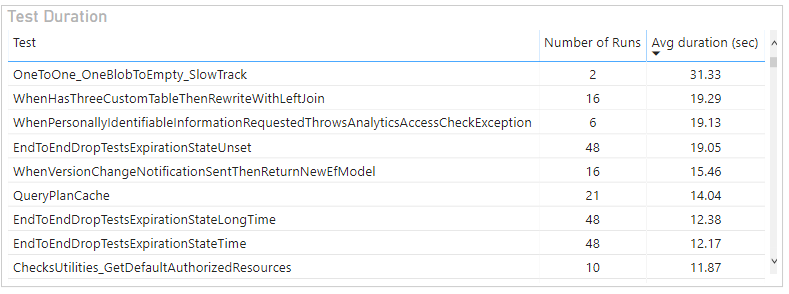

# Test duration sample report

[!INCLUDE [version-eq-azure-devops](../../includes/version-eq-azure-devops.md)] 

This article shows you how to create a report that shows list of all the tests in a pipeline and the average time taken to execute each test for a selected time range.

An example is shown in the following image.

> [!div class="mx-imgBorder"] 
> 


Specifically, you'll find sample queries for the following reports: 

- Test duration for build workflow
- Test duration for release workflow
- Test duration for a particular branch
- Test duration for a particular test file
- Test duration for a particular test owner 


[!INCLUDE [temp](includes/preview-note.md)]

[!INCLUDE [temp](./includes/prerequisites-power-bi-cloud-only.md)]

## Sample queries

[!INCLUDE [temp](includes/sample-required-reading.md)]

#### [Power BI query](#tab/powerbi/)

[!INCLUDE [temp](includes/sample-powerbi-query.md)]

```
let
   Source = OData.Feed ("https://analytics.dev.azure.com/{organization}/{project}/_odata/v4.0-preview/TestResultsDaily?
$apply=filter("
                &"Pipeline/PipelineName eq '{pipelineName}' "
                &"And Date/Date ge {startdate} "
        &"And Workflow eq 'Build' "
        &") "
            &"/groupby( "
                &"(TestSK, Test/TestName), "
                &"aggregate( "
            &"ResultCount with sum as TotalCount, "
                &"ResultDurationSeconds with sum as TotalDuration "
            &")) "
        &"/compute( "
    &"TotalDuration div TotalCount as AvgDuration) "
    ,null, [Implementation="2.0",OmitValues = ODataOmitValues.Nulls,ODataVersion = 4]) 
in
    Source
```

#### [OData query](#tab/odata/)

[!INCLUDE [temp](includes/sample-odata-query.md)]

```
https://analytics.dev.azure.com/{organization}/{project}/_odata/v4.0-preview/TestResultsDaily?
$apply=filter(
	Pipeline/PipelineName eq '{pipelineName}'
	And Date/Date ge {startdate}
	And Workflow eq 'Build'
	)
/groupby(
	(TestSK, Test/TestName), 
	aggregate(
	ResultCount with sum as TotalCount,
	ResultDurationSeconds with sum as TotalDuration
	))
/compute(
TotalDuration div TotalCount as AvgDuration)
```

***

### Substitution strings

Each query contains the following strings that you must replace with your values. Don't include brackets {} with your substitution. For example if your organization name is "Fabrikam", replace `{organization}` with **Fabrikam**, not `{Fabrikam}`.
 
- `{organization}` - Your organization name
- `{project}` - Your team project name
- `{pipelinename}` - Your pipeline name. Example: `Fabrikam hourly build pipeline`.
- `{startdate}` - The date to start your report. Format: YYYY-MM-DDZ. Example: `2021-09-01Z` represents September 1, 2021. Don't enclose in quotes or brackets and use two digits for both, month and date.

### Query breakdown

The following table describes each part of the query.

:::row:::
   :::column span="1":::
   **Query part**
   :::column-end:::
   :::column span="1":::
   **Description**
   :::column-end:::
:::row-end:::
:::row:::
   :::column span="1":::
   `$apply=filter(`
   :::column-end:::
   :::column span="1":::
   Start filter()
   :::column-end:::
:::row-end:::
:::row:::
   :::column span="1":::
   `Pipeline/PipelineName eq '{pipelineName}'`
   :::column-end:::
   :::column span="1":::
   Return test runs for the specified pipeline
   :::column-end:::
:::row-end:::
:::row:::
   :::column span="1":::
   `And Date/Date ge {startdate}`
   :::column-end:::
   :::column span="1":::
   Return test runs on or after the specified date
   :::column-end:::
:::row-end:::
:::row:::
   :::column span="1":::
   `and Workflow eq 'Build'`
   :::column-end:::
   :::column span="1":::
   Return test runs for 'Build' workflow
   :::column-end:::
:::row-end:::
:::row:::
   :::column span="1":::
   `)`
   :::column-end:::
   :::column span="1":::
   Close filter()
   :::column-end:::
:::row-end:::
:::row:::
   :::column span="1":::
   `/groupby(`
   :::column-end:::
   :::column span="1":::
   Start groupby()
   :::column-end:::
:::row-end:::
:::row:::
   :::column span="1":::
   `(TestSK, Test/TestName),`
   :::column-end:::
   :::column span="1":::
   Group by the test Name
   :::column-end:::
:::row-end:::
:::row:::
   :::column span="1":::
   `aggregate(`
   :::column-end:::
   :::column span="1":::
   Start aggregate. For all the test runs matching the above filter criteria:
   :::column-end:::
:::row-end:::
:::row:::
   :::column span="1":::
   `ResultCount with sum as TotalCount,`
   :::column-end:::
   :::column span="1":::
   Count the total number of test runs as TotalCount.
   :::column-end:::
:::row-end:::
:::row:::
   :::column span="1":::
   `ResultDurationSeconds with sum as TotalDuration`
   :::column-end:::
   :::column span="1":::
   Sum the total duration of all the runs as TotalDuration.
   :::column-end:::
:::row-end:::
:::row:::
   :::column span="1":::
   `))`
   :::column-end:::
   :::column span="1":::
   Close aggregate() and groupby()
   :::column-end:::
:::row-end:::
:::row:::
   :::column span="1":::
   `/compute(`
   :::column-end:::
   :::column span="1":::
   Start compute()
   :::column-end:::
:::row-end:::
:::row:::
   :::column span="1":::
   `TotalDuration div TotalCount as AvgDuration`
   :::column-end:::
   :::column span="1":::
   For all the tests, we already have total number of runs and total duration. Calculate average duration by diving total duration by total number of runs.
   :::column-end:::
:::row-end:::
:::row:::
   :::column span="1":::
   `)`
   :::column-end:::
   :::column span="1":::
   Close compute()
   :::column-end:::
:::row-end:::


[!INCLUDE [temp](includes/query-filters-test.md)]


## Power BI transforms

The query returns some columns that you need to expand and flatten into its fields before you can use them in Power BI. In this example, such an entity is Test.

After closing the Advanced Editor and while remaining in the Power Query Editor, select the expand button on **Test**.

### Expand the Test column

1. Choose the expand button

    > [!div class="mx-imgBorder"] 
    > 
    
1. Select the checkbox "(Select All Columns)" to expand

    > [!div class="mx-imgBorder"] 
    > 

1. The table now contains the expanded entity **Test.TestName**.

    > [!div class="mx-imgBorder"] 
    > 
    

### Change column type

The query doesn't return all the columns in the format in which you can directly consume them in Power BI reports. You can change the column type as shown.

1. Change the type of column **TotalCount** to **Whole Number**.

    > [!div class="mx-imgBorder"] 
    > 
    
1. Change the type of column **TotalDuration** and **AvgDuration** to **Decimal Number**.

    > [!div class="mx-imgBorder"] 
    > 


### Rename fields and query, then Close & Apply

When finished, you may choose to rename columns. 

1. Right-click a column header and select **Rename...**

	> [!div class="mx-imgBorder"] 
	> 

1. You also may want to rename the query from the default **Query1**, to something more meaningful. 

	> [!div class="mx-imgBorder"] 
	> 

1. Once done, choose **Close & Apply** to save the query and return to Power BI.

	> [!div class="mx-imgBorder"] 
	> 
  
  
## Create the report

Power BI shows you the fields you can report on. 

> [!NOTE]   
> The example below assumes that no one renamed any columns. 

> [!div class="mx-imgBorder"] 
> 

For a simple report, do the following steps:

1. Select Power BI Visualization **Table**.
1. Add the field "Test.TestName" to **Values**.
1. Add the field "TotalCount" to **Values**.
1. Add the field "AvgDuration" to **Values**.
    
Your report should look like this. 

> [!div class="mx-imgBorder"] 
> 


You can use the following other queries to create different but similar reports using the same steps defined previously in this article.

## Test duration for Release workflow

You may want to view the test duration of all the tests of a pipeline for **Release** workflow, instead of Build workflow.

#### [Power BI query](#tab/powerbi/)

[!INCLUDE [temp](includes/sample-powerbi-query.md)]

```
let
   Source = OData.Feed ("https://analytics.dev.azure.com/{organization}/{project}/_odata/v4.0-preview/TestResultsDaily?
$apply=filter("
                &"Pipeline/PipelineName eq '{pipelineName}' "
                &"And Date/Date ge {startdate}) "
        &"/groupby((TestSK, Test/TestName, Workflow), "
        &"aggregate( "
            &"ResultCount with sum as TotalCount, "
                &"ResultDurationSeconds with sum as TotalDuration "
                &")) "
            &"/compute( "
                &"TotalDuration div TotalCount as AvgDuration) "
    ,null, [Implementation="2.0",OmitValues = ODataOmitValues.Nulls,ODataVersion = 4]) 
in
    Source
```

#### [OData query](#tab/odata/)

[!INCLUDE [temp](includes/sample-odata-query.md)]

```
https://analytics.dev.azure.com/{organization}/{project}/_odata/v4.0-preview/TestResultsDaily?
$apply=filter(
	Pipeline/PipelineName eq '{pipelineName}'
	And Date/Date ge {startdate})
/groupby((TestSK, Test/TestName, Workflow), 
	aggregate(
	ResultCount with sum as TotalCount,
	ResultDurationSeconds with sum as TotalDuration
	))
/compute(
TotalDuration div TotalCount as AvgDuration)
```

***

## Filter by branch

You may want to view the test duration for all the tests of a pipeline for a particular branch only. To create the report, carry out the following extra steps along with what is defined previously in this article.

- Expand Branch into Branch.BranchName
- Select Power BI Visualization Slicer and add the field Branch.BranchName to the slicer's Field
- Select the pipeline from the slicer for which you need to see the outcome summary

#### [Power BI query](#tab/powerbi/)

[!INCLUDE [temp](includes/sample-powerbi-query.md)]

```
let
   Source = OData.Feed ("https://analytics.dev.azure.com/{organization}/{project}/_odata/v4.0-preview/TestResultsDaily?
$apply=filter("
                &"Pipeline/PipelineName eq '{pipelineName}' "
                &"And Date/Date ge {startdate} "
        &"And Workflow eq 'Build') "
        &"/groupby((TestSK, Test/TestName, Branch/BranchName), "
            &"aggregate( "
                &"ResultCount with sum as TotalCount, "
                &"ResultDurationSeconds with sum as TotalDuration "
            &")) "
                &"/compute( "
            &"TotalDuration div TotalCount as AvgDuration) "
    ,null, [Implementation="2.0",OmitValues = ODataOmitValues.Nulls,ODataVersion = 4]) 
in
    Source
```

#### [OData query](#tab/odata/)

[!INCLUDE [temp](includes/sample-odata-query.md)]

```
https://analytics.dev.azure.com/{organization}/{project}/_odata/v4.0-preview/TestResultsDaily?
$apply=filter(
	Pipeline/PipelineName eq '{pipelineName}'
	And Date/Date ge {startdate}
	And Workflow eq 'Build')
/groupby((TestSK, Test/TestName, Branch/BranchName), 
	aggregate(
	ResultCount with sum as TotalCount,
	ResultDurationSeconds with sum as TotalDuration
	))
/compute(
TotalDuration div TotalCount as AvgDuration)
```

***

## Filter by test file

You may want to view the test duration of all the tests of a pipeline for a particular test file only. To create the report, carry out the following extra steps along with what is defined previously in this article.

- Expand Branch into Test.ContainerName
- Select Power BI Visualization Slicer and add the field Test.ContainerName to the slicer's Field
- Select the pipeline from the slicer for which you need to see the outcome summary

#### [Power BI query](#tab/powerbi/)

[!INCLUDE [temp](includes/sample-powerbi-query.md)]

```
let
   Source = OData.Feed ("https://analytics.dev.azure.com/{organization}/{project}/_odata/v4.0-preview/TestResultsDaily?
$apply=filter("
                &"Pipeline/PipelineName eq '{pipelineName}' "
                &"And Date/Date ge {startdate} "
        &"And Workflow eq 'Build') "
        &"/groupby((TestSK, Test/TestName, Test/ContainerName), "
            &"aggregate( "
                &"ResultCount with sum as TotalCount, "
                &"ResultDurationSeconds with sum as TotalDuration "
            &")) "
                &"/compute( "
            &"TotalDuration div TotalCount as AvgDuration) "
    ,null, [Implementation="2.0",OmitValues = ODataOmitValues.Nulls,ODataVersion = 4]) 
in
    Source
```

#### [OData query](#tab/odata/)

[!INCLUDE [temp](includes/sample-odata-query.md)]

```
https://analytics.dev.azure.com/{organization}/{project}/_odata/v4.0-preview/TestResultsDaily?
$apply=filter(
	Pipeline/PipelineName eq '{pipelineName}'
	And Date/Date ge {startdate}
	And Workflow eq 'Build')
/groupby((TestSK, Test/TestName, Test/ContainerName), 
	aggregate(
	ResultCount with sum as TotalCount,
	ResultDurationSeconds with sum as TotalDuration
	))
/compute(
TotalDuration div TotalCount as AvgDuration)
```

***

## Filter by test owner

You may want to view the test duration of all the tests of a pipeline for tests owned by a particular test owner only. To create the report, carry out the following extra steps along with what is defined previously in this article.

- Expand Branch into Test.TestOwner
- Select Power BI Visualization Slicer and add the field Test.TestOwner to the slicer's Field
- Select the pipeline from the slicer for which you need to see the outcome summary

#### [Power BI query](#tab/powerbi/)

[!INCLUDE [temp](includes/sample-powerbi-query.md)]

```
let
   Source = OData.Feed ("https://analytics.dev.azure.com/{organization}/{project}/_odata/v4.0-preview/TestResultsDaily?
$apply=filter("
                &"Pipeline/PipelineName eq '{pipelineName}' "
                &"And Date/Date ge {startdate} "
        &"And Workflow eq 'Build') "
        &"/groupby((TestSK, Test/TestName, Test/TestOwner), "
            &"aggregate( "
                &"ResultCount with sum as TotalCount, "
                &"ResultDurationSeconds with sum as TotalDuration "
            &")) "
                &"/compute( "
            &"TotalDuration div TotalCount as AvgDuration) "
    ,null, [Implementation="2.0",OmitValues = ODataOmitValues.Nulls,ODataVersion = 4]) 
in
    Source
```

#### [OData query](#tab/odata/)

[!INCLUDE [temp](includes/sample-odata-query.md)]

```
https://analytics.dev.azure.com/{organization}/{project}/_odata/v4.0-preview/TestResultsDaily?
$apply=filter(
	Pipeline/PipelineName eq '{pipelineName}'
	And Date/Date ge {startdate}
	And Workflow eq 'Build')
/groupby((TestSK, Test/TestName, Test/TestOwner), 
	aggregate(
	ResultCount with sum as TotalCount,
	ResultDurationSeconds with sum as TotalDuration
	))
/compute(
TotalDuration div TotalCount as AvgDuration)
```

***

## Full list of Pipelines sample reports 

[!INCLUDE [temp](includes/sample-full-list-pipelines.md)]

## Related articles

[!INCLUDE [temp](includes/sample-related-articles-pipelines.md)]
