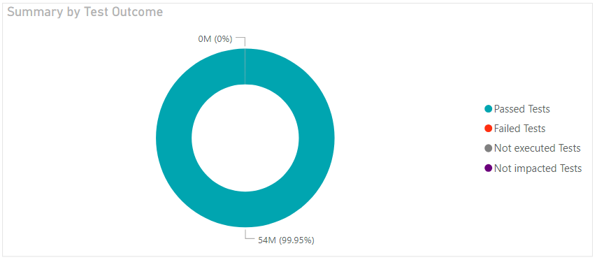
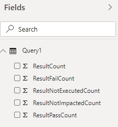

# Test summary sample report 

[!INCLUDE [temp](../includes/version-azure-devops-cloud.md)]

This article shows you how to get the number of test runs for different test outcomes: **Passed**, **Failed**, **Not executed**, **Not impacted**.

An example is shown in the following image.

> [!div class="mx-imgBorder"] 
> 

Specifically, you'll find sample queries for the following reports: 

- Test summary for build workflow
- Test summary for release workflow
- Test summary for a particular branch
- Test summary for a particular test file
- Test summary for a particular test owner 

[!INCLUDE [temp](includes/preview-note.md)]

[!INCLUDE [temp](./includes/prerequisites-power-bi-cloud-only.md)]

## Sample queries

[!INCLUDE [temp](includes/sample-required-reading.md)]

#### [Power BI query](#tab/powerbi/)

[!INCLUDE [temp](includes/sample-powerbi-query.md)]

```
let
   Source = OData.Feed ("https://analytics.dev.azure.com/{organization}/{project}/_odata/v4.0-preview/TestResultsDaily?
$apply=filter("
                &"Pipeline/PipelineName eq '{pipelineName}' "
                &"And Date/Date ge {startdate} "
        &"And Workflow eq 'Build' "
        &") "
            &"/aggregate( "
                &"ResultCount with sum as ResultCount, "
                &"ResultPassCount with sum as ResultPassCount, "
            &"ResultFailCount with sum as ResultFailCount, "
                &"ResultNotExecutedCount with sum as ResultNotExecutedCount, "
            &"ResultNotImpactedCount with sum as ResultNotImpactedCount "
        &") "
    ,null, [Implementation="2.0",OmitValues = ODataOmitValues.Nulls,ODataVersion = 4]) 
in
    Source
```

#### [OData query](#tab/odata/)

[!INCLUDE [temp](includes/sample-odata-query.md)]

```
https://analytics.dev.azure.com/{organization}/{project}/_odata/v4.0-preview/TestResultsDaily?
$apply=filter(
	Pipeline/PipelineName eq '{pipelineName}'
	And Date/Date ge {startdate}
	And Workflow eq 'Build'
	)
	/aggregate(
		ResultCount with sum as ResultCount,
		ResultPassCount with sum as ResultPassCount,
		ResultFailCount with sum as ResultFailCount,
		ResultNotExecutedCount with sum as ResultNotExecutedCount,
		ResultNotImpactedCount with sum as ResultNotImpactedCount
	)

```

***

### Substitution strings

Each query contains the following strings that you must substitute with your values. Don't include brackets {} with your substitution. For example if your organization name is "Fabrikam", replace {organization} with **Fabrikam**, not {Fabrikam}.
 
- {organization} - Your organization name
- {project} - Your team project name
- {pipelinename} - Your pipeline name. Example:**Fabrikam hourly build pipeline**.
- {startdate} - The date to start your report. Format: YYYY-MM-DDZ. Example: **2019-09-04Z** represents September 4, 2019. Don't enclose in quotes or brackets and use two digits for both, month and date.

### Query breakdown

The following table describes each part of the query.

<table width="90%">
<tbody valign="top">
<tr><td width="25%"><b>Query part</b></td><td><b>Description</b></td><tr>
<tr><td><code>$apply=filter(</code></td>
<td>Start filter()</td>
<tr>
<tr>
<td><code>Pipeline/PipelineName eq '{pipelineName}'</code></td>
<td>Return test runs for the specified pipeline</td>
<tr>
<tr><td><code>and CompletedOn/Date ge {startdate}</code></td>
<td>Return test runs on or after the specified date</td>
<tr>
<tr><td><code>and Workflow eq 'Build'</code></td>
<td>Return test runs for 'Build' workflow</td>
<tr>
<tr><td><code>)</code></td>
<td>Close filter()</td>
<tr>
<tr><td><code>aggregate(</code></td>
<td>Start aggregate. For all the test runs matching the above filter criteria:</td>
<tr>
<tr><td><code>ResultCount with sum as ResultCount,</code></td>
<td>Count the total number of test runs as ResultCount</td>
<tr>
<tr><td><code>ResultPassCount with sum as ResultPassCount,</code></td>
<td>Count the total number of passed test runs as ResultPassCount</td>
<tr>
<tr><td><code>ResultFailCount with sum as ResultFailCount</code></td>
<td>Count the total number of failed test runs as ResultFailCount</td>
<tr>
<tr><td><code>ResultNotExecutedCount with sum as ResultNotExecutedCount,</code></td>
<td>Count the total number of not executed test runs as ResultNotExecutedCount</td>
<tr>
<tr><td><code>ResultNotImpactedCount with sum as ResultNotImpactedCount</code></td>
<td>Count the total number of not impacted test runs as ResultNotImpactedCount</td>
<tr>
<tr><td><code>)</code></td>
<td>Close aggregate()</td>
<tr>
</tbody>
</table>


## Power BI transforms

### Rename fields and query, then Close & Apply

When finished, you may choose to rename columns. 

1. Right-click a column header and select **Rename...**

	> [!div class="mx-imgBorder"] 
	> 

1. You also may want to rename the query from the default **Query1**, to something more meaningful. 

	> [!div class="mx-imgBorder"] 
	> 

1. Once done, choose **Close & Apply** to save the query and return to Power BI.

	> [!div class="mx-imgBorder"] 
	> 
  
  
## Create the report

Power BI shows you the fields you can report on. 

> [!NOTE]   
> The example below assumes that no one renamed any columns. 

> [!div class="mx-imgBorder"] 
> 

For a simple report, do the following steps:

1. Select Power BI Visualization **Donut Chart**. 
1. Add the field "ResultPassCount" to **Values**.
    - Right-click "ResultPassCount" field and ensure **Sum** is selected.
1. Add the field "ResultFailCount" to **Values**.
	  - Right-click "ResultFailCount" field and ensure **Sum** is selected.
1. Add the field "ResultNotExecutedCount" to **Values**.
	  - Right-click "ResultNotExecutedCount" field and ensure **Sum** is selected.
1. Add the field "ResultNotImpactedCount " to **Values**.
    - Right-click "ResultNotImpactedCount " field and ensure **Sum** is selected.

    
Your report should look like this. 

> [!div class="mx-imgBorder"] 
> 


You can use the following additional queries to create different but similar reports using the same steps defined previously in this article.

## Test summary for Release workflow 

You may want to view the test summary of a pipeline for **Release** workflow, instead of Build workflow.

#### [Power BI query](#tab/powerbi/)

[!INCLUDE [temp](includes/sample-powerbi-query.md)]

```
let
   Source = OData.Feed ("https://analytics.dev.azure.com/{organization}/{project}/_odata/v4.0-preview/TestResultsDaily?
$apply=filter("
                &"Pipeline/PipelineName eq '{pipelineName}' "
                &"And Date/Date ge {startdate} "
        &"And Workflow eq 'Release' "
        &") "
            &"/aggregate( "
                &"ResultCount with sum as ResultCount, "
                &"ResultPassCount with sum as ResultPassCount, "
            &"ResultFailCount with sum as ResultFailCount, "
                &"ResultNotExecutedCount with sum as ResultNotExecutedCount, "
            &"ResultNotImpactedCount with sum as ResultNotImpactedCount "
        &") "
    ,null, [Implementation="2.0",OmitValues = ODataOmitValues.Nulls,ODataVersion = 4]) 
in
    Source
```

#### [OData query](#tab/odata/)

[!INCLUDE [temp](includes/sample-odata-query.md)]

```
https://analytics.dev.azure.com/{organization}/{project}/_odata/v4.0-preview/TestResultsDaily?
$apply=filter(
	Pipeline/PipelineName eq '{pipelineName}'
	And Date/Date ge {startdate}
	And Workflow eq 'Release'
	)
	/aggregate(
		ResultCount with sum as ResultCount,
		ResultPassCount with sum as ResultPassCount,
		ResultFailCount with sum as ResultFailCount,
		ResultNotExecutedCount with sum as ResultNotExecutedCount,
		ResultNotImpactedCount with sum as ResultNotImpactedCount
	)
```

***

## Filter by branch

You may want to view the test summary of a pipeline for a particular branch only. To create the report, perform the following additional steps along with what is defined previously in this article.

- Expand Branch into Branch.BranchName
- Select Power BI Visualization Slicer and add the field Branch.BranchName to the slicer's Field
- Select the pipeline from the slicer for which you need to see the outcome summary

#### [Power BI query](#tab/powerbi/)

[!INCLUDE [temp](includes/sample-powerbi-query.md)]

```
let
   Source = OData.Feed ("https://analytics.dev.azure.com/{organization}/{project}/_odata/v4.0-preview/TestResultsDaily?
$apply=filter("
                &"Pipeline/PipelineName eq '{pipelineName}' "
                &"And Date/Date ge {startdate} "
        &"And Workflow eq 'Build' "
        &") "
            &"/groupby( "
                &"(Branch/BranchName), "
                &"aggregate( "
            &"ResultCount with sum as ResultCount, "
                &"ResultPassCount with sum as ResultPassCount, "
            &"ResultFailCount with sum as ResultFailCount, "
        &"ResultNotExecutedCount with sum as ResultNotExecutedCount, "
    &"ResultNotImpactedCount with sum as ResultNotImpactedCount "
    &")) "
    ,null, [Implementation="2.0",OmitValues = ODataOmitValues.Nulls,ODataVersion = 4]) 
in
    Source
```

#### [OData query](#tab/odata/)

[!INCLUDE [temp](includes/sample-odata-query.md)]

```
https://analytics.dev.azure.com/{organization}/{project}/_odata/v4.0-preview/TestResultsDaily?
$apply=filter(
	Pipeline/PipelineName eq '{pipelineName}'
	And Date/Date ge {startdate}
	And Workflow eq 'Build'
	)
	/groupby(
		(Branch/BranchName),
		aggregate(
		ResultCount with sum as ResultCount,
		ResultPassCount with sum as ResultPassCount,
		ResultFailCount with sum as ResultFailCount,
		ResultNotExecutedCount with sum as ResultNotExecutedCount,
		ResultNotImpactedCount with sum as ResultNotImpactedCount
	))
```

***

## Filter by test file

You may want to view the test summary of a pipeline for a particular test file only. To create the report, perform the following additional steps along with what is defined previously in this article.

- Expand Branch into Test.ContainerName
- Select Power BI Visualization Slicer and add the field Test.ContainerName to the slicer's Field
- Select the pipeline from the slicer for which you need to see the outcome summary

#### [Power BI query](#tab/powerbi/)

[!INCLUDE [temp](includes/sample-powerbi-query.md)]

```
let
   Source = OData.Feed ("https://analytics.dev.azure.com/{organization}/{project}/_odata/v4.0-preview/TestResultsDaily?
$apply=filter("
                &"Pipeline/PipelineName eq '{pipelineName}' "
                &"And Date/Date ge {startdate} "
        &"And Workflow eq 'Build') "
        &"/groupby( "
            &"(Test/ContainerName), "
                &"aggregate( "
                &"ResultCount with sum as ResultCount, "
            &"ResultPassCount with sum as ResultPassCount, "
                &"ResultFailCount with sum as ResultFailCount, "
            &"ResultNotExecutedCount with sum as ResultNotExecutedCount, "
        &"ResultNotImpactedCount with sum as ResultNotImpactedCount "
    &")) "
    ,null, [Implementation="2.0",OmitValues = ODataOmitValues.Nulls,ODataVersion = 4]) 
in
    Source
```

#### [OData query](#tab/odata/)

[!INCLUDE [temp](includes/sample-odata-query.md)]

```
https://analytics.dev.azure.com/{organization}/{project}/_odata/v4.0-preview/TestResultsDaily?
$apply=filter(
	Pipeline/PipelineName eq '{pipelineName}'
	And Date/Date ge {startdate}
	And Workflow eq 'Build')
	/groupby(
		(Test/ContainerName),
		aggregate(
		ResultCount with sum as ResultCount,
		ResultPassCount with sum as ResultPassCount,
		ResultFailCount with sum as ResultFailCount,
		ResultNotExecutedCount with sum as ResultNotExecutedCount,
		ResultNotImpactedCount with sum as ResultNotImpactedCount
	))
```

***

## Filter by test owner

You may want to view the test summary of a pipeline for tests owned by a particular test owner only. To create the report, perform the following additional steps along with what is defined previously in this article.

- Expand Branch into Test.TestOwner
- Select Power BI Visualization Slicer and add the field Test.TestOwner to the slicer's Field
- Select the pipeline from the slicer for which you need to see the outcome summary

#### [Power BI query](#tab/powerbi/)

[!INCLUDE [temp](includes/sample-powerbi-query.md)]

```
let
   Source = OData.Feed ("https://analytics.dev.azure.com/{organization}/{project}/_odata/v4.0-preview/TestResultsDaily?
$apply=filter("
                &"Pipeline/PipelineName eq '{pipelineName}' "
                &"And Date/Date ge {startdate} "
        &"And Workflow eq 'Build') "
        &"/groupby( "
            &"(Test/TestOwner), "
                &"aggregate( "
                &"ResultCount with sum as ResultCount, "
            &"ResultPassCount with sum as ResultPassCount, "
                &"ResultFailCount with sum as ResultFailCount, "
            &"ResultNotExecutedCount with sum as ResultNotExecutedCount, "
        &"ResultNotImpactedCount with sum as ResultNotImpactedCount "
    &")) "
    ,null, [Implementation="2.0",OmitValues = ODataOmitValues.Nulls,ODataVersion = 4]) 
in
    Source
```

#### [OData query](#tab/odata/)

[!INCLUDE [temp](includes/sample-odata-query.md)]

```
https://analytics.dev.azure.com/{organization}/{project}/_odata/v4.0-preview/TestResultsDaily?
$apply=filter(
	Pipeline/PipelineName eq '{pipelineName}'
	And Date/Date ge {startdate}
	And Workflow eq 'Build')
	/groupby(
		(Test/TestOwner), 
		aggregate(
		ResultCount with sum as ResultCount,
		ResultPassCount with sum as ResultPassCount,
		ResultFailCount with sum as ResultFailCount,
		ResultNotExecutedCount with sum as ResultNotExecutedCount,
		ResultNotImpactedCount with sum as ResultNotImpactedCount
))
```

***

## Full list of Pipelines sample reports 

[!INCLUDE [temp](includes/sample-full-list-pipelines.md)]

## Related articles

[!INCLUDE [temp](includes/sample-related-articles-pipelines.md)]
