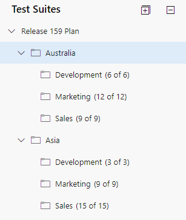
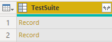
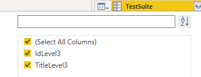
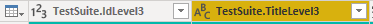
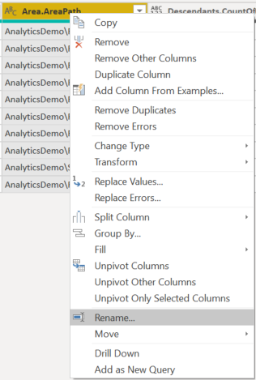
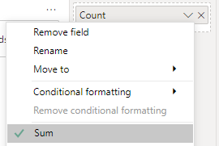

# Manual test suites aggregated view sample report

[!INCLUDE [version-lt-eq-azure-devops](../../includes/version-lt-eq-azure-devops.md)] 

You can report on the execution state of one or more test suites. The report you create by using the information in this article is similar to the following image.  

:::image type="content" source="media/odatapowerbi-aggregatedatlevel.png" alt-text="Screenshot of Power BI Test Suites Aggregated View - Report.":::

As shown in the following image, you can arrange test suites within a hierarchical organization. As shown, three test suites with the same names exist under two test suites labeled *Australia* and *Asia*. This article outlines how to aggregate data for a specific test suite level. 

> [!div class="mx-imgBorder"] 
> 

[!INCLUDE [temp](includes/preview-note.md)]

[!INCLUDE [prerequisites-simple](../includes/analytics-prerequisites-simple.md)]

[!INCLUDE [temp](includes/sample-required-reading.md)]

For the report to generate useful data, the team must carry out the following activities to manage test plans:

- Define test plans, test suites, and test cases. Specify their state. For a test suite to run, it must be in the In Progress state. For a test case to run, it must be in the Ready state. For details, see [Create test plans and test suites](../../test/create-a-test-plan.md) and [Create manual test cases](../../test/create-test-cases.md). 
- Run manual tests and verify the results. Mark the results of each validation step in the test case as passed or failed. For details, see [Run manual tests](../../test/run-manual-tests.md).

	> [!NOTE]  
	> Testers must mark a test step with a status if it's a validation test step. The overall result for a test reflects the status of all the test steps that were marked. Therefore, the test has a status of failed if any test step is marked as failed or not marked.   
 
## Sample queries

Use the following queries for the `TestPoints` entity set to create aggregated test suite reports.

[!INCLUDE [temp](includes/query-filters-test.md)] 

#### [Power BI query](#tab/powerbi/)

[!INCLUDE [temp](includes/sample-powerbi-query.md)]

```
let 
    Source = OData.Feed ("https://analytics.dev.azure.com/{organization}/{project}/_odata/v3.0-preview/TestPoints?" 
        &"$apply=filter((TestSuite/TestPlanTitle eq '{testPlanTitle}' and TestSuite/IdLevel3 ne null))" 
            &"/groupby(" 
                &"(TestSuite/TitleLevel3)," 
                &"aggregate(" 
                    &"$count as TotalCount," 
                    &"cast(LastResultOutcome eq 'Passed', Edm.Int32) with sum as PassedCount," 
                    &"cast(LastResultOutcome eq 'Failed', Edm.Int32) with sum as FailedCount," 
                    &"cast(LastResultOutcome eq 'None', Edm.Int32) with sum as  NotRunCount," 
                    &"cast(LastResultOutcome ne 'None', Edm.Int32) with sum as RunCount" 
            &")" 
        &")" 
        &"/compute(" 
            &"RunCount mul 100 div TotalCount as RunPercentage," 
            &"NotRunCount mul 100 div TotalCount as NotRunPercentage," 
            &"iif(TotalCount gt NotRunCount, PassedCount mul 100 div RunCount,0) as PassedPercentage," 
            &"iif(TotalCount gt NotRunCount, FailedCount mul 100 div RunCount,0) as FailedPercentage" 
        &")" 
        &"&$orderby=RunPercentage desc", null, [Implementation="2.0"]) 
in 
    Source 
```

#### [OData query](#tab/odata/)

[!INCLUDE [temp](includes/sample-odata-query.md)]

```
https://analytics.dev.azure.com/{organization}/{project}/_odata/v3.0-preview/TestPoints?  
$apply=filter((TestSuite/TestPlanTitle eq '{testPlanTitle}' and TestSuite/IdLevel3 ne null)) 
/groupby( 
    (TestSuite/TitleLevel3), 
    aggregate( 
        $count as TotalCount,  
        cast(LastResultOutcome eq 'Passed', Edm.Int32) with sum as PassedCount, 
        cast(LastResultOutcome eq 'Failed', Edm.Int32) with sum as FailedCount, 
        cast(LastResultOutcome eq 'None', Edm.Int32) with sum as  NotRunCount, 
        cast(LastResultOutcome ne 'None', Edm.Int32) with sum as RunCount 
    )
)
/compute( 
    RunCount mul 100 div TotalCount as RunPercentage, 
    NotRunCount mul 100 div TotalCount as NotRunPercentage, 
    iif(TotalCount gt NotRunCount, PassedCount mul 100 div RunCount,0) as PassedPercentage, 
    iif(TotalCount gt NotRunCount, FailedCount mul 100 div RunCount,0) as FailedPercentage 
) 
&$orderby=RunPercentage desc
```

***

## Substitution strings and query breakdown
 

[!INCLUDE [temp](includes/sample-query-substitutions.md)]

- `{organization}` - Your organization name. 
- `{project}` - Your team project name. To create a cross-project query, omit `/{project}`.
- `{testPlanTitle}` - Title of the test plan whose data you want to return.

### Query breakdown

The following table describes each part of the query.

:::row:::
   :::column span="1":::
   **Query part**
   :::column-end:::
   :::column span="1":::
   **Description**
   :::column-end:::
:::row-end:::
:::row:::
   :::column span="1":::
   `filter((TestSuite/TestPlanTitle eq '{testPlanTitle}' and TestSuite/IdLevel3 ne null))`
   :::column-end:::
   :::column span="1":::
   Returns data for only the selected test plan. Also returns the data for level 3 test suites onwards. To add multiple plans, use a clause like `filter((TestSuite/TestPlanTitle eq '{testPlanTitle1}' or TestSuite/TestPlanTitle eq '{testPlanTitle2}' and TestSuite/IdLevel3 ne null))`. You can also apply any other filters related to test suites and test configurations.
   :::column-end:::
:::row-end:::
:::row:::
   :::column span="1":::
   `/groupby((TestSuite/TitleLevel3),`
   :::column-end:::
   :::column span="1":::
   The test suites to group by. If you want a report for all distinct test suites at level 3 of the test suite hierarchy, specify this query part. You can change the level number from 1 to 14. If you want to separate test suites with the same name, use `/groupby((TestSuite/TitleLevel3, TestSuite/IdLevel3),` to ensure that even if you have two test suites with the same name, the report shows them as two different entries because they have two different IDs.
   :::column-end:::
:::row-end:::
:::row:::
   :::column span="1":::
   `/aggregate($count as TotalCount,`
   :::column-end:::
   :::column span="1":::
   Aggregates data across the filtered test points with the count as `TotalCount`.
   :::column-end:::
:::row-end:::
:::row:::
   :::column span="1":::
   `cast(LastResultOutcome eq 'Passed', Edm.Int32) with sum as Passed,`
   :::column-end:::
   :::column span="1":::
   While aggregating, type-cast test points that have the latest execution outcome 'Passed' to 1 and sum them up as the '`Passed`' metric.
   :::column-end:::
:::row-end:::
:::row:::
   :::column span="1":::
   `/compute(Executed mul 100 div TotalCount as ExecPct`
   :::column-end:::
   :::column span="1":::
   Provides a computed metric `ExecPct` that is equal to (Executed test points / Total count * 100).
   :::column-end:::
:::row-end:::

[!INCLUDE [temp](includes/rename-query.md)]

## Expand columns in Power Query Editor

Before you create the report, expand the `TestSuite` column to flatten the records into specific fields. For more information, see [Transform Analytics data to generate Power BI reports](transform-analytics-data-report-generation.md#expand-columns).

In Power BI, follow these steps.  

When finished, you can rename columns. 

1. Expand `TestSuite`
    - Select the **expand** button.

        > [!div class="mx-imgBorder"] 
	    > 

    - Select the fields to flatten.

        > [!div class="mx-imgBorder"] 
	    > 

    - The table now contains entity fields for `TestSuite.IdLevel3` and `TestSuite.TitleLevel3`.

        > [!div class="mx-imgBorder"] 
	    > 

1. Right-click a column header and select **Rename...**

	> [!div class="mx-imgBorder"] 
	> 

## Change column data type 

In Power Query Editor, select all columns that contain numbers, such as *TotalCount*, *RunCount*, and *Passed*. Select **Data Type** from the **Transform** menu, and choose **Whole Number**. For more information about changing the data type, see [Transform Analytics data to generate Power BI reports, Transform a column data type](transform-analytics-data-report-generation.md#transform-data-type). 

[!INCLUDE [temp](includes/sample-rename-column-fields.md)]

[!INCLUDE [temp](includes/close-apply.md)]

## Create the Table report
 
1. Under **Visualizations**, choose **Table**.
1. Drag and drop `TestSuite.TitleLevel3`, `NotRunCount`, `RunCount`, `PassedCount`, and `TotalCount` under **Columns**.
1. Select **Sum** as the aggregation for **Count**.
	> [!div class="mx-imgBorder"] 
	> 

Your report should look similar to the following image.

:::image type="content" source="media/odatapowerbi-aggregatedatlevel.png" alt-text="Screenshot of Power BI Sample Test Suites Aggregated View - Report.":::

## Related articles

[!INCLUDE [temp](includes/sample-related-articles-test.md)]
