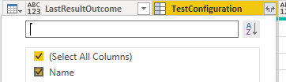
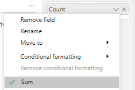

# Configuration by outcome matrix sample report

[!INCLUDE [version-gt-eq-2020](../../includes/version-gt-eq-2020.md)] 

When you've multiple configurations in your product to release, you can take a decision about releasing different configurations independently based on the progress of tests made for each configuration. An example of the configuration by outcome matrix report is shown in the following image.

:::image type="content" source="media/odatapowerbi-configurationbyoutcome.png" alt-text="Screenshot of Power BI Configuration by Outcome matrix report.":::


[!INCLUDE [temp](includes/preview-note.md)]

[!INCLUDE [prerequisites-simple](../includes/analytics-prerequisites-simple.md)]

[!INCLUDE [temp](includes/sample-required-reading.md)]

For the report to generate useful data, the team must carry out the following activities to manage test plans:

- Define test plans, test suites, and test cases. Specify their state. For a Test Suite to run, it must be in the In Progress state. For a Test Case to run, it must be in the Ready state. For details, see [Create manual test cases](../../test/create-test-cases.md). 
- Define test configurations and assign then to  test cases. For details, see [Test different configurations](../../test/test-different-configurations.md).
- Run manual tests and verify the results. Mark the results of each validation step in the test case as passed or failed. For details, see [Run manual tests](../../test/run-manual-tests.md).

	> [!NOTE]  
	> Testers must mark a test step with a status if it is a validation test step. The overall result for a test reflects the status of all the test steps that were marked. Therefore, the test will have a status of failed if any test step is marked as failed or not marked.   


## Sample queries

You can use the following queries of the `TestPoints` entity set to create different but similar test plan progress reports.

[!INCLUDE [temp](includes/query-filters-test.md)] 

#### [Power BI query](#tab/powerbi/)

[!INCLUDE [temp](includes/sample-powerbi-query.md)]

```
let 
    Source = OData.Feed ("https://analytics.dev.azure.com/{organization}/{project}/_odata/v3.0-preview/TestPoints?" 
        &"$apply=filter((TestSuite/TestPlanTitle eq '{testPlanTitle}'))" 
        &"/groupby((TestConfiguration/Name, LastResultOutcome)," 
            &"aggregate($count as Count)" 
        &")", null, [Implementation="2.0"]) 
in 
    Source
```

#### [OData query](#tab/odata/)

[!INCLUDE [temp](includes/sample-odata-query.md)]

```
https://analytics.dev.azure.com/{organization}/{project}/_odata/v3.0-preview/TestPoints?  
    $apply=filter((TestSuite/TestPlanTitle eq '{testPlanTitle}')) 
    /groupby( 
        (TestConfiguration/Name, LastResultOutcome),  
        aggregate($count as Count) 
    )
```

***

## Substitution strings and query breakdown

[!INCLUDE [temp](includes/sample-query-substitutions.md)]

- `{organization}` - Your organization name 
- `{project}` - Your team project name, or omit "/{project}" entirely, for a cross-project query
- `{testPlanTitle}` - Title of your test plan. Example: `Fabrikam test plan`. 

### Query breakdown

The following table describes each part of the query.


:::row:::
   :::column span="1":::
   **Query part**
   :::column-end:::
   :::column span="1":::
   **Description**
   :::column-end:::
:::row-end:::
:::row:::
   :::column span="1":::
   `filter((TestSuite/TestPlanTitle eq '{testPlanTitle}')) `
   :::column-end:::
   :::column span="1":::
   Return data for only selected test plan. You can add multiple plans with a clause like `filter((TestSuite/TestPlanTitle eq '{testPlanTitle1}' or TestSuite/TestPlanTitle eq '{testPlanTitle2}'))`. You can also apply any other filters related to test suites, test configurations here.
   :::column-end:::
:::row-end:::
:::row:::
   :::column span="1":::
   `/groupby((TestConfiguration/Name, LastResultOutcome),`
   :::column-end:::
   :::column span="1":::
   Grouping the points by the test configuration names and their outcome.
   :::column-end:::
:::row-end:::
:::row:::
   :::column span="1":::
   `/aggregate($count as Count)`
   :::column-end:::
   :::column span="1":::
   Aggregate data across the filtered test points with having count as `Count`.
   :::column-end:::
:::row-end:::
 

[!INCLUDE [temp](includes/rename-query.md)]

## Expand the TestConfiguration column

1. Expand `TestConfiguration`
    - Choose the expand button.

        > [!div class="mx-imgBorder"] 
	    > 

    - Select the fields to flatten.

        > [!div class="mx-imgBorder"] 
	    > 

    - The table now contains entity field of `TestConfiguration.Name`.

        > [!div class="mx-imgBorder"] 
	    > 

1. (Optional) Right-click a column header and select **Rename...**

	> [!div class="mx-imgBorder"] 
	> 


## Change the data type of select columns  

From the Power Query Editor, select the columns containing a number, such as *Blocked*, *Failed*, and *NotApplicable*; select **Data Type** from the **Transform** menu; and then choose **Whole Number**. To learn more about changing the data type, see  [Transform Analytics data to generate Power BI reports, Transform a column data type](transform-analytics-data-report-generation.md#transform-data-type). 

[!INCLUDE [temp](includes/close-apply.md)]

## Create the Matrix report

 
1. Under **Visualizations**, choose **Matrix**.
1. Add `TestConfiguration.Name` to **Rows**.
1. Add `LastResultOutcome` to **Columns**.
1. Add `Count` to **Values**.
1. Select **Sum** as aggregation for **Count**.
	> [!div class="mx-imgBorder"] 
	> 

Your report should look similar to the following image.

:::image type="content" source="media/odatapowerbi-configurationbyoutcome.png" alt-text="Screenshot of Power BI Sample Configuration by Outcome matrix report.":::

## Related articles

- [Overview of sample reports using OData queries](./sample-odata-overview.md)
- [Connect using Power BI and OData queries](./odataquery-connect.md)
- [Sample reports and quick reference index](../extend-analytics/quick-ref.md)