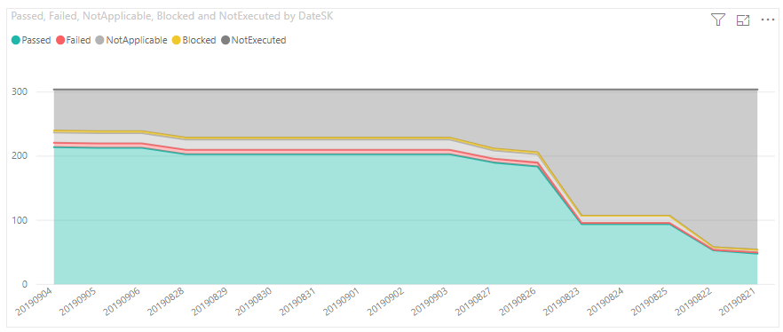
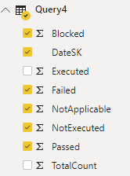

# Manual test execution trend sample report

[!INCLUDE [version-gt-eq-2020](../../includes/version-gt-eq-2020.md)] 

This article shows you how to get the execution state of one or more Test Plans in Power BI. 

[!INCLUDE [temp](includes/preview-note.md)]
 
The report generated is similar to following image and the Outcome trend chart of the [Progress report](../../test/progress-report.md).

> [!div class="mx-imgBorder"] 
> 

The report displays a trend chart that summarizes the number and outcome states of Test Plans executed over a specified period of time.  

- **Passed**: Number of test cases passing.  
- **Failed**: Number of test cases failing.  
- **NotApplicable**: Number of test cases 
- **Blocked**:  Number of test cases blocked from running.  
- **NotExecuted**: Number of test cases defined but not executed.  

## Questions the report answers

This report helps you track the team's progress with respect to planned testing of your product or service by answering the following questions:

- *How much testing is complete?*
- *What is the current status of tests passing, failing, or being blocked?*
- *How many tests are passing and what does the trend indicate about software quality?*
- *How many tests are failing?*
- *How many tests are blocked and what does the trend indicate?*

A healthy test execution trend report shows a steady progress in test plans running and passing. Ideally, the report shows a relatively flat number of test cases for a given plan. As the development cycle progresses, the number of passing test cases should increase, and the numbers of test cases in other states should go down.

[!INCLUDE [temp](includes/sample-required-reading.md)]


[!INCLUDE [prerequisites-simple](../includes/analytics-prerequisites-simple.md)]

For the report to generate useful data, the team must carry out the following activities to manage test plans:

- Define test plans, test suites, and test cases. Specify their state. For a Test Suite to run, it must be in the In Progress state. For a Test Case to run, it must be in the Ready state. For details, see [Create test plans and test suites](../../test/create-a-test-plan.md) and [Create manual test cases](../../test/create-test-cases.md). 
- Run manual tests and verify the results. Mark the results of each validation step in the test case as passed or failed. For details, see [Run manual tests](../../test/run-manual-tests.md).

	> [!NOTE]  
	> Testers must mark a test step with a status if it is a validation test step. The overall result for a test reflects the status of all the test steps that were marked. Therefore, the test will have a status of failed if any test step is marked as failed or not marked.   


## Sample queries

#### [Power BI query](#tab/powerbi/)

[!INCLUDE [temp](includes/sample-powerbi-query.md)]

```
let 
    Source = OData.Feed ("https://analytics.dev.azure.com/{organization}/{project}/_odata/v3.0-preview/TestPointHistorySnapshot?" 
        &"$apply=filter((TestSuite/TestPlanTitle eq '{testPlanTitle}') and (DateSK ge {startDate} and DateSK le {endDate}))" 
        &"/groupby(" 
            &"(DateSK)," 
            &"aggregate(" 
                &"$count as TotalCount," 
                &"cast(ResultOutcome  eq 'Passed', Edm.Int32) with sum as Passed," 
                &"cast(ResultOutcome  eq 'Failed', Edm.Int32) with sum as Failed," 
                &"cast(ResultOutcome eq 'Blocked', Edm.Int32) with sum as Blocked," 
                &"cast(ResultOutcome eq 'NotApplicable', Edm.Int32) with sum as NotApplicable," 
                &"cast(ResultOutcome eq 'None', Edm.Int32) with sum as NotExecuted," 
                &"cast(ResultOutcome ne 'None', Edm.Int32) with sum as Executed 
            ) 
        )", null, [Implementation="2.0"]) 
in 
    Source 
```

#### [OData query](#tab/odata/)

[!INCLUDE [temp](includes/sample-odata-query.md)]

```
https://analytics.dev.azure.com/{organization}/{project}/_odata/v3.0-preview/TestPointHistorySnapshot? 
$apply=filter( 
    (TestSuite/TestPlanTitle eq '{testPlanTitle}') and (DateSK ge {startDate} and DateSK le {endDate}) 
)
/groupby( 
    (DateSK),  
    aggregate( 
        $count as TotalCount, 
        cast(ResultOutcome  eq 'Passed', Edm.Int32) with sum as Passed, 
        cast(ResultOutcome  eq 'Failed', Edm.Int32) with sum as Failed, 
        cast(ResultOutcome eq 'Blocked', Edm.Int32) with sum as Blocked, 
        cast(ResultOutcome eq 'NotApplicable', Edm.Int32) with sum as NotApplicable, 
        cast(ResultOutcome eq 'None', Edm.Int32) with sum as NotExecuted,  
        cast(ResultOutcome ne 'None', Edm.Int32) with sum as Executed 
    ) 
)
```

***

### Substitution strings

[!INCLUDE [temp](includes/sample-query-substitutions.md)]

- `{organization}` - Your organization name 
- `{project}` - Your team project name, or omit "/{project}" entirely, for a cross-project query
- `{testPlanTitle}` - Title of your test plan. Example: `Fabrikam test plan`.
- `{startDate}` and `{endDate}` - Date range of interest. You can enter the dates in YYYYMMDD format. For example, `20190822` for 22 August 2019.


### Query breakdown

The following table describes each part of the query.

---
:::row:::
   :::column span="1":::
      **Query part**
   :::column-end:::
   :::column span="1":::
      **Description**
   :::column-end:::
:::row-end:::
---
:::row:::
   :::column span="1":::
      `filter((TestSuite/TestPlanTitle eq '{testPlanTitle}'))`
   :::column-end:::
   :::column span="1":::
      Return data for only selected test plan. You can add multiple plans with a clause like `filter((TestSuite/TestPlanTitle eq '{testPlanTitle1}'` or `TestSuite/TestPlanTitle eq '{testPlanTitle2}'))`. You can also apply any other filters related to test suites, test configurations here.
   :::column-end:::
:::row-end:::
:::row:::
   :::column span="1":::
      `and (DateSK ge {startDate} and DateSK le {endDate})`
   :::column-end:::
   :::column span="1":::
      Date range of interest. You can enter the dates in **YYYYMMDD** format. 
   :::column-end:::
:::row-end:::
:::row:::
   :::column span="1":::
      `/groupby((DateSK)`
   :::column-end:::
   :::column span="1":::
      Group the data into bins of same date. It produces one set of values per day in given date range.
   :::column-end:::
:::row-end:::
:::row:::
   :::column span="1":::
      `/aggregate($count as TotalCount,`
   :::column-end:::
   :::column span="1":::
      Aggregate data across the filtered test points with having count as `TotalCount`. 
   :::column-end:::
:::row-end:::
:::row:::
   :::column span="1":::
      `cast(LastResultOutcome eq 'Passed', Edm.Int32) with sum as Passed,`
   :::column-end:::
   :::column span="1":::
      While aggregating, type-cast test points having latest execution outcome 'Passed' to 1 and sum them up as `Passed` metric. 
   :::column-end:::
:::row-end:::

 
[!INCLUDE [temp](includes/query-filters-test.md)]

## Power BI transforms

[!INCLUDE [temp](includes/sample-test-plans-finish-query.md)]


## Create the report

Power BI shows you the fields you can report on. 

> [!NOTE]   
> The example below assumes that no one renamed any columns. 


> [!div class="mx-imgBorder"] 
> 

To create the report, do the following steps:

1. Create a Power BI visualization **Stacked Area Chart**.
1. Drag and drop **DateSK** in **Axis**.
1. Drag and drop **Passed**, **Failed**, **Blocked**, **NotApplicable** and **NotExecuted** in **Values**.

Your report should look similar to the following image.

> [!div class="mx-imgBorder"] 
> 
 

## Related articles

- [Overview of sample reports using OData queries](./sample-odata-overview.md)
- [Connect using Power BI and OData queries](./odataquery-connect.md)
- [Sample reports and quick reference index](../extend-analytics/quick-ref.md)