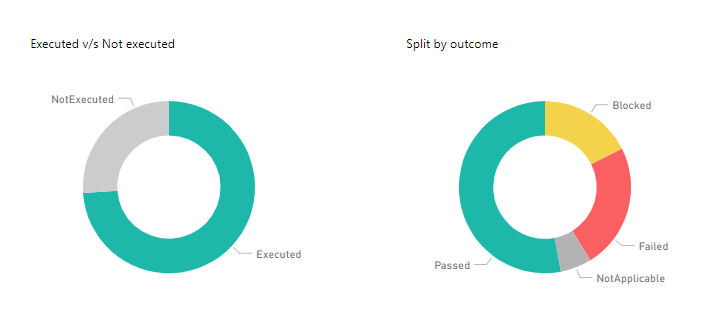
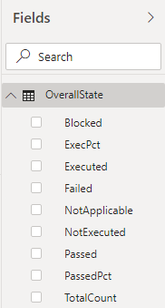

# Progress status sample report 

[!INCLUDE [temp](../includes/version-azure-devops-cloud.md)]

This article shows you how to get the execution state of one or more Test Plans in Power BI. 

[!INCLUDE [temp](includes/preview-note.md)]

The report generated is similar to following image and the Summary chart of the [Track test status - Progress report](../../test/track-test-status.md).

> [!div class="mx-imgBorder"] 
> 

This report displays two donut charts that summarize Test Plans executed and not executed, and the status of executed Test Plans.  

- **Executed vs Not executed** 
	- **Executed**: The percentage of test plans defined which have run.  
	- **NotExecuted**: The percentage of test plans defined which haven't run.    
- **Split by outcome** 
	- **Blocked**:  Percentage of test cases that are currently blocked from running.  
	- **Failed**: Percentage of test cases that failed.  
	- **NotApplicable**: Percentage of test cases that didn't run.  
	- **Passed**: Percentage of test cases that passed.  
 

## Questions the report answers

The overall execution state report helps you track the team's progress with respect to planned testing of your product or service by answering the following questions:

- *How much testing is complete?*
- *What is the current status of tests passing, failing, or being blocked?*

[!INCLUDE [temp](includes/sample-required-reading.md)]

[!INCLUDE [temp](./includes/prerequisites-power-bi-2020.md)]

For the report to generate useful data, the team must perform the following activities to manage test plans:

- Define test plans, test suites, and test cases. Specify their state. For a Test Suite to run, it must be in the In Progress state. For a Test Case to run, it must be in the Ready state. For details, see [Create manual test cases](../../test/create-test-cases.md). 
- Run manual tests and verify the results. Mark the results of each validation step in the test case as passed or failed. For details, see [Run manual tests](../../test/run-manual-tests.md).

	> [!NOTE]  
	> Testers must mark a test step with a status if it is a validation test step. The overall result for a test reflects the status of all the test steps that were marked. Therefore, the test will have a status of failed if any test step is marked as failed or not marked.   


## Sample queries

#### [Power BI query](#tab/powerbi/)

[!INCLUDE [temp](includes/sample-powerbi-query.md)]

```
let 
    Source = OData.Feed ("https://analytics.dev.azure.com/{organization}/{project}/_odata/v3.0-preview/TestPoints?" 
        &"$apply=filter(( TestSuite/TestPlanTitle eq '{testPlanTitle}' ))" 
        &"/aggregate(" 
            &"$count as TotalCount," 
            &"cast(LastResultOutcome eq 'Passed', Edm.Int32) with sum as Passed," 
            &"cast(LastResultOutcome eq 'Failed', Edm.Int32) with sum as Failed," 
            &"cast(LastResultOutcome eq 'Blocked', Edm.Int32) with sum as Blocked," 
            &"cast(LastResultOutcome eq 'NotApplicable', Edm.Int32) with sum as NotApplicable," 
            &"cast(LastResultOutcome eq 'None', Edm.Int32) with sum as NotExecuted," 
            &"cast(LastResultOutcome ne 'None', Edm.Int32) with sum as Executed" 
        &")/compute(" 
            &"Executed mul 100 div TotalCount as ExecPct," 
            &"iif(TotalCount gt NotExecuted, Passed mul 100 div Executed,0) as PassedPct" 
        &")", null, [Implementation="2.0"]) 
in 
    Source
```

#### [OData query](#tab/odata/)

[!INCLUDE [temp](includes/sample-odata-query.md)]

```
https://analytics.dev.azure.com/{organization}/{project}/_odata/v3.0-preview/TestPoints? 
$apply=filter( 
    (TestSuite/TestPlanTitle eq '{testPlanTitle}')
) 
/aggregate( 
    $count as TotalCount,  
    cast(LastResultOutcome eq 'Passed', Edm.Int32) with sum as Passed,  
    cast(LastResultOutcome eq 'Failed', Edm.Int32) with sum as Failed, 
    cast(LastResultOutcome eq 'Blocked', Edm.Int32) with sum as Blocked, 
    cast(LastResultOutcome eq 'NotApplicable', Edm.Int32) with sum as NotApplicable, 
    cast(LastResultOutcome eq 'None', Edm.Int32) with sum as NotExecuted, 
    cast(LastResultOutcome ne 'None', Edm.Int32) with sum as Executed 
)
/compute( 
    Executed mul 100 div TotalCount as ExecPct, 
    iif(TotalCount gt NotExecuted, Passed mul 100 div Executed,0) as PassedPct 
)
```

***

### Substitution strings

[!INCLUDE [temp](includes/sample-query-substitutions-3.md)]


### Query breakdown

The following table describes each part of the query.


<table width="90%">
<tbody valign="top">
<tr><td width="25%"><b>Query part</b></td><td><b>Description</b></td><tr>
<tr><td><code>filter((TestSuite/TestPlanTitle eq '{testPlanTitle}')) </code></td><td>Return data for only selected test plan. You can add multiple plans with a clause like <code>filter((TestSuite/TestPlanTitle eq '{testPlanTitle1}' or TestSuite/TestPlanTitle eq '{testPlanTitle2}'))</code>. You can also apply any other filters related to test suites, test configurations here.</td><tr>
<tr><td><code>/aggregate($count as TotalCount,</code></td><td>Aggregate data across the filtered test points with having count as <code>TotalCount</code>.</td><tr>
<tr><td><code>cast(LastResultOutcome eq 'Passed', Edm.Int32) with sum as Passed</code></td><td>While aggregating, type-cast test points having latest execution outcome 'Passed' to 1 and sum them up as '<code>Passed</code>' metric.</td><tr>
<tr><td><code>/compute(Executed mul 100 div TotalCount as ExecPct</code>.</td><td>Provide a computed metric <code>ExecPct</code> which is equal to (Executed test points / Total count * 100).</td><tr>
</tbody>
</table>

[!INCLUDE [temp](includes/query-filters-test.md)]

## Power BI transforms

[!INCLUDE [temp](includes/sample-test-plans-finish-query.md)]


## Create the report

Power BI shows you the fields you can report on. 

> [!NOTE]   
> The example below assumes that no one renamed any columns. 


> [!div class="mx-imgBorder"] 
> 

To create the report, do the following steps:

1. To create donut chart of Executed v/s Not executed:
    - Create a Power BI visualization **Donut chart**.
    - Drag and drop **Executed** and **NotExecuted** in **Values**.
2. To create donut chart of split by outcome
    - Create a Power BI visualization **Donut chart**.
    - Drag and drop outcome values like **Passed, Failed, Blocked, NotApplicable** etc. into **Values**.

Your report should appear similar to the following image. 

> [!div class="mx-imgBorder"] 
> 

## Full list of Test Plans sample reports 

[!INCLUDE [temp](includes/sample-full-list-test-plans.md)]

## Related articles

- [Overview of sample reports using OData queries](./sample-odata-overview.md)
- [Connect using Power BI and OData queries](./odataquery-connect.md)
- [Analytics OData query quick reference](../extend-analytics/quick-ref.md)