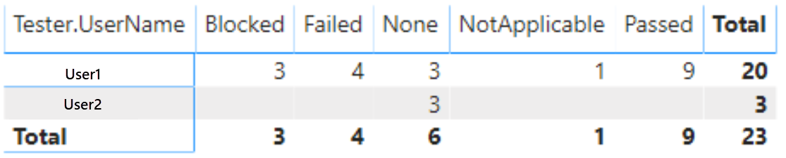
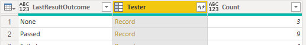
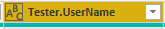
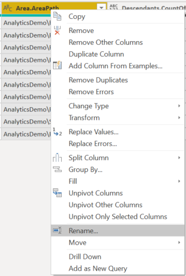
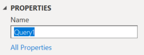

# Tester by outcome matrix sample report

[!INCLUDE [version-gt-eq-2020](../../includes/version-gt-eq-2020.md)] 

When multiple testers are executing test cases, it may be possible that few have completed the execution of tests assigned to them while others still have remaining tests to execute. You can see the distribution of test point outcomes across testers to figure out how the tests can be load-balanced. 

[!INCLUDE [temp](includes/preview-note.md)]

The report generated is similar to following image.
 
> [!div class="mx-imgBorder"] 
> 

[!INCLUDE [temp](includes/sample-required-reading.md)]


[!INCLUDE [temp](./includes/prerequisites-power-bi-2020.md)]

For the report to generate useful data, the team must carry out the following activities to manage test plans:

- Define test plans, test suites, and test cases. Specify their state. For a Test Suite to run, it must be in the In Progress state. For a Test Case to run, it must be in the Ready state. For details, see [Create test plans and test suites](../../test/create-a-test-plan.md) and [Create manual test cases](../../test/create-test-cases.md). 
- Assign test cases to specific testers.
- Run manual tests and verify the results. Mark the results of each validation step in the test case as passed or failed. For details, see [Run manual tests](../../test/run-manual-tests.md).

	> [!NOTE]  
	> Testers must mark a test step with a status if it is a validation test step. The overall result for a test reflects the status of all the test steps that were marked. Therefore, the test will have a status of failed if any test step is marked as failed or not marked.   

## Sample queries

#### [Power BI query](#tab/powerbi/)

[!INCLUDE [temp](includes/sample-powerbi-query.md)]

```
let 
    Source = OData.Feed ("https://analytics.dev.azure.com/{organization}/{project}/_odata/v3.0-preview/TestPoints?" 
        &"$apply=filter((TestSuite/TestPlanTitle eq '{testPlanTitle}'))" 
        &"/groupby((Tester/UserName, LastResultOutcome)," 
             &"aggregate($count as Count)" 
        &")", null, [Implementation="2.0"]) 
in 
    Source
```

#### [OData query](#tab/odata/)

[!INCLUDE [temp](includes/sample-odata-query.md)]

```
https://analytics.dev.azure.com/{organization}/{project}/_odata/v3.0-preview/TestPoints?  
    $apply=filter((TestSuite/TestPlanTitle eq '{testPlanTitle}')) 
    /groupby(
        (Tester/UserName, LastResultOutcome),  
        aggregate($count as Count) 
    )
```

***

### Substitution strings

[!INCLUDE [temp](includes/sample-query-substitutions-3.md)]

### Query breakdown

The following table describes each part of the query.


:::row:::
   :::column span="1":::
   **Query part**
   :::column-end:::
   :::column span="1":::
   **Description**
   :::column-end:::
:::row-end:::
:::row:::
   :::column span="1":::
   `filter((TestSuite/TestPlanTitle eq '{testPlanTitle}')) `
   :::column-end:::
   :::column span="1":::
   Return data for only selected test plan. You can add multiple plans with a clause like `filter((TestSuite/TestPlanTitle eq '{testPlanTitle1}' or TestSuite/TestPlanTitle eq '{testPlanTitle2}'))`. You can also apply any other filters related to test suites, test configurations here.
   :::column-end:::
:::row-end:::
:::row:::
   :::column span="1":::
   `/groupby((Tester/UserName, LastResultOutcome),`
   :::column-end:::
   :::column span="1":::
   Grouping the points by the user names of testers and their outcome.
   :::column-end:::
:::row-end:::
:::row:::
   :::column span="1":::
   `/aggregate($count as Count)`
   :::column-end:::
   :::column span="1":::
   Aggregate data across the filtered test points with having count as `Count`.
   :::column-end:::
:::row-end:::


[!INCLUDE [temp](includes/query-filters-test.md)]

## Power BI transforms

In Power BI, do the following steps.  

When finished, you may choose to rename columns. 

1. Expand `Tester`
    - Choose the expand button.

        > [!div class="mx-imgBorder"] 
	    > 

    - Select the fields to flatten.

        > [!div class="mx-imgBorder"] 
	    > 

    - The table now contains entity field of `Tester.UserName`.

        > [!div class="mx-imgBorder"] 
	    > 

1. Right-click a column header and select **Rename...**

	> [!div class="mx-imgBorder"] 
	> 

1. Change the type of count columns to **Whole Number** and percentage fields to **Decimal Number**.

	> [!div class="mx-imgBorder"]
	> 

1. You also may want to rename the query from the default **Query1**, to something more meaningful. 

	> [!div class="mx-imgBorder"] 
	> 

1. Once done, choose **Close & Apply** to save the query and return to Power BI.

	> [!div class="mx-imgBorder"] 
	> 


## Create the report

Power BI shows you the fields you can report on. 

> [!NOTE]   
> The example below assumes that no one renamed any columns. 

To create the report, do the following steps:

1. Create a Power BI visualization **Matrix**.
1. Add the field **Tester.UserName** to **Rows**.
1. Add the field **LastResultOutcome** to **Columns**.
1. Add the field **Count** to **Values**.
1. Select **Sum** as aggregation for **Count**.
	> [!div class="mx-imgBorder"] 
	> 

Your report should look similar to the following image.

> [!div class="mx-imgBorder"] 
> 

## Full list of sample reports for Test Plans

[!INCLUDE [temp](includes/sample-full-list-test-plans.md)]

## Related articles

- [Overview of sample reports using OData queries](./sample-odata-overview.md)
- [Connect using Power BI and OData queries](./odataquery-connect.md)
- [Sample reports and quick reference index](../extend-analytics/quick-ref.md)