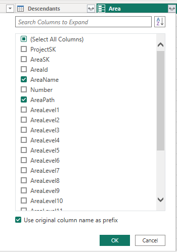
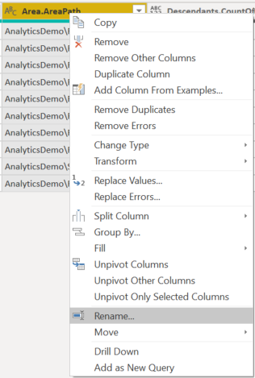

# Transform Analytics data to generate Power BI reports

[!INCLUDE [version-gt-eq-2019](../../includes/version-gt-eq-2019.md)]

Once you've imported your Analytics data into Power BI, you may need to transform select column data prior to creating a report. This article shows you how to perform some of these basic tasks, such as: 

- Expand columns, such as **Area**, **AssignedTo**, and **Iteration** 
- Expand descendant columns when querying linked work items
- Pivot columns to generate counts for select category states 
- Transform the column data type from decimal to whole numbers 
- Replace null values in column data 
- Create a custom field 
- Rename fields. 
 
## Expand columns 

The query returns several columns that you need to expand before you can use them in Power BI. Any entity pulled in using an OData **$expand** statement returns a record with potentially several fields. You need to expand the record to flatten the entity into its fields. Examples of such entities are: **AssignedTo**, **Iteration**, and **Area**. 

After closing the **Advanced Editor** and while remaining in the **Power Query Editor**, select the expand button on the entities you need to flatten.

1. For example, choose the expand button for **Area**, select the properties you want to expand, and choose **OK**. Here, we choose `AreaName` and `AreaPath` to flatten. The `AreaName` property is similar to the **Node Name** field.

    > [!div class="mx-imgBorder"] 
    > 

	> [!NOTE]   
	> The available properties to select depends on the properties requested to return in the query. If you don't specify any properties, then all properties are available. To learn more about these properties, see the following metadata references: [Areas](../analytics/entity-reference-boards.md#areas), [Iterations](../analytics/entity-reference-boards.md#iterations), and [Users](../analytics/entity-reference-general.md#users).
	
1. The table now contains entity field(s).

    > [!div class="mx-imgBorder"] 
    > 

1. Repeat steps 1 through 3 for all fields representing entities that need expanding. These appear with *Record* listed in the table column when unexpanded. 


<a id="expand-descendants" />

### Expand Descendants column


The **Descendants** column contains a table with two fields: **State** and **TotalStoryPoints**. Expand it. 

1. Choose the **Expand** button, and select the columns to report on:

	:::image type="content" source="media/transform-data/descendants-column-expand.png" alt-text="Screenshot of Power BI Descendants column. ":::

2. Check all the columns and choose **OK**.

	:::image type="content" source="media/transform-data/expand-descendents-property.png" alt-text="Screenshot of Power BI Descendants column, expand options. ":::

3. The Descendants entity is flattened to the selected columns:

	:::image type="content" source="media/transform-data/descendents-expanded-columns.png" alt-text="Screenshot of Power BI expanded Descendants column. ":::


<a id="pivot-statecategory" />

#### Pivot Descendants.StateCategory column

1. Select the 1Descendants.StateCategory1 column header to select it.

1. Select **Transform** menu and then **Pivot Column**. 
	:::image type="content" source="media/transform-data/transform-menu-pivot-column.png" alt-text="Transform menu, Pivot Column option.":::

1. In the Pivot Column dialog, for **Values** select `Descendants.TotalStoryPoints`, and then press **OK**.
	Power BI creates a column for every StateCategory value.

	:::image type="content" source="media/transform-data/descendants-pivot-column-dialog.png" alt-text="Dialog of Pivot Column for  Descendants.TotalStoryPoints column. ":::  


<a id="expand-links-column" />

### Expand the Links column

1. Select the expand button on the `Links` column.

	:::image type="content" source="media/transform-data/links-column-expand.png" alt-text="Screenshot of Power BI Links column, expand options. ":::

1. Select all the fields to flatten.

	:::image type="content" source="media/transform-data/links-column-expand.png" alt-text="Screenshot of Power BI Links column, expand options. ":::

1. Select the expand button on the `Links.TargetWorkItem` column and select the properties to flatten.

	:::image type="content" source="media/transform-data/links-target-work-item-column-expand.png" alt-text="Screenshot of Power BI Links.TargetWorkItem column, expand options. ":::


> [!NOTE]
> If the link represents a one-to-many or many-to-many relationship, then multiple links will
> expand to multiple rows, one for each link. 
> 
> For example, if Work Item #1 is linked to Work Item's #2 and #3, then when you expand the Links record, 
> you will have 2 rows for Work Item #1. One that represents its link to Work Item #2, and another that
> represents its link to Work Item #3.


<a id="transform-data-type" />

## Transform a column data type 

<a id="leadtimedays-cycletimedays" />

 
### Transform LeadTimeDays and CycleTimeDays to whole numbers

The `LeadTimeDays` and `CycleTimeDays` are decimal fields. For example if **Lead Time** is 10 and 1/2 days, the value is 10.5. Since most Lead/Cycle Time reports assume that it's rounded to the nearest day, we need to convert these fields to an Integer. Making this conversion converts all values less than 1 to 0. 

From the Power Query Editor, select the ribbon **Transform** menu.  

1. Select the `LeadTimeDays` column by selecting the column header.  

1. Select **Data Type** and change to **Whole Numbers**.  

   :::image type="content" source="media/transform-data/change-data-type-lead-time.png" alt-text="Screenshot of Power BI Transform menu, Data type selection.":::

1. Repeat for `CycleTimeDays`.

### Change CompletedDateSK to a Date field

The `CompletedDateSK` column data corresponds to an integer rendering of the **Completed Date** field in the format `YYYYMMDD`. For example, the integer value of 2022-July-01 is 20220701. For easier reporting, we change it to a **Date** field.

From the Power Query Editor, select the ribbon **Transform** menu. 

1. Select the `CompletedDateSK` column header. 
1. Select **Data Type** and change to **Text**.
	When the **Change Column Type** dialog appears, select **Add new step** (rather than **Replace current step**). This two-step process is the easiest way to change it to a proper **Date** field in Power BI.

   :::image type="content" source="media/transform-data/change-column-type-add-new-step.png" alt-text="Screenshot of Power BI Transform menu, Change Column Type dialog.":::

1. Next, select **Date Type** again and choose **Date**. 
	In the **Change Column Type** dialog, select **Add new step**.
 

<a id="replace-null-values" /> 

## Replace values  

Sometimes one or more records may contain null values. For example, a value may not have been entered for **Story Points** or **Remaining Work**.  

:::image type="content" source="media/transform-data/records-null-data.png" alt-text="Screenshot of Power BI table containing null values.":::

For easier reporting, replace nulls with zero by following these steps.

1. Select the column by clicking the column header.
1. Select the **Transform** menu.
1. Select **Replace Values**. In the **Replace Values** dialog:
	- Enter "null" in **Value to Find**.
	- Enter "0" in **Replace With**.
1. Choose **OK**.

## Create a custom column

<a id="create-percent-complete" />


### Create a percentage complete computed column

Prior to adding the percentage complete column, make sure that you replace all null values in the pivoted state columns.
1. Select **Add Column** menu.
1. Select **Custom Column**.
1. Enter **PercentComplete** for **New column name**.
1. Enter the following in **Custom column formula**.

    ```
    = [Completed]/([Proposed]+[InProgress]+[Resolved]+[Completed])
    ```
	:::image type="content" source="media/transform-data/custom-column-dialog-percent-complete.png" alt-text="Custom Column Dialog, PercentComplete syntax.":::

    > [!NOTE]
    > It's possible that you won't have a **Resolved** column, if the work items don't have States mapped to the *Resolved* workflow state category. 
    > If so, omit "[Resolved]" in the above formula.

1. Press **OK**.
1. Select **Transform** menu.
1. Select **Data Type** and select **Percentage**.

## Rename column fields

When finished with your expansion, you may choose to rename one or more columns. 

1. Right-click a column header and select **Rename...**

	> [!div class="mx-imgBorder"] 
	> 

1. Enter a new label for the column field and then press Enter. 
 

[!INCLUDE [temp](includes/close-apply.md)]


## Related articles 

- [Create a Power BI report with an OData Query](create-quick-report-odataq.md)
- [Connect with data by using Power BI and OData queries](odataquery-connect.md) 
- [Overview of sample reports using OData queries](sample-odata-overview.md) 
- [Add a team slicer to a Power BI report](sample-boards-teamslicer.md)

<!---
Can't pivot if you have unexpanded records - will get an error message about nested columns  
Must remove Null fields - use Replace values (why does this not work in some instances) 
--> 