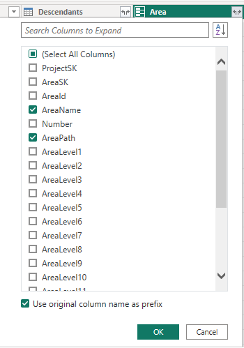
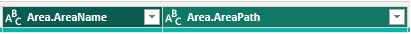

# Transform Analytics data to generate Power BI reports

[!INCLUDE [version-lt-eq-azure-devops](../../includes/version-lt-eq-azure-devops.md)]

After you import Analytics data into Power BI through an OData query or Analytics view, the raw data often needs shaping before it's ready for reports. Entity fields arrive as collapsed records, dates may appear as integers, and null values can skew calculations.

This article covers the most common Power Query transformations:

- Expand entity columns (**Area**, **AssignedTo**, **Iteration**) and linked-work-item descendants
- Pivot state categories into count columns
- Convert decimal or integer fields to the correct data type
- Replace null values with zeros
- Add computed columns (for example, percent complete)
- Rename columns for readability 

[!INCLUDE [ai-assistance-mcp-server-tip](../../includes/ai-assistance-mcp-server-tip.md)]

## Prerequisites

[!INCLUDE [prerequisites-simple](../includes/analytics-prerequisites-simple.md)]

## Expand columns

When your OData query uses `$expand` to include related entities such as **Area**, **AssignedTo**, or **Iteration**, those entities arrive in Power BI as collapsed *Record* values. You must expand each record to expose its individual fields.

In Power Query Editor:

1. Select the expand button () on a column that shows *Record* — for example, **Area**. Select the properties you want (such as `AreaName` and `AreaPath`), and then select **OK**.

    > [!div class="mx-imgBorder"] 
    > 

	> [!NOTE]
	> The properties available for selection depend on which properties your query requested. If you didn't specify properties in the query, all properties are available. For metadata details, see [Areas](../analytics/entity-reference-boards.md#areas), [Iterations](../analytics/entity-reference-boards.md#iterations), and [Users](../analytics/entity-reference-general.md#users).

1. The expanded fields now appear as separate columns in the table.

    > [!div class="mx-imgBorder"] 
    > 

1. Repeat for every column that displays *Record* — for example, **AssignedTo** and **Iteration**.

<a id="expand-descendants"></a>

### Expand the Descendants column

If your query returns linked work items with rollup data, the **Descendants** column contains a nested table. Expand it to access fields like **State** and **TotalStoryPoints**.

1. Select the **Expand** button on the **Descendants** column and select the fields to include.

	:::image type="content" source="media/transform-data/descendants-column-expand.png" alt-text="Screenshot of Power BI Descendants column.":::

1. Select all columns and choose **OK**.

	:::image type="content" source="media/transform-data/expand-descendents-property.png" alt-text="Screenshot of Power BI Descendants column, expand options.":::

1. The nested table is flattened into individual columns.

	:::image type="content" source="media/transform-data/descendents-expanded-columns.png" alt-text="Screenshot of Power BI expanded Descendants column.":::

<a id="pivot-statecategory"></a>

#### Pivot the Descendants.StateCategory column

After expanding descendants, you can pivot **StateCategory** to create one column per state — useful for percent-complete calculations.

1. Select the **Descendants.StateCategory** column header.

1. Select **Transform** > **Pivot Column**.

	:::image type="content" source="media/transform-data/transform-menu-pivot-column.png" alt-text="Transform menu, Pivot Column option.":::

1. In the **Pivot Column** dialog, set **Values** to `Descendants.TotalStoryPoints` and select **OK**. Power BI creates a separate column for each state category (for example, *Proposed*, *InProgress*, *Completed*).

	:::image type="content" source="media/transform-data/descendants-pivot-column-dialog.png" alt-text="Dialog of Pivot Column for Descendants.TotalStoryPoints column.":::

<a id="expand-links-column"></a>

### Expand the Links column

When your query includes work-item links, the **Links** column contains a nested table that you must expand in two stages.

1. Select the expand button on the **Links** column and select all fields.

	:::image type="content" source="media/transform-data/links-column-expand.png" alt-text="Screenshot of Power BI Links column, expand options.":::

1. Select the expand button on the **Links.TargetWorkItem** column and select the target properties you want (for example, **Title**, **State**, **WorkItemType**).

	:::image type="content" source="media/transform-data/links-target-work-item-column-expand.png" alt-text="Screenshot of Power BI Links.TargetWorkItem column, expand options.":::

> [!NOTE]
> For one-to-many or many-to-many relationships, expanding links creates multiple rows per source work item — one row for each link. For example, if Work Item #1 links to Work Items #2 and #3, you get two rows for Work Item #1.

<a id="transform-data-type"></a>

## Transform column data types

<a id="leadtimedays-cycletimedays"></a>

### Convert LeadTimeDays and CycleTimeDays to whole numbers

Analytics returns `LeadTimeDays` and `CycleTimeDays` as decimals (for example, 10.5 for 10½ days). Most lead/cycle time reports round to the nearest day, so convert these columns to integers. Values less than 1 become 0.

1. In Power Query Editor, select the **Transform** tab.

1. Select the `LeadTimeDays` column header, then select **Data Type** > **Whole Number**.

   :::image type="content" source="media/transform-data/change-data-type-lead-time.png" alt-text="Screenshot of Power BI Transform menu, Data type selection.":::

1. Repeat for `CycleTimeDays`.

### Convert CompletedDateSK to a Date field

Analytics stores `CompletedDateSK` as an integer in `YYYYMMDD` format (for example, `20220701` for July 1, 2022). Convert it to a proper **Date** type in two steps — integer to text, then text to date.

1. Select the `CompletedDateSK` column header.

1. Select **Data Type** > **Text**. When the **Change Column Type** dialog appears, select **Add new step**.

   :::image type="content" source="media/transform-data/change-column-type-add-new-step.png" alt-text="Screenshot of Power BI Transform menu, Change Column Type dialog.":::

1. With the same column still selected, select **Data Type** > **Date**. In the **Change Column Type** dialog, select **Add new step** again.

<a id="replace-null-values"></a> 

## Replace null values

Fields like **Story Points** or **Remaining Work** may contain null values when no value was entered. Nulls cause errors in calculations (for example, a percent-complete formula fails if any denominator term is null). Replace them with zero before you create computed columns.

:::image type="content" source="media/transform-data/records-null-data.png" alt-text="Screenshot of Power BI table containing null values.":::

1. Select the column header.
1. Select **Transform** > **Replace Values**.
1. In the **Replace Values** dialog, enter `null` in **Value to Find** and `0` in **Replace With**.
1. Select **OK**.
1. Repeat for each column that might contain nulls.

## Create a computed column

<a id="create-percent-complete"></a>

### Add a percentage complete column

> [!IMPORTANT]
> Before you add this column, replace all null values in the pivoted state columns (see preceding section). Any null term causes the formula to return an error.

1. Select **Add Column** > **Custom Column**.

1. Enter `PercentComplete` for **New column name** and enter the following formula:

    ```
    = [Completed]/([Proposed]+[InProgress]+[Resolved]+[Completed])
    ```

	:::image type="content" source="media/transform-data/custom-column-dialog-percent-complete.png" alt-text="Custom Column Dialog, PercentComplete syntax.":::

    > [!NOTE]
    > If your work items don't have states mapped to the *Resolved* category, omit `[Resolved]` from the formula.

1. Select **OK**.

1. With the new column selected, select **Transform** > **Data Type** > **Percentage**.

## Rename columns

After expanding and transforming columns, rename them so they're readable in your report visuals.

1. Right-click a column header and select **Rename**.

	> [!div class="mx-imgBorder"] 
	> 

1. Enter a new label and press Enter. 

[!INCLUDE [temp](includes/close-apply.md)]

::: moniker range="azure-devops"

<a id="use-ai-assistance"></a>

## Use AI to transform Analytics data in Power BI

If you configure the [Azure DevOps MCP Server](/azure/devops/mcp-server/mcp-server-overview), you can use AI assistants to help with Power BI data transformations.

### Example prompts

| Task | Example prompt |
|------|----------------|
| Expand entity columns | `How do I expand the Area and Iteration columns in Power BI after importing OData data from <Contoso> project?` |
| Pivot state categories | `Write Power Query steps to pivot the StateCategory column into separate count columns in my Power BI report` |
| Replace null values | `Help me replace null values in the StoryPoints column with zero in Power BI` |
| Create a computed column | `Create a Power Query custom column that calculates percent complete from pivoted state category columns` |
| Convert date fields | `How do I convert CompletedDateSK from an integer like 20220701 to a proper Date field in Power BI?` |

::: moniker-end

## Related articles 

- [Create a Power BI report with an OData Query](create-quick-report-odataq.md)
- [Connect with data by using Power BI and OData queries](odataquery-connect.md) 
- [Overview of sample reports using OData queries](sample-odata-overview.md) 
- [Add a team slicer to a Power BI report](sample-boards-teamslicer.md)
