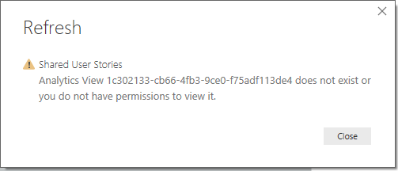

# Resolve errors associated with an Analytics view

[!INCLUDE [temp](../_shared/version-azure-devops.md)]

An Analytics view provides a simplified way to specify the filter criteria for a Power BI report based on the Analytics Service data store. The Analytics Service provides the reporting platform for Azure DevOps. You manage Analytics views in the web portal for Azure DevOps and then access them with the [Power BI Connector](data-connector-connect.md). 

## Resolve size warnings

### **Warning: This view may contain too much data**

This warning appears when Power BI determines that it may not be able to load all the data contained within the view. It typically occurs when you haven't specified sufficient filters within the view or you've specified to load all history with a daily granularity. 

To resolve this warning, specify additional [work items filters](analytics-views-create.md#specify-wi-filters) or modify the [History or Granularity](analytics-views-create.md#select-trend-data) to scope the view's results. 

Views that pull a large amount of data, might take a long time to refresh and load in Power BI. For organizations with a large amount of data, it might even fail to load. To make sure your view will successfully load in Power BI, [Verify](analytics-views-create.md#verify-and-save) your view before saving it. 

## Resolve verification errors

### **Error: The field 'FieldName' already exists**

This error indicates that one of your project's [custom fields](../../organizations/settings/work/customize-process-field.md) is a duplicate of one of the [Analytics Service fields](../extend-analytics/data-model-analytics-service.md). 

To resolve this error, rename your custom field.

### **Error: Field doesn't exists anymore**

This error means that one of your [work items filters](analytics-views-create.md#specify-wi-filters) or [view fields](analytics-views-create.md#select-fields) references a field that was removed from your [project process](../../organizations/settings/work/customize-process-field.md). 

To resolve this error, [edit your view](analytics-views-manage.md#edit-an-existing-view) and remove the filter or field from the view's definition. 

## Resolve errors in Power BI

### **Analytics view ... Does not exist or you do not have permission to view it** 

This error occurs when you try to refresh a view in Power BI that is no longer available in Azure DevOps. One or more of the following actions may have occurred: 
- The view was renamed
- The view was deleted
- Your permissions to access the view were explicitly removed
- The view has been modified from a **Shared** view to a **Private** view.  

To resolve this issue, check that you can access the view in Azure DevOps and that you have [permission to use the view](analytics-views-manage.md#manage-permissions).  

If the view no longer exists, you can still use the rest of your report in Power BI by deleting the loaded table from your Power BI desktop.

### **The field ... already exists in the record**

This error indicates that you have a custom field with the same display name as one of the Azure DevOps reserved fields.

To resolve this collision, remove the duplicate column from the view's fields. You will need to customize your fields selection and remove the duplicate field from the [field list](analytics-views-create.md#select-fields). 

## Related articles
- [Create an Analytics view](analytics-views-create.md) 
- [Manage Analytics views](analytics-views-manage.md).  
- [Data available from the Analytics Service](data-available-in-analytics.md)
- [Grant permissions to access the Analytics service](./analytics-security.md)
- [Power BI integration overview](overview.md)
