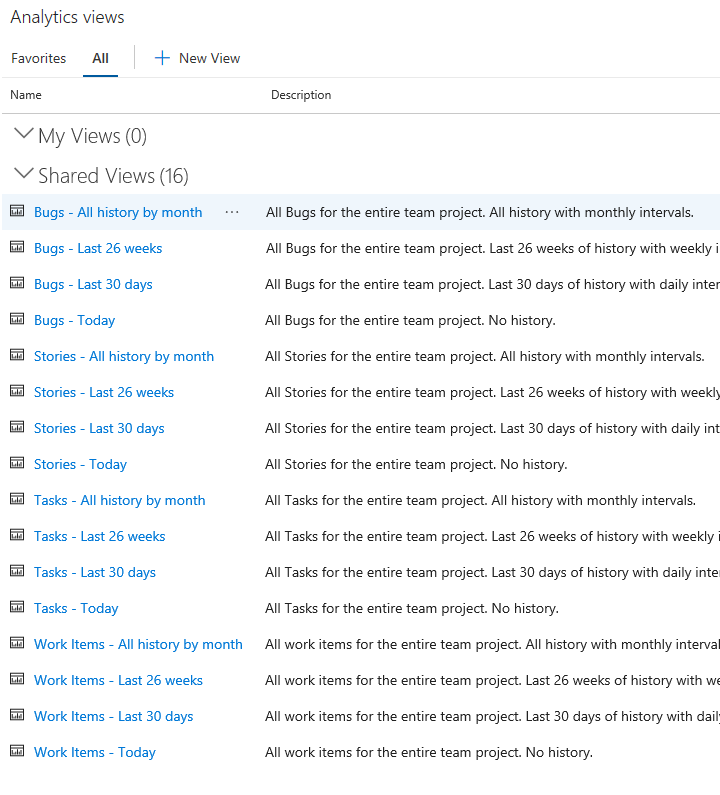
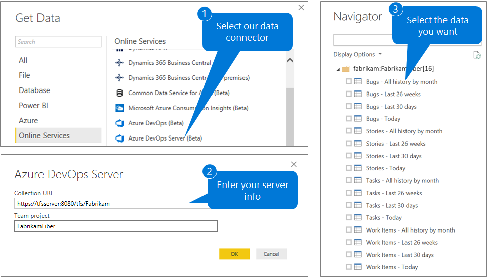

# What are Analytics views?

[!INCLUDE [temp](../_shared/version-azure-devops.md)]

<!--- Supports https://go.microsoft.com/fwlink/?linkid=865481  --> 

An Analytics view provides a simplified way to specify the filter criteria for a Power BI report based on the Analytics Service data store. The Analytics Service provides the reporting platform for Azure DevOps. 

Each view defines a dataset designed to support viewing, sharing, and publishing work tracking data for Azure DevOps through Power BI. You can use default Analytics views or create custom views and open the view using the [Power BI Data Connector](data-connector-connect.md). You create custom views in the web portal for Azure DevOps. 

You can use the [default Analytics views](analytics-default-views.md) we provide or [create your own custom views](analytics-views-create.md).

[!INCLUDE [temp](../_shared/boards-disabled.md)]

## Default Analytics views

As set of default Analytics views are provided. The default views and are immediately accessible from Power BI. The view you select determines the set of records, fields, and history that are pulled into Power BI.  

::: moniker range="azure-devops"

> [!NOTE]  
> To access <strong>Analytics views</strong>, you must enable the feature as described in [Enable preview features](/azure/devops/project/navigation/preview-features).  

::: moniker-end

Here we show the default views created for a project based on the Agile process. To learn how to open this view in your web portal, see [Manage Analytics views](analytics-views-manage.md).

> [!div class="mx-imgBorder"] 
> 

[!INCLUDE [temp](../_shared/analytics-image-differences.md)] 

When you use the Power BI Data Connector, these same default views appear in the Navigator dialog. The view you select determines the set of records, fields, and history that are loaded into Power BI.

::: moniker range="azure-devops"

::: moniker-end

::: moniker range="azure-devops-2019"

::: moniker-end

Default Analytics views work well for customers with small datasets. To learn more, see [Default Analytics views](analytics-default-views.md).

## Custom Analytics views

If the default Analytics views do not meet your needs, you can create custom views to fine-tune the records, fields, and history returned to Power BI.

A custom view supports defining the following options:
- Sharing options
- Work item filters 
- Team and area path filters
- Backlog and work item type filters
- Field specific filters 
- Fields to display 
- View history and trend options 

To learn more, see [Create an Analytics view](./analytics-views-create.md).

## How the data is modeled in Power BI

For more information on how the dataset is modeled when using the Power BI Data Connector, see [dataset design for the Power BI Data Connector](data-connector-dataset.md).

## Try this next
> [!div class="nextstepaction"]
> [Data available from the Analytics Service](data-available-in-analytics.md)

 
