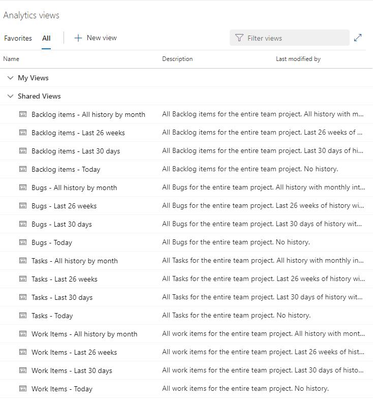

# About Analytics views 

[!INCLUDE [version-gt-eq-2019](../../includes/version-gt-eq-2019.md)]

<!--- Supports https://go.microsoft.com/fwlink/?linkid=865481  --> 

An Analytics view provides a simplified way to specify the filter criteria for a Power BI report based on Analytics data. **Analytics views** only support Azure Boards data (work items). Analytics views don't support other data types, such as pipelines and tests.  Each view corresponds to a flat-list of work items. Work item hierarchies aren't supported. 

[!INCLUDE [temp](includes/analytics-views-warning.md)]

You can use a default Analytics view or [create a custom view](analytics-views-create.md). You create custom views in the web portal for Azure DevOps. Once you've defined a view that supports the data of interest, you can then open the view using [Power BI Data Connector](data-connector-connect.md) to create a report. 

[!INCLUDE [prerequisites-simple](../includes/analytics-prerequisites-simple.md)]

Users with Stakeholder access have no access to view or edit Analytics views.

[!INCLUDE [temp](../includes/boards-disabled.md)]

## Default Analytics views

A set of default Analytics views are provided. The default views and are immediately accessible from Power BI. The view you select determines the set of records, fields, and history that is pulled into Power BI.  

::: moniker range="azure-devops"
> [!NOTE]   
> To access **Analytics views**, you must enable the **Analytics views** preview feature as described in [Manage or enable features](../../project/navigation/preview-features.md).  
::: moniker-end

Here we show the default views created for a project based on the Agile process. To learn how to open this view in your web portal, see [Manage Analytics views](analytics-views-manage.md).

> [!div class="mx-imgBorder"] 
> 

[!INCLUDE [temp](../includes/analytics-image-differences.md)] 

When you use the Power BI Data Connector, these same default views appear in the Navigator dialog. The view you select determines the set of records, fields, and history that is loaded into Power BI.

::: moniker range="azure-devops"

::: moniker-end

::: moniker range=">= azure-devops-2019 < azure-devops"

::: moniker-end

### Options for work item types and historical data

Default Analytics views work well for customers with small datasets. Each default Analytics view provides a combination of options for work item types and historical data. The following tables describe each set of options. 

> [!div class="mx-tdCol2BreakAll"]
> |Work item type option | Description |
> |------|---------|
> | Bugs | Load current or historical state of Bugs only |
> | Requirement Backlog | Load current or historical state of Stories, Backlog Items or Requirements |
> | Tasks | Load current or historical state of Tasks
> | Work Items | Load current or historical state of all work items  |

> [!div class="mx-tdCol2BreakAll"]
> |Historical option | Description |
> |------|---------|
> | Today | Loads only the most recent revision for each work item |
> | Last 30 days | Loads work item history for the last 30 days, on a daily interval |
> | Last 26 weeks | Loads work item history for the last 26 weeks, on a weekly interval |
> | All history by month | Loads all work item history, on a monthly interval |

### When a default view doesn't meet your needs 

The default Analytics views return all the specified data in a project. They work well for customers with smaller datasets. For larger datasets, the amount of data generated by a default view  may be too large for Power BI to load. 

In these cases, you can [create a custom Analytics view](analytics-views-create.md) to fine-tune the records, fields, and history loaded into Power BI.  

## Custom Analytics views

If the default Analytics views don't meet your needs, you can create custom views to fine-tune the records, fields, and history returned to Power BI. With a custom view, you can  define the following options:
- Sharing options
- Work item filters 
- Team and area path filters
- Backlog and work item type filters 
- Field-specific filters 
- Fields to display 
- View history and trend options 

To learn more, see [Create an Analytics view](./analytics-views-create.md).

## Common reportable fields  

Default views automatically include the most common fields for the included work item types used for reporting. All custom fields are included. 

For example, the following fields are included when filtered for bugs and user stories. You can look up the description of most of these fields from the [Entities and properties reference for Azure Boards](../analytics/entity-reference-boards.md) or [Work item field index](../../boards/work-items/guidance/work-item-field.md).  

> [!div class="mx-imgBorder"]
> 

Two fields that are reported on are only available from Analytics data, Cycle Time Days and Lead Time Days. To learn more about how these days are calculated, see [Cumulative flow, lead time, and cycle time guidance, Lead time versus cycle time](../dashboards/cumulative-flow-cycle-lead-time-guidance.md#lead-time-versus-cycle-time).

For more information on how the dataset is modeled when using the Power BI Data Connector, see [Analytics views dataset design](data-connector-dataset.md).

## Next steps

> [!div class="nextstepaction"]
> [Create an Analytics view](analytics-views-create.md) 

## Related articles 

- [Manage Analytics views](analytics-views-manage.md) 
- [Create a Power BI report with a default Analytics view](create-quick-report.md) 
- [Connect to Analytics with Power BI Data Connector](data-connector-connect.md)
- [Data available from Analytics](data-available-in-analytics.md) 
- [Entities and properties reference for Azure Boards](../analytics/entity-reference-boards.md) 

### Related resources 

- [Wiql to OData Marketplace extension](https://marketplace.visualstudio.com/items?itemName=ms-eswm.wiql-to-odata)
- [What is Power BI Desktop?](/power-bi/fundamentals/desktop-what-is-desktop) 
