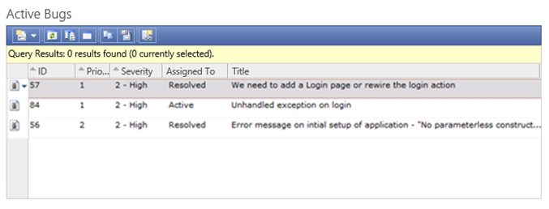
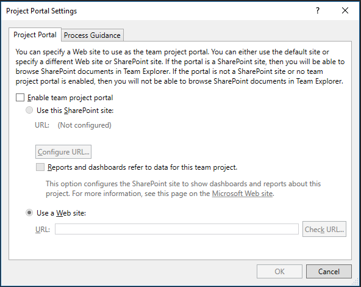

# Features removed when disabling SharePoint integration

[!INCLUDE [temp](../_shared/about-sharepoint-deprecation.md)]


With TFS 2018, we  no longer offer the TFS Extension for SharePoint. For more information, read the [Discontinuing the pre-TFS 2018 SharePoint integration model](./discontinue-pre-tfs-2017-sharepoint-integration.md)

Beginning with TFS 2018, the features that the TFS Extension for SharePoint provided will no longer be available. this article describes each feature being deprecated and proposed replacements.
 
## Creation of a SharePoint site when creating a team project 

With TFS 2017 and earlier versions, when you created a team project, you could choose to create an associated SharePoint site. Going forward, this option will no longer be supported.  

Customers can create a SharePoint site using SharePoint's own interface. SharePoint administrators can [enable site creation for end-users](https://support.office.com/article/Manage-site-creation-in-SharePoint-Online-e72844a3-0171-47c9-befb-e98b23e2dcf9). 

Additionally, Microsoft has introduced [Microsoft Teams](https://products.office.com/microsoft-teams) which allows teams to collaborate on a set of shared resources. Every Team gets a shared SharePoint site, OneNote, and Documents library. 

We already offer [integration with Microsoft Teams](https://blogs.msdn.microsoft.com/visualstudioalm/2016/11/02/microsoft-teams-integration-with-team-services/) for both Azure DevOps Services and TFS. As we look to the future, we are looking for more opportunities to integrate with both Microsoft Teams and SharePoint.
 
## TFS web parts on Classic SharePoint sites
SharePoint web parts display TFS data such as work item summary, recent builds, recent check-ins, and work item queries. These web parts display on classic SharePoint sites but will not display on the latest versions of SharePoint sites offered in SharePoint 2016 or SharePoint Online. Going forward, we will no longer support these SharePoint web parts.

**TFS web parts - summary lists**


**TFS web parts - query-based lists**



After upgrading to TFS 2018 or to SharePoint 2016, your TFS SharePoint sites will look something like this:


Azure DevOps Services and TFS offer [built-in dashboards](../../dashboards.md). Each Azure DevOps Services and TFS team can create any number of dashboards to meet their needs. Here is an example:


We will continue to invest in our built-in dashboards solution. We continue to develop widgets to provide instant insights into your data. Additionally, you can find widgets developed by our partners in the [VSTS Marketplace](https://marketplace.visualstudio.com/search?term=widgets&target=VSTS&category=All%20categories&sortBy=Relevance). 

In the future, we will provide ways of displaying our built-in dashboards on SharePoint pages.


## Display of Excel Reports on a SharePoint site
**Excel Charts continue to display on SharePoint sites, even after disabling SharePoint integration**. You will still be able to create Excel-based charts and host them on SharePoint sites. These charts can still connect to the existing TFS cube to get data. Any existing Excel-based charts hosted on SharePoint sites will continue to work. 

Displaying Excel Charts on a SharePoint site is based on Excel, Office Online Server, and SQL Server Reporting and Analysis technologies. It doesn't require the TFS Extension for SharePoint to operate.

> [!NOTE]   
> If you are upgrading to SharePoint 2016, then Excel Services has been replaced by Office Online Server. To learn more, see [Upgrade from SharePoint 2013 with TFS integration to SharePoint 2016](./upgrade-from-sharepoint2013-to-sharepoint-2106.md).

The TFS Extension for SharePoint did install a SharePoint timer job. When executed, this timer job would detect if:

* The TFS Warehouse or Cube location or name had changed
* The TFS collection name had changed
* The name of the team project associated with a SharePoint site had changed

If any of these changes were made, then it would update the Excel workbook's filters and Data Connection string so the Excel Chart would continue to work. After disabling SharePoint integration, you'll need to update the Excel workbooks manually to reflect the changes. See [How to update an Excel chart on a SharePoint site](./update-excel-chart.md)

## Display of SSRS Reports on a SharePoint site
**SSRS Reports continue to display on SharePoint sites, even after disabling SharePoint integration**. You can still create SSRS reports and host them on SharePoint sites.

Displaying SSRS Reports in SharePoint is based on SharePoint and SQL Server Reporting Services technologies. It doesn't require the TFS Extension for SharePoint to operate. The TFS site used the standard [SharePoint Page Viewer web part](https://support.office.com/article/Display-a-Web-page-on-a-SharePoint-page-by-adding-the-Page-Viewer-Web-Part-7F61FEEC-9B3D-4805-A960-07636BA59527) with a URL to the SSRS Report.

The TFS Extension for SharePoint provides a URL re-director labeled **tfsredirect.aspx**. The URL provided to the Page Viewer web part is formatted as follows:

```
PATHTOCURRENTSITE/_layouts/TfsRedirect.aspx?tf:Type=Report&tf:ReportName=REPORTNAME&tf:ShowToolbar=0&Width=381pt&Height=180pt
```

The **tfsRedirect.aspx** looks up the location of the SQL Services Reporting Server and redirects the URL to display the report. After disabling TFS-SharePoint integration, this redirect functionality will continue to work until you do one of the following:

* Move the location of your SQL Services Reporting Server
* Rename your team project
* Rename your collection

If any of these changes are made, then you can replace the URL in the [Page Viewer web part](https://support.office.com/article/Display-a-Web-page-on-a-SharePoint-page-by-adding-the-Page-Viewer-Web-Part-7F61FEEC-9B3D-4805-A960-07636BA59527) with the full URL to the SSRS Report. See [How to update a SSRS report on a SharePoint site](./update-ssrs-report.md) 

## Quick links on a SharePoint site
Quick links are listed on the left side navigation pane of a TFS SharePoint site. Quick links were supported by **tfsRedirect.aspx**. TFS SharePoint sites were created with the following Quick Links: 

* Team Web Access&mdash;Links to the TFS web access URL
* Reports&mdash;Links to the SQL Server Reporting Services (SSRS) Reports location
* Process Guidance&mdash;Links to process guidance topic, based on the project's current process.

These links will no longer work after you disable the SharePoint integration. You will need to either edit the links to point to the correct location, or delete them.

## Manage a Documents library using the Team Explorer Documents pane
If you have [configured a SharePoint site for a team project](../../../report/sharepoint-dashboards/configure-or-add-a-project-portal.md?toc=/azure/devops/report/sharepoint-dashboards/toc.json&bc=/azure/devops/report/sharepoint-dashboards/breadcrumb/toc.json), Team Explorer displays a Documents pane to allow you to manage the Documents libraries on that SharePoint site. 

Going forward, the Documents pane within Team Explorer will no longer be supported. 


We encourage customers to use [the OneDrive for Business sync client](https://support.office.com/article/Get-started-with-the-new-OneDrive-sync-client-in-Windows-615391c4-2bd3-4aae-a42a-858262e42a49), which works for both [SharePoint 2016](https://technet.microsoft.com/library/dn232145(v=office.16).aspx) and SharePoint Online. The OneDrive for Business sync client lets you select any SharePoint document library and sync the files to your local computer. The user can edit the files using Windows File Explorer, and changes are synced back to SharePoint. 

OneDrive for Business works for both Windows and [macOS](https://support.office.com/article/Get-started-with-the-new-OneDrive-sync-client-on-Mac-OS-X-d11b9f29-00bb-4172-be39-997da46f913f), and provides [mobile apps](https://onedrive.live.com/about/download/) for iOS, Android, and Windows Phone. 

Additionally, if you are using [Microsoft Teams](https://products.office.com/microsoft-teams), it provides easy access to the team's Documents.

## Project portal settings
Project portal settings that you configure from the Team Explorer pane allow you to configure the Project Portal link. It could point to a SharePoint site or any Web site. After disabling SharePoint integration, you will not be able to specify a SharePoint site. The Project Portal link only appeared on the Documents Pane. 



## Process guidance settings
Additionally, you could define the location of Process Guidance as a SharePoint site or any Web site. After disabling SharePoint integration, you will not be able to specify a SharePoint site. The Process Guidance link was used by Quick Links on the TFS SharePoint site. You may want to remove those links from your SharePoint sites or replace them with a hyperlink to your process guidance. 


