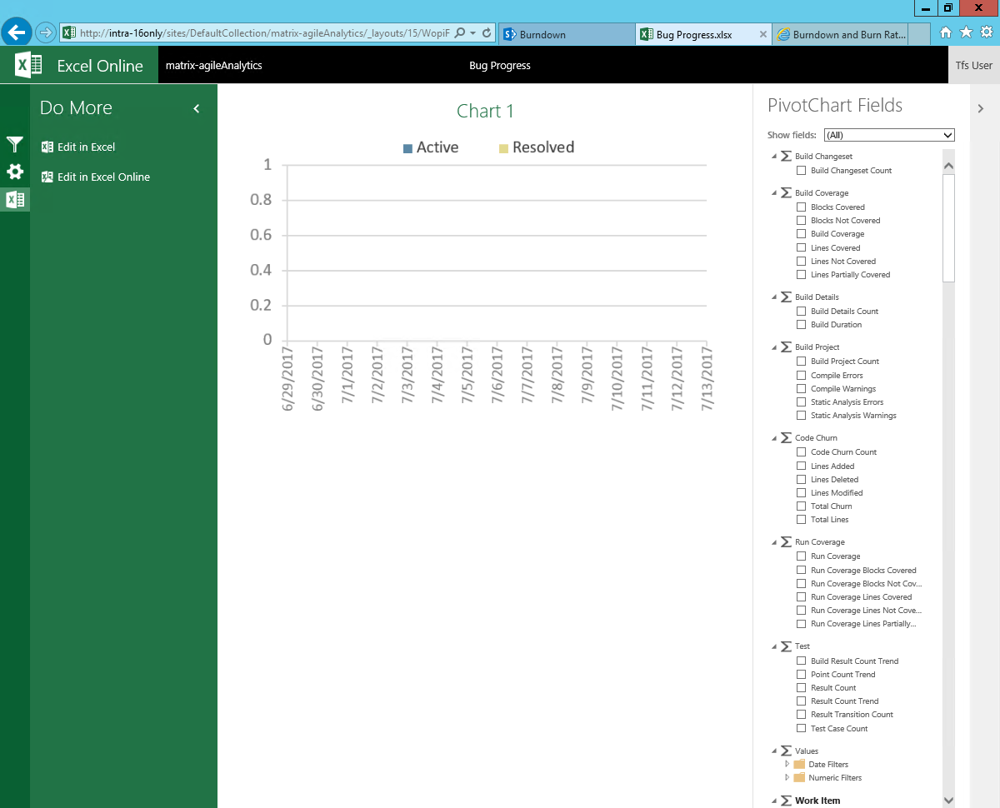
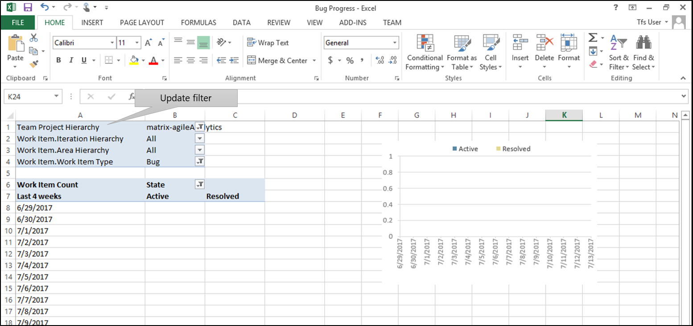
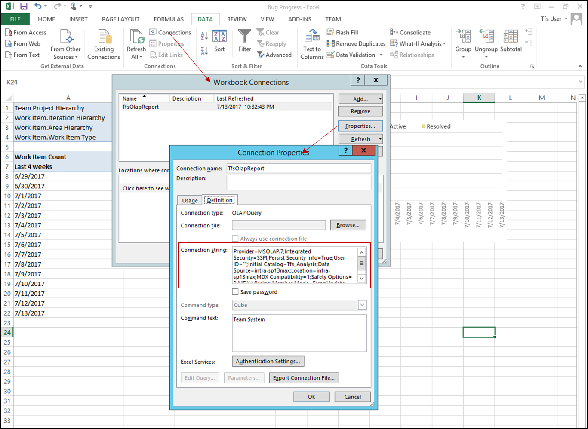

# Update Excel Chart after SharePoint integration is disabled

[!INCLUDE [temp](../_shared/about-sharepoint-deprecation.md)]

Excel charts continue to work, even after disabling SharePoint integration. Displaying Excel Charts on SharePoint is based on Excel, Office Online Server, and SQL Server Reporting and Analysis technologies. It doesn't require the TFS Extension for SharePoint to operate. 

The TFS Extension for SharePoint did install a SharePoint timer job. When executed, this timer job would detect if:
* The TFS Warehouse or Cube location or name had change
* The TFS collection name had changed
* The name of the team project associated with a SharePoint site had changed

If any of these changes were made, then it will update the Excel workbook's filters and Data Connection string so that the Excel charts will continue to work.

With SharePoint integration disabled, the timer job no longer exists. Therefore, if any of the above changes are made, you'll need to update the filters and Data Connection string manually.

Follow these steps to update the Data Connection string:

1.	Click the Chart Title to open the Excel workbook. 

    

2.	Edit the workbook using Excel

    

3.	If the team project name has changed, update the "Team Project Hierarchy" filter:

    

4.	If the location or name of the TFS cube has changed, update the Data Connection string:

    

    Update the connection string to match the new server location and/or name of your TFS cube:

```
Provider=MSOLAP.7;Integrated Security=SSPI;Persist Security Info=True;User ID="";Initial Catalog=Tfs_Analysis;Data Source=<**DATABASENAME**>;Location=<**SERVERNAME**>;MDX Compatibility=1;Safety Options=2;MDX Missing Member Mode=Error;Update Isolation Level=2
```

## Related articles
* [Upload and refresh Excel reports in the team project portal](../upload-refresh-excel-reports.md)
