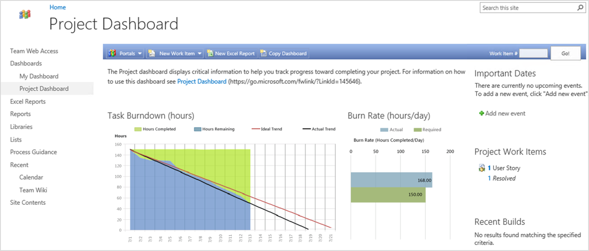

# Update SSRS Report after SharePoint is disabled

[!INCLUDE [temp](../_shared/about-sharepoint-deprecation.md)]

Displaying SSRS Reports on a SharePoint will continue to work, even after disabling SharePoint integration. Displaying SSRS Reports in SharePoint is based on SharePoint and SQL Server Reporting Services technologies. It doesn't require the TFS Extension for SharePoint to operate. 



The TFS site used the standard [SharePoint Page Viewer web part](https://support.office.com/article/Display-a-Web-page-on-a-SharePoint-page-by-adding-the-Page-Viewer-Web-Part-7F61FEEC-9B3D-4805-A960-07636BA59527) with a URL to the SSRS Report.

The TFS Extension for SharePoint provided a URL re-director called *tfsRedirect.aspx* which would look up the location of the SQL Services Reporting Server and redirect to the URL to display the report. If you edited the properties of the Page Viewer web part hosting the SSRS report, you would see a URL that looks something like this:

```
PATHTOCURRENTSITE/_layouts/TfsRedirect.aspx?tf:Type=Report&tf:ReportName=REPORTNAME&tf:ShowToolbar=0&Width=381pt&Height=180pt
```

Installing TFS Disconnector for SharePoint replaces *tfsRedirect.aspx* with a version that will continue to work until you do one of the following:
* Move the location of your SQL Services Reporting Server
* Rename your team project
* Rename your collection

If any of these changes are made, then you must replace the URL in the Page Viewer web part with the **full URL to the SSRS Report**. 

Follow these steps to replace the URL:

1. Edit the Page Viewer web part
1. Paste the following into the URL field
```
http://REPORTSERVER/ReportServer?%2fTfsReports%2fCOLLECTIONNAME%2fPROJECTNAME%2fDashboards%2fREPORTNAME&rc%3aToolbar=false
```
3. Replace **REPORTSERVER** with the name of your TFS SSRS server
1. Replace **COLLECTIONNAME** with the name of the TFS Collection. Typically, this is "DefaultCollection"
1. Replace **PROJECTNAME** with the name of your team project
1. Replace **REPORTNAME** with the name of your report.

    **NOTE**: You are building a URL. If any of the above replacements have spaces in the name, you'll need to replace the space with "%20" to ensure it is a well-formed URL. For example "My Team Project" would be "My%20Team%20Project". 

1. Save your changes to the PageViewer web part.

## Related articles
* [SSRS Report URL Access Parameter Reference](/sql/reporting-services/url-access-parameter-reference)