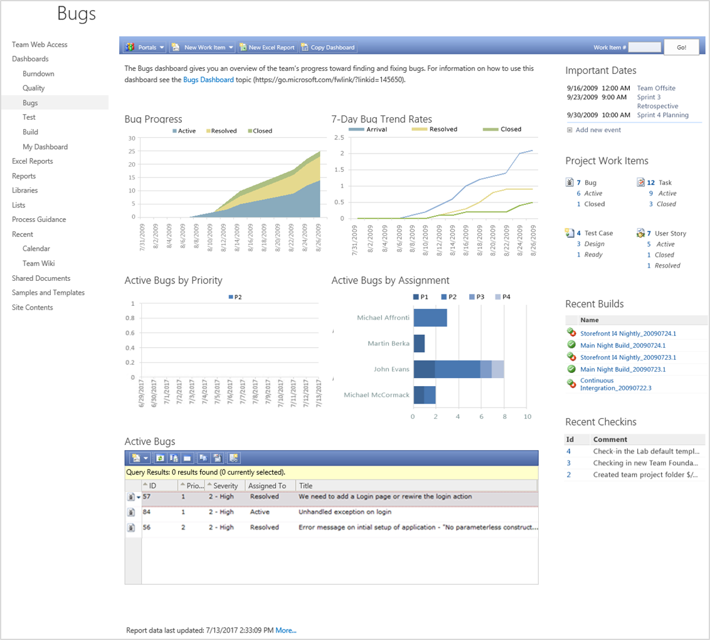
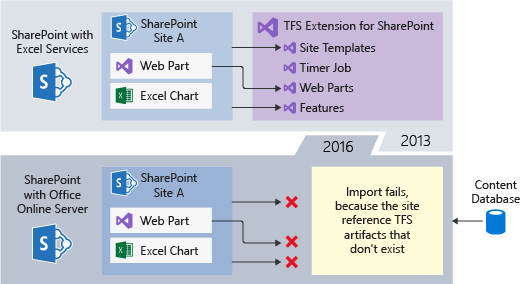
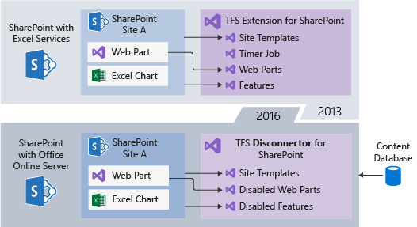

# Upgrade from SharePoint 2013 with TFS integration to SharePoint 2016

[!INCLUDE [temp](../../_shared/tfs-sharepoint-version.md)]

With TFS 2017, the TFS Extension for SharePoint supports SharePoint 2010 and 2013, but does not support SharePoint 2016. For more information, read [Discontinue the TFS 2017 (and earlier) SharePoint integration](./discontinue-pre-tfs-2017-sharepoint-integration.md). 

Customers that have TFS 2017 with integration configured for SharePoint 2013 need an upgrade path to SharePoint 2016. This upgrade path needs to provide a way to upgrade "away" from the old-style integration.

If you are upgrading from TFS 2017, or prior version, to TFS 2018, please see [Disable SharePoint integration after TFS 2018 upgrade](./disable-tfs-sharepoint-integration-after-tfs-2018-upgrade.md)

**Please refer to the SharePoint topic: [Upgrade to SharePoint Server 2016](https://technet.microsoft.com/library/cc303420%28v=office.16%29.aspx), for full instructions on upgrading your SharePoint server.** The instructions below provide additional guidance to ensure the TFS SharePoint sites are functional after upgrading to SharePoint 2016.

## Overview of problem

To configure TFS 2017 with SharePoint integration, you must have installed the TFS Extension for SharePoint on the SharePoint 2013 server. You may or may not have had Excel Services configured. Excel Services enabled Excel Charts to be displayed on a SharePoint site. On your SharePoint 2013 server, you may have several TFS SharePoint sites which use web parts, display Excel charts, and refer to TFS site templates.


In this configuration, with Excel Services configured, your TFS sites on SharePoint 2013 would look similar to the following image.  



To upgrade to SharePoint 2016, you must first set up a SharePoint 2016 Server. [Excel Services was deprecated in SharePoint 2016](https://technet.microsoft.com/library/mt346112%28v=office.16%29.aspx) and replaced with Office Online Server. If you had Excel Services configured in SharePoint 2013, then you will need to [configure Office Online Server](https://technet.microsoft.com/library/ff431687%28v=office.16%29.aspx) to ensure Excel Charts continue to display on the TFS SharePoint sites. See [References for configuring Office Online Server for SharePoint 2016](#references) later in this article for more information.

The first step is to set up a SharePoint 2016 server. 


The next step is to export the SharePoint content database from SharePoint 2013. 


The next step would normally be to import the SharePoint content database into SharePoint 2016. 



The import validation step fails, because the TFS SharePoint sites are referencing TFS artifacts that don't exist on the SharePoint 2016 server, such as site templates, web parts, and features.

The types of errors displayed on import are:

```
=========================================================================================================================
Category        : MissingSiteDefinition
Error           : True
UpgradeBlocking : False
Message         : 2 Sites in database [WSS_Content] have reference(s) to a missing site definition, Id = [12001], Lcid
                  = [1033], compatibility level = [15].
Remedy          : The site definition with Id 12001 is referenced in the database [WSS_Content], but is not installed
                  on the current farm for sites with compatibility level 15. The missing site definition may cause
                  upgrade to fail. Please install any solution which contains the site definition and restart upgrade
                  if necessary.

=========================================================================================================================
Category        : MissingFeature
Error           : True
UpgradeBlocking : False
Message         : Database [WSS_Content] has reference(s) to a missing feature: Id =
                  [a654fec6-ae10-43f4-8730-076ea76a36e9], Name = [Team Foundation Server Agile Reports], Description =
                  [], Install Location = [TfsDashboardAgileReports].
Remedy          : The feature with Id a654fec6-ae10-43f4-8730-076ea76a36e9 is referenced in the database
                  [WSS_Content], but is not installed on the current farm. The missing feature may cause upgrade to
                  fail. Please install any solution which contains the feature and restart upgrade if necessary.
=========================================================================================================================
Category        : MissingSetupFile
Error           : True
UpgradeBlocking : False
Message         : File [Features\TswaWebParts\WebParts\WorkItemSummary.webpart] is referenced [1] times in the
                  database [WSS_Content], but is not installed on the current farm. Please install any
                  feature/solution which contains this file.
Remedy          : One or more setup files are referenced in the database [WSS_Content], but are not installed on the
                  current farm. Please install any feature or solution which contains these files.
=========================================================================================================================
Category        : MissingWebPart
Error           : True
UpgradeBlocking : False
Message         : WebPart class [bda9196d-87dc-18f4-469b-1c42dd26bfa7] (class
                  [Microsoft.TeamFoundation.WebAccess.WebParts.WorkItemSummaryWebPart] from assembly
                  [Microsoft.TeamFoundation.WebAccess.WebParts, Version=15.0.0.0, Culture=neutral,
                  PublicKeyToken=b03f5f7f11d50a3a]) is referenced [12] times in the database [WSS_Content], but is not
                  installed on the current farm. Please install any feature/solution which contains this web part.
Remedy          : One or more web parts are referenced in the database [WSS_Content], but are not installed on the
                  current farm. Please install any feature or solution which contains these web parts.
=========================================================================================================================
```

## Steps for solution
The solution is to install the TFS Disconnector for SharePoint on the SharePoint 2016 server first. To do this, follow these steps:

1. Execute the guidelines described in [Upgrade to SharePoint Server 2016](https://technet.microsoft.com/library/cc303420%28v=office.16%29.aspx), until you get to the "[Verify custom components](https://technet.microsoft.com/library/cc263299%28v=office.16%29.aspx)" step. 
1. Download the [TFS Disconnector for SharePoint](https://go.microsoft.com/fwlink/?linkid=854633) to the SharePoint 2016 server. Unzip the files. You will be running script-2016.ps1 later.

   *The TFS Disconnector for SharePoint was last updated on Sep 9, 2017. Support for non-English was added.*

1. Run "SharePoint 2016 Management Shell" as administrator. 
1. From the shell, run script-2016.ps1 and answer all the prompts.
1. Open Central Administration -> Monitoring -> Check Job Status -> Running section and verify that the uninstall jobs finished prior to proceeding
1. Proceed with "[Verify custom components](https://technet.microsoft.com/library/cc263299%28v=office.16%29.aspx)" step. 

> [!NOTE] 
> If you have problems running the scripts, please reach out to Customer Support. 
>
> Go to the [Team Foundation Server support page](https://support.microsoft.com/getsupport?oaspworkflow=start_1.0.0.0&wf=0&wfName=productselection&gprid=10453&ccsid=636125714937824749), select the appropriate TFS version, then select "SharePoint Integration" as the Problem Type. Our support team will work with you to resolve the issue as quickly as possible. 

This installs all the required references for TFS Sites to display properly, while disabling TFS/SharePoint integration. 


After the TFS Disconnector for SharePoint is installed, you can then successfully import the SharePoint 2013 content database:



After the upgrade, your TFS SharePoint sites will display, but all integration functionality is disabled. This is what the site would look like after the upgrade:


<a id="references" />
## References for configuring Office Online Server for SharePoint 2016
Deploying Office Online Server requires a considerable amount of configuration. We recommend you familiarize yourself with the topics below to ensure a successful deployment.

* [Deploy Office Online Server](https://technet.microsoft.com/library/jj219455%28v=office.16%29.aspx)
* [Configure Office Online Server for SharePoint Server 2016](https://technet.microsoft.com/library/ff431687%28v=office.16%29.aspx)
* [Configure server-to-server authentication between Office Online Server and SharePoint Server 2016](https://technet.microsoft.com/library/mt346470%28v=office.16%29.aspx)
* [Configure an Analysis Services (data model) server for Excel Online](https://technet.microsoft.com/library/jj219698%28v=office.16%29.aspx#SSAS)
* [Configure Analysis Services and Kerberos Constrained Delegation (KCD)](/sql/analysis-services/instances/install-windows/configure-analysis-services-and-kerberos-constrained-delegation-kcd)
* [ExcelWarnOnDataRefresh](https://technet.microsoft.com/library/jj219442.aspx)


