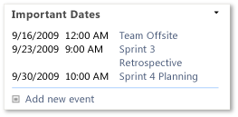
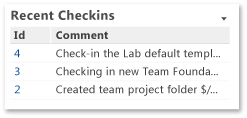

# My Dashboard (Agile and CMMI)

[!INCLUDE [temp](../_shared/tfs-sharepoint-version.md)]

You can monitor your tasks and quickly access work items that are assigned to you by using My Dashboard. You can use this dashboard to answer the following questions:  
  
-   What is the next set of tasks, bugs, or test cases that I should act on?  
  
-   What is the status of the team's most recent builds?  
  
 **Requirements**  
  
 See requirements listed in [Project portal dashboards](project-portal-dashboards.md).  
  
##   Data that appears in the dashboard  
 You can use My Dashboard to review and access your work items. To learn about the Web Parts that are displayed on My Dashboard, refer to the illustration and the table that follow. You can open the list of Tasks, Bugs, and Test Cases in either Team Web Access or Team Explorer by using one of the following team queries: My Tasks, My Bugs, or My Test Cases.  
  
   
  
|Web Part|Data displayed|  
|--------------|--------------------|  
||**My Tasks**: List of all tasks that are not closed and that are assigned to the team member who is logged on to the site. This list is derived from the My Tasks shared query.|  
||**My Bugs**: List of all bugs that are not closed and that are assigned to the team member who is logged on to the site. This list is derived from the My Bugs shared query.|  
||**My Test Cases**: List of all test cases that are not closed and that are assigned to the team member who is logged on to the site. This list is derived from the My Test Cases shared query.|  
||List of upcoming events. This list is derived from a SharePoint Web Part.   |  
||Count of active, resolved, and closed work items. You can open the list of work items by choosing each number. This list is derived from a Team Web Access Web Part.   |  
||List of recent builds and their build status. You can view more details by choosing a specific build. This list is derived from a Team Web Access Web Part.      **Legend**:   : Build not started   : Build in progress   : Build succeeded   : Build failed   : Build stopped   : Build partially succeeded|  
||List of the most recent check-ins. You can view more details by choosing a specific check-in. This list is derived from a Team Web Access Web Part.   |  
  
##   Required work item tracking activities  
 For the reports that My Dashboard shows to be useful and accurate, the team must perform the following activities:  
  
-   Define tasks, bugs, and test cases, and assign each work item to the team member who is currently working to resolve or close it.  
  
-   Update the **State** of each work item the team fixes, verifies, and closes it.  
  
## Related notes 
 [Project portal dashboards](project-portal-dashboards.md)