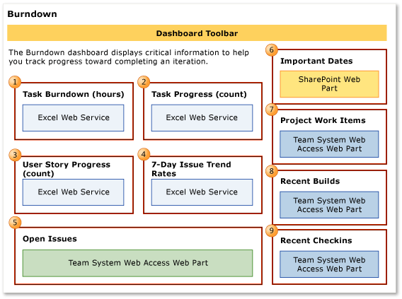

# Progress dashboard (Agile and CMMI)

[!INCLUDE [temp](../_shared/tfs-sharepoint-version.md)]

You can use the Progress dashboard to track team progress toward completing an iteration. This dashboard displays four reports that help you monitor progress, burndown, and issues.  

**You can use this dashboard to answer the following questions**:
- Is the team likely to finish the iteration on time?  
- Will the team complete the planned work based on the current burndown?  
- How much progress has the team made on implementing user stories or requirements in the past four weeks?  
- How quickly is the team identifying and closing Issues?  
- What were the most recent check-ins?  
  

**Requirements**  
  
 Same requirements defined in [Project portal dashboards](project-portal-dashboards.md).  
  
##   Data displayed in the dashboard  
 You can use the Progress dashboard to understand how much progress the team is making toward completing user stories, tasks, and issues. To learn about the Web Parts that are displayed on the Progress dashboard, refer to the illustration and the table that follow.  
  
 **Agile process template version**  
  
   
  
 **CMMI process template version**  
  
   
  
> [!NOTE]  
>  Burndown, progress, and trend charts, reports  through , do not appear when the server that hosts Analysis Services for the team project is not available.  
  
 For more information about how to interpret, update, or customize the charts that appear in the Progress dashboard, see the topics that are listed in the following table.  
  
|Web Part|Data displayed|  
|--------------|--------------------|  
||[Burndown](../excel/burndown-excel-report.md)   A visual representation of the cumulative count of all hours that the team spent on all tasks for the past four weeks.      The **Ideal Trend** line calculates a slope or trajectory for when work will be completed based on the amount of work remaining and the end date of the report. The line is drawn from the remaining work on the start date to intersect the x-axis on the end date.|  
||[Task Progress](../excel/task-progress-excel-report.md)   A visual representation of the cumulative count of all active and closed tasks for the past four weeks.   |  
||[User Story Progress](../excel/user-story-progress-excel-report-agile.md)   [Requirements Progress](../excel/requirements-progress-excel-report-cmmi.md)   A visual representation of the cumulative count of all user stories (Agile) or requirements (CMMI), grouped by their state, for the past four weeks.   |  
||[Issue Trends](../excel/issue-trends-excel-report.md)   Line chart that shows the rolling average of the number of Issues that the team has opened and closed for the past four weeks. The rolling average is based on the seven days before the date for which it is calculated.   |  
||[Issues Workbook](workbooks.md)   Query results list of active issues.|  
||List of upcoming events. The list is derived from a SharePoint Web Part.   |  
||Count of active, resolved, and closed work items. You can open the list of work items by choosing each number.   |  
||List of recent builds and their status. You can view more details about a specific build by choosing it.      See also [Run, monitor, and manage](../../pipelines/overview.md).|  
||List of the most recent check-ins. You can view more details about a specific check-in by choosing it.      See also [Manage pending changes](../../repos/tfvc/develop-code-manage-pending-changes.md).|  
  
##   Required activities for tracking progress  
 For the reports that appear in the Progress dashboard to be useful and accurate, the team must perform the following activities:  
  
-   Define user stories, tasks, and issues.  
  
-   Specify and update the **Completed** and **Remaining** fields for each Task as the team works on it.  
  
    > [!IMPORTANT]
    >  If you subdivide a task into subtasks, specify hours only for the subtasks. These hours are rolled up as summary values for the parent task and user story.  
  
-   Update the **State** of each task, user story, and issue as it progresses from **Active** to **Closed**.  
  
-   (optional) Specify the **Iteration** and **Area** paths for each work item if you want to filter by those fields.  
  
##   Track an iteration  
 By using the Progress dashboard, product owners and the team can view the team's progress and determine whether the team is making enough progress, delivering value by closing user stories, and implementing the iteration based on the iteration plan.  
  
###   Modify the Task Burndown report for an iteration  
 To track an iteration by using the Progress dashboard, you must modify the Task Burndown report in Office Excel to reflect the start date for your iteration. By default, the start date is five days before the current date.  
  
> [!NOTE]
>  The progress and trend reports,  through , display data for the previous four weeks. You can change the time interval for these reports by modifying the corresponding report in Office Excel.  
  
##### To modify the Task Burndown report to correspond to a specific iteration  
  
1.  In the dashboard navigation panel, choose **Excel Reports**.  
  
2.  Check out the Burndown file.  
  
3.  On the Reports worksheet, choose the  down arrow in the cell to the right of Work Item.Iteration Hierarchy, expand the selections, and then select the check box of the iteration that you want to track.  
  
4.  (Optional) Click the  down arrow in the cell to the right of Work Item.Area Hierarchy, expand the selections, and then select the check box of the product area that you want to track.  
  
5.  In the cell under **Date**, specify the start date of the time interval in either mm/dd or mm/dd/yyyy format.  
  
6.  Click the cell that contains the start date that you just specified, and then drag the fill handle across the cells that you want to fill.  
  
7.  (Optional) Use the **Auto Fill Options** button  to specify how to fill the selection.  
  
     For example, you can specify **Fill Series** or **Fill Weekdays**.  
  
8.  Click the **Data** tab.  
  
9. In the **Connections** group, choose **Refresh All**, and verify that the report is refreshed.  
  
10. Save and close the report.  
  
11. Check in the report to the SharePoint site.  
  
12. Return to the Progress dashboard, and refresh your browser window to display the most recent reports.  
  
###   Monitor progress  
 To monitor team progress, you can review the **Task Burndown (hours)**, **Task Progress (count)**, and **User Story Progress (count)** or **Requirement Progress (count)** reports for the following types of indicators:  
  
-   **Has Completed Work stopped increasing in the Task Burndown (hours) report?**  
  
     One or more issues might be blocking progress or the team might not be resolving and closing work items that it has completed, fixed, and verified.  
  
-   **Has the number of active Tasks or active or resolved user stories stopped increasing?**  
  
     This situation warrants additional investigation. When the team appears to make no progress over several days in either the **Task Progress (count)** or **User Story Progress (count)** reports, the team might be blocked or the team might not be resolving and closing work items that it has completed, fixed, and verified. You should investigate the cause because it could hinder the team's ability to meet the iteration plan and project schedule.  
  
-   **Is the team adding or expanding the scope of work during the iteration?**  
  
     Significant increases over time to the amount of Remaining Work or to the number of active tasks or user stories may indicate poor estimations or scope creep. That is, either the team did not accurately estimate the work at the start of the iteration or the team added features after the iteration started. When required effort is larger than estimated effort, team members might be underestimating the difficulty, time, or other factors. You should investigate the root causes. For example, you might want to determine how granular the tasks are.  
  
-   **Do changes in the reports match your expectations?**  
  
     Dashboard reports reflect work that the team is tracking. You should expect the reports to change according to the decisions and changes that the team makes about the work. If the team reallocates work to another iteration or decides to add work for an iteration, reports on the Progress dashboard should reflect those decisions.  
  
 If the slope of the **Remaining Work** is progressing near or under the **Ideal Trend** line, the team is executing well against the iteration plan. However, if the **Remaining Work** slope is higher than the **Ideal Trend** line, the team will probably not complete all planned tasks before the end of the iteration.  
  
###   Monitor issues  
 Because issues can block or impede team progress, you should track them as the team identifies them, and you should monitor how quickly the team addresses them. You can use the **7-Day Issue Trend Rate** and the Open Issues report to review any issues that have an impact on the team. Specifically, you can find answers to the following questions:  
  
-   How often is the team identifying issues?  
  
-   Is the team resolving issues as quickly as it is identifying them?  
  
 If the team identifies more issues than it can address, the Issue Trends report will show that the team is closing issues at a lower rate. The team might need to reexamine priorities to determine whether the issues are actually problems that it should address or if it can ignore them.  
  
## Related notes

- [Define area paths](../../organizations/settings/set-area-paths.md) or [Define iteration paths](../../organizations/settings/set-iteration-paths-sprints.md) 