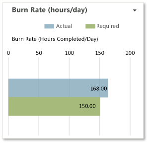

# Project dashboard (Agile and CMMI)

[!INCLUDE [temp](../_shared/tfs-sharepoint-version.md)]

You can use the Project dashboard to track team progress toward completing an iteration. This dashboard displays data that helps you monitor task burndown, burn rate, and the product backlog.  

**You can use this dashboard to answer the following questions**:   -   Is the team likely to finish the iteration on time? -   Will the team complete the planned work based on the current burn rate? -   What were the most recent check-ins?  
  
 **Requirements**  
  
 Same requirements defined in [Project portal dashboards](project-portal-dashboards.md).  
  
##   Data displayed in the dashboard  
 You can use the Project dashboard to understand how much progress the team is making toward completing tasks. To learn about the Web Parts that are displayed on the Project dashboard, refer to the illustration and the table that follow.  
  
   
  
> [!NOTE]
>  Burndown and burn rate charts, reports  and , do not appear when the server that hosts Analysis Services for the team project is not available.  
  
 For more information about how to interpret, update, or customize the charts that appear in the Project dashboard, see the topics that are listed in the following table:  
  
|Web Part|Data displayed|Related topic|  
|--------------|--------------------|-------------------|  
||A visual representation of the cumulative count of all hours that the team spent on all task work items for the past four weeks.      The **Ideal Trend** line calculates a slope or trajectory for when work will be completed based on the amount of work remaining and the end date of the report. The line is drawn from the remaining work on the start date to intersect the x-axis on the end date.|[Burndown and Burn Rate](../sql-reports/burndown-and-burn-rate-report.md)|  
||Bar chart that shows the actual and required burn rate of the team. The burn rate shows how quickly the team is actually completing planned work and what the rate must be to complete the currently active tasks on schedule.   |[Burndown and Burn Rate](../sql-reports/burndown-and-burn-rate-report.md)|  
||Team Web Access list of active user stories.|[User Story Progress](../excel/user-story-progress-excel-report-agile.md)|  
||List of upcoming events. The list is derived from a SharePoint Web Part.   |Not applicable|  
||Count of active, resolved, and closed work items. You can open the list of work items by choosing each number. This list is derived from a Team Web Access Web Part.   |Not applicable|  
||List of recent builds and their status. You can view more details about a specific build by choosing it. This list is derived from a Team Web Access Web Part.      **Legend**:   : Build not started   : Build in progress   : Build succeeded   : Build failed   : Build stopped   : Build partially succeeded|[Run, monitor, and manage](../../pipelines/overview.md)|  
||List of the most recent check-ins. You can view more details about a specific check-in by choosing it. This list is derived from a Team Web Access Web Part.   |[Manage pending changes](../../repos/tfvc/develop-code-manage-pending-changes.md)|  
  
##   Required activities for tracking task burndown and burn rate  
 For the reports that appear in the Project dashboard to be useful and accurate, the team must perform the following activities:  
  
-   Define tasks.  
  
-   Specify and update the **Completed** and **Remaining** fields for each task as the team works on it.  
  
    > [!IMPORTANT]
    >  If you subdivide a task into subtasks, specify hours only for the subtasks. These hours are rolled up as summary values for the parent task and the user story.  
  
-   Update the **State** of each task as it progresses from **Active** to **Closed**.  
  
-   (optional) Specify the **Iteration** and **Area** paths for each work item if you want to filter by those fields.  
  
##   Track an iteration  
 By using the Project dashboard, product owners and the team can view the team's progress and determine whether the team is making sufficient progress.  
  
###   Modify the Task Burndown Report for an iteration  
 To track an iteration by using the Project Dashboard, you must modify the parameters for the Task Burndown and Burn Rate reports in Report Manager to reflect the start and end dates for your iteration. By default, the start date is five days before the current date.  
  
##### To modify the Task Burndown and Burn Rate reports to correspond to a specific iteration  
  
1.  In the dashboard navigation panel, choose **Reports**.  
  
2.  In Report Manager, choose **Dashboards**, and then choose **Burndown**.  
  
3.  Choose **Properties**, and then choose **Parameters**.  
  
4.  For the **StartDateParam** parameter, choose **Override Default**, and type the iteration start date in the text box with the format mm/dd/yyyy.  
  
5.  For the **EndDateParam** parameter, choose **Override Default**, and type the iteration end date in the text box with the format mm/dd/yyyy.  
  
6.  Choose **Apply**.  
  
7.  At the top of Report Manager, choose the **Dashboards** navigation link, and then choose **Burn Rate**.  
  
8.  Repeat steps 3 through 6.  
  
9. Return to the Project Dashboard, and refresh the browser.  
  
10. Verify that the **Task Burndown** chart shows the new start and end dates.  
  
##### To switch between displaying work hours and number of work items in the Task Burndown or Burn Rate reports  
  
1.  In the dashboard navigation panel, choose **Reports**.  
  
2.  In Report Manager, choose **Dashboards**, and then choose **Burndown** or **Burn Rate**.  
  
3.  Choose **Properties**, and then choose **Parameters**.  
  
4.  In the **YAxis** list, choose one of the following options:  
  
    -   **Hours of Work** displays the cumulative number of work hours for all tasks that are defined for the iteration.  
  
    -   **Number of Work Items** displays the cumulative number of work items, grouped by state, that are defined for the iteration.  
  
5.  Choose **Apply**.  
  
##### To display different trend lines in the Task Burndown report  
  
1.  In the dashboard navigation panel, choose **Reports**.  
  
2.  In Report Manager, choose **Dashboards**, and then choose **Burndown**.  
  
3.  Choose **Properties**, and then Choose **Parameters**.  
  
4.  In the **TrendLineParameter** list, choose one of the following options:  
  
    -   **Display Actual** displays a band that is based on the actual burndown. The band intersects the x-axis when the iteration is expected to finish.  
  
    -   **Display Ideal** displays a straight line from the remaining work at the start date to the x-axis on the end date.  
  
    -   **Display Both** displays both the actual and ideal trend lines.  
  
    -   **None** does not display a trend line.  
  
5.  Choose **Apply**.  
  
6.  Return to the Project Dashboard, and refresh the browser.  
  
###   Monitor progress  
 To monitor team progress, you can review the **Task Burndown (hours)** report for the following types of indicators:  
  
-   **Has Completed Work stopped increasing in the Task Burndown (hours) report?**  
  
     One or more issues might be blocking progress or the team might not be resolving and closing work items that it has completed, fixed, and verified.  
  
-   **Is the team adding or expanding the scope of work during the iteration?**  
  
     Significant increases over time to the amount of Remaining Work may indicate poor estimations or scope creep. That is, either the team did not accurately estimate the work at the start of the iteration or the team added features after the iteration started. When required effort is larger than estimated effort, team members might be underestimating the difficulty, time, or other factors. You should investigate the root causes. For example, you might want to determine how granular the Tasks are.  
  
-   **Do changes in the reports match your expectations?**  
  
     Dashboard reports reflect work that the team is tracking. You should expect the reports to change according to the decisions and changes that the team makes about the work. If the team reallocates work to another iteration or decides to add work for an iteration, those one or more reports on the Project dashboard should reflect those decisions.  
  
 If the slope of the **Remaining Work** is progressing near or under the **Ideal Trend** line, the team is executing well against the iteration plan. However, if the **Remaining Work** slope is higher than the **Ideal Trend** line, the team will probably not complete all planned tasks before the end of the iteration.  
  
## Related notes 
 [Project portal dashboards](project-portal-dashboards.md)