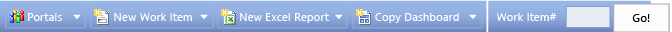

# Project portal dashboards

[!INCLUDE [temp](../_shared/tfs-sharepoint-version.md)]

Teams can quickly find important information about their team projects by using dashboards. Dashboards show project data, support investigation, and provide tools for teams to quickly perform common tasks.  
  
> [!TIP]  
>  See [Dashboards](../dashboards.md) for information about creating dashboards in the web portal. If you work in Azure DevOps, you can also [Create Power BI dashboards and reports](https://visualstudio.microsoft.com/get-started/report/report-on-vso-with-power-bi-vs). this article discusses SharePoint site dashboards.  
  
 To view a dashboard, choose **Go to project portal** from the **Documents** page in Team Explorer.  
  
 **Requirements**  
  
-   To view dashboards, your team project must have a [project portal enabled and be associated with a SharePoint site](configure-or-add-a-project-portal.md). To view the project portal, you must also be a member of the **Visitors** or **Members** group for the portal.   
-   PivotChart reports and Excel Web Access Web Parts that appear in dashboards require that your team project is provisioned with SQL Server Analysis Services.    
-   To update or refresh [Excel reports](../excel/excel-reports.md) that appear in the dashboard, you must belong to a group that is granted access to the Single Sign-on enterprise application definition, or you must belong to the **TfsWarehouseDataReaders** security role in  SQL Server Analysis Services.    
-   To view the dashboard, you must be assigned or belong to a group that has been assigned **Read** permissions in SharePoint Products for the team project. See [Set SharePoint site permissions](../../organizations/security/set-sharepoint-permissions.md).  
-   To create or modify work items from the dashboard, you must be a member of the **Contributors** group or your **Edit work items in this node** permissions must be set to **Allow**. See [Add users to team projects](../../organizations/security/set-sharepoint-permissions.md).  
  
##   Dashboards available to you  
 The dashboards that are available to you depend on the version of SharePoint Products that is installed on your portal and the process template used to create your team project. The following dashboards are installed with the Agile and CMMI process templates. When you create a team project with the Scrum process template, you only have access to the [Release dashboard](release-scrum.md).  
  
|Task|SharePoint Server Standard Edition|SharePoint Server Enterprise Edition|  
|----------|----------------------------------------|------------------------------------------|  
|**Quickly access work items that are assigned to you**. Use [My dashboard](my-dashboard-agile-cmmi.md) to view and open the bugs, tasks, and test cases that are assigned to you.|||  
|**Review progress with the team**. Use the [Project dashboard](project-dashboard-agile-cmmi.md) to view team status and progress and to answer the following questions:   -   Is the team on track? -   Is the team likely to finish the iteration on time? -   Will the team complete the planned work based on the current burn rate?|||  
|**Track progress toward completing an iteration**. Use the [Progress dashboard](progress-dashboard-agile-cmmi.md) to view its own progress and to answer the following questions:   -   Is the team on track? -   Is the team delivering value (closing stories)? -   How well did the team plan the iteration? -   How many hours remain in the iteration? -   How much work has been added to the iteration?|||  
|**Troubleshoot software quality issues with the team**. Use the [Quality dashboard](quality-dashboard-agile-cmmi.md) to view the quality of the software and to answer the following questions:   -   Is the team testing the correct functionality? -   Is the team fixing bugs effectively? -   Are tests stale? -   Does the team have sufficient tests?|||  
|**Monitor test progress and find gaps in test coverage**. Use the [Test dashboard](test-dashboard-agile-cmmi.md) to track the team's progress toward testing user stories or requirements and to answer the following questions:   -   Is authoring of test cases on track? -   Is the team analyzing automated test results? -   Are automated tests broken? -   Is the team's automation of test cases on track?|||  
|**Monitor bug activity**. Use the [Bugs dashboard](bugs-dashboard-agile-cmmi.md) to track the team's progress toward finding and resolving code defects and to answer the following questions:   -   Is the team fixing bugs quickly enough to finish on time? -   Is the team fixing high priority bugs first? -   What is the distribution of bugs by priority? -   How many bugs are being reactivated? -   Is the team resolving and closing reactivated bugs quickly enough?|||  
|**Monitor code coverage, code churn, and build activity**. Use the [Build dashboard](build-dashboard-agile-cmmi.md) to track the quality of the builds and to answer the following questions:   -   How much code is being tested? -   How much is the code changing every day? -   Is the quality of the builds improving? **Note:**  If you use Git for version control, code churn and code coverage report data are not available.|||  
  
##   Dashboards and web parts  
 Dashboards use SharePoint Products to display web parts. You can add many types of web parts to a dashboard.  TFS web parts show lists of work items, work item counts, and other project data that is derived from TFS databases. These are the web parts that TFS provides:  
  
-   Completed Builds Web Part  
-   Go to Work Item Web Part    
-   New Work Item Shortcuts Web Part    
-   Project Portal Links Web Part    
-   Query Results Web Part    
-   Recent Check-ins Web Part   
-   Team Project Portal Shortcut Web Part   
-   Work Item Summary Web Part  
  
 The following illustration and table show and describe a sample dashboard, Bugs dashboard. For more information, see [Bugs](bugs-dashboard-agile-cmmi.md).  
  
   
  
|Dashboard element|Element title|Source data|Data displayed|  
|-----------------------|-------------------|-----------------|--------------------|  
||**Bug Progress**|Bug Progress Excel Report|A visual representation of the cumulative count of all bugs, grouped by their state for the past four weeks.|  
||**7-Day Bug Trend Rates**|Bug Trends Excel Report|Line chart that shows the rolling average of the number of bugs that the team has opened, resolved, and closed for the past four weeks. The rolling average is based on the seven days before the date for which it is calculated.|  
||**Active Bugs by Priority**|Bugs by Priority Excel Report|A visual representation of the cumulative count of all bugs, grouped by their priority, for the past four weeks.|  
||**Active Bugs by Assignment**|Bugs by Assignment Excel Report|A horizontal bar chart with the total count of active bugs, grouped by priority, that are assigned to each team member.|  
||**Active Bugs**|Query Results Web Part|A list of active bugs derived from a query.|  
||**Important Dates**|SharePoint Events Web Part|A list of upcoming events|  
||**Project Work Items**|Work Item Summary Web Part|A count of active, resolved, and closed work items. You can open the list of work items by clicking each number.|  
||**Recent Builds**|Completed Builds Web Part|A list of recent builds and their build status. You can view more details by clicking a specific build.|  
||**Recent Checkins**|Recent Check-ins Web Part|A list of the most recent check-ins. You can view more details by clicking a specific check-in.|  
  
##   Use the dashboard toolbar  
 From the dashboard toolbar, you can create a work item, an Excel report, or a copy of the current dashboard. Or, you can open a work item based on its ID. The following illustration shows these functions.  
  
   
  
##   Use the work item toolbar  
 By using the following toolbar which is displayed within a work item query web part, you can perform the functions that the following illustration summarizes.  
  
   
  
-   Create a task, bug, test case, or other work item.    
-   Refresh the items in the list from the query that it references.    
-   Add or remove columns, and change the sort order of the items in the list.    
-   Run the query behind the work item list.    
-   Copy work items to the Clipboard.    
-   Send work items to Office Outlook.    
-   Create a linked work item.  
  
##   Customize a dashboard  
Here's how you can customize a SharePoint dashboard:    
-   Add columns, or sort columns in an existing work item list.    
-   Change the query that is referenced by one of the existing work item lists.    
-   Add a custom query Web part that displays the list of work items that the query finds. For example, you can add a query that lists all active requirements, issues, or other types of work items that are assigned to you.    
-   Add other SharePoint site supported Web parts that integrate with Office Outlook or search functions of SharePoint Products.    
-   Change the filters of each report in Office Excel to focus on specific product areas or iterations.    
-   Add existing or ad hoc Excel reports.  
  
 For more information about how to work with and customize reports in Office Excel, see these articles:  
  
-   [Ways to customize PivotTable reports](http://go.microsoft.com/fwlink/?LinkId=165722)    
-   [Edit or remove a workbook from Excel Services](http://go.microsoft.com/fwlink/?LinkId=165723)   
-   [Publish a workbook to Excel Services](http://go.microsoft.com/fwlink/?LinkId=165724)    
-   [Save a file to a SharePoint library or another Web location](http://go.microsoft.com/fwlink/?LinkId=165725)