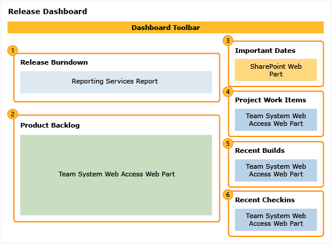
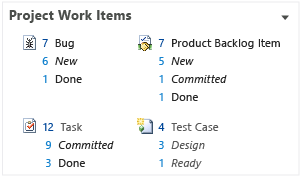

# Release (Scrum) dashboard
[!INCLUDE [temp](../_shared/tfs-sharepoint-version.md)]

The Release dashboard shows how much work remains in the release and how quickly your team is working through the product backlog. It displays the Release Burndown report, along with additional charts and quick access links.  
  
   
  
 To view the dashboard, choose **Go to project portal** from the **Documents** page in Team Explorer or the home page of the web portal.  
  
 **Requirements**  
  
 See [Project portal dashboards](project-portal-dashboards.md).  
  
##   Data displayed in the dashboard  
 You can use the Release dashboard to understand how much progress the team is making to complete PBIs.  To learn about the web parts that are displayed on the dashboard, refer to the following illustration and table.  
  
   
  
|Web Part|Data displayed|  
|--------------|--------------------|  
||Shows how much work remains at the start of each sprint in a release. This chart doesn't appear when the server that hosts Analysis Services for the team project is unavailable.   The source of the raw data is your product backlog. Each sprint that has been assigned to the team project or team appears along the horizontal axis. The vertical axis indicates the sum of all effort of all active backlog items at the start of each sprint. As the team updates the state of backlog items to Done, the effort remaining decreases. The amount of estimated effort on the vertical axis is in whatever unit that your scrum team has decided to use (for example, story points, size, or hours).   See also [Release Burndown](../sql-reports/release-burndown.md).|  
||Excel list of active PBIs.|  
||List of upcoming events derived from a SharePoint Web Part.   |  
||Count of new, approved, committed, or done work items. You can open the list of work items by choosing each number.   |  
||List of recent builds and their status. You can view more details about a specific build by choosing it. This list is derived from a Team Web Access Web Part.      **Legend**:   : Build not started   : Build in progress   : Build succeeded   : Build failed   : Build stopped   : Build partially succeeded   For more information, see [Run, monitor, and manage](../../pipelines/overview.md).|  
||List of the most recent check-ins. You can view more details about a specific check-in by choosing it. This list is derived from a Team Web Access Web Part.      For more information, see [Manage pending changes](../../repos/tfvc/develop-code-manage-pending-changes.md). **Note:**  If you use Git for version control, check-in data is not available.|  
  
## Related notes 
 [Project portal dashboards](project-portal-dashboards.md)