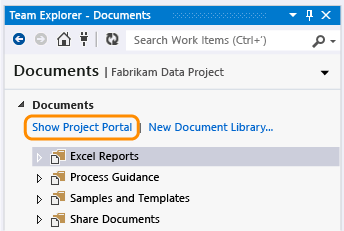

# Share information using the project portal

[!INCLUDE [temp](../_shared/tfs-sharepoint-version.md)]

Teams use project portals to share information and support how their team works. If you install TFS with a configuration that includes SharePoint Products and you created a project portal when you created your team project, your team project is configured with a SharePoint site for the project portal.  
  
## Open the project portal  
  
1.  From Team Explorer, open the documents page.  
  
    <table>
	<tbody valign="top">
	<tr>
	<td>**Git**</td>
	<td>**TFVC**</td>
	</tr>
	<tr>
	<td></td>
	<td></td>
	</tr>
	</tbody>
	</table> 
    
     If you don't see the documents icon, your team project is not configured with a SharePoint site. To learn how to configure a SharePoint site for your team project, see [Configure or add a project portal](configure-or-add-a-project-portal.md).  
  
2.  Show the project portal.  
  
       
  
     From the web portal, choose the **Go to project portal** from the home page or a dashboard which contains the [Other links widget](../widget-catalog.md). 
  
     The link opens to the Project, Progress, or Release dashboard, depending on your SharePoint site configuration and the process template used to create your team project.  
  
     To learn more about SharePoint dashboards, see [Project portal dashboards](project-portal-dashboards.md).  
  
     If you can't open the portal, you need to be added to a [permissions group in SharePoint](../../organizations/security/set-sharepoint-permissions.md).  
  
  
## Related notes

- [Dashboards and reports](../overview.md)   
- [Agile process guidance](../../boards/work-items/guidance/agile-process.md)
- [CMMI process guidance](../../boards/work-items/guidance/cmmi-process.md) 
- [Scrum process guidance](../../boards/work-items/guidance/scrum-process.md)
  
### Q: What artifacts are available with a SharePoint project portal?  
 **A:** The artifacts you'll have access to depend on the process template created with your team project. For an overview of the artifacts available with the default process templates, see [Choose a process](../../boards/work-items/guidance/choose-process.md).  
  
### Q: How do I access process guidance?  
 **A:** If your team project is configured with a SharePoint site for its project portal, you can access process guidance from the work item forms in Team Explorer.  Choose the  process guidance icon or press F1.  These links access information contained in the Documents **Support** folder.  
  
 From the web portal, you can access process guidance from the home page or a dashboard  
  
 When you choose the  process guidance icon that appears in the work item forms in Team Explorer, a web browser opens and the page that's defined in the process guidance support file for the corresponding work item type is displayed.  If you have not configured your team project with a project portal, or you haven't uploaded the process guidance support files to the project portal, then this link will be inactive.  
  
 You can [redirect process guidance](configure-or-redirect-process-guidance.md) to your custom content.  
  
###   Q: How do I add a project portal to my team project? How do I enable process guidance?  
 **A:** If you want to specify an existing website as your team project's portal or support process guidance, see [Configure a project portal](configure-or-add-a-project-portal.md).  
  
> [!IMPORTANT]  
>  If you add another type of website, the links to open the project portal from the web portal and Team Explorer don't appear. Also, the **Documents** page doesn't appear in Team Explorer.  
  
 **A:** If you have a SharePoint site already configured with Team Foundation Server Extensions for SharePoint, see [Configure a project portal](configure-or-add-a-project-portal.md).  

 If you need to install a SharePoint product first, see [Manually install SharePoint products for Team Foundation Server](/azure/devops/server/install/sharepoint/install-sharepoint).  
  
### Q: Can I customize the process guidance?  
 **A:** Yes. See [Configure or redirect process guidance](configure-or-redirect-process-guidance.md).  
  
### Q: Do you want more information about SharePoint site features?  
 **A:** See the [SharePoint Online Tutorial](http://office.microsoft.com/sharepoint-server-help/sharepoint-pages-i-an-introduction-RZ101837217.aspx?CTT=1).