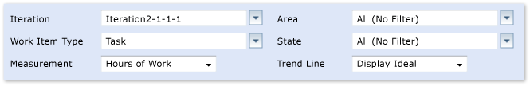

# Burndown and Burn Rate Report

[!INCLUDE [temp](../_shared/tfs-report-platform-version.md)]

After a team has worked on one or more iterations, also known as sprints, you can determine the rate of team progress by reviewing the Burndown and Burn Rate report. Burndown shows the trend of completed and remaining work over a specified time period. Burn rate provides calculations of the completed and required rate of work based on the specified time period. In addition, a chart shows the amount of completed and remaining work that is assigned to team members. You can view the Burndown and Burn Rate report based on hours worked or number of work items that have been resolved and closed.  
  
 For information about how to access, refresh, or manage reports, see [Reporting Services Reports](reporting-services-reports.md).  
  
> [!NOTE]
>  This report requires that the team project collection that contains your team project was provisioned with SQL Server Reporting Services. This report is not available if  **Reports** does not appear when you open Team Explorer and expand your team project node.  
  
**You can use this report to answer the following questions**:   -   Is the team likely to finish the iteration on time? -   Will the team complete the required work, based on the current burn rate? -   How much work does each team member have?  
  
 **Required Permissions**  
  
 To view the report, you must be assigned or belong to a group that has been assigned the **Browser** role in SQL Server Reporting Services. For more information, see [Add users to team projects](../admin/grant-permissions-to-reports.md).  
  
##   Data in the Report  
 The Burndown and Burn Rate report summarizes the data that was captured during the time interval that you specify for each task, user story, or bug based on the filters that you specify. The data is derived from the data warehouse.  
  
 You can filter the report in the following ways:  
  
-   Change the start and end dates for the report.  
  
-   Filter the tasks that are counted in the report by specifying iteration and area paths and work item states. You can also filter the report to show user stories and bugs.  
  
 For more information, see [Filtering the Report and Changing the Display](#Changing) later in this article.  
  
 You can use the Burndown and Burn Rate report to understand how well the team is progressing and whether the team or a team member is over-allocated. The upper section of the report displays a version of the Remaining Work report, as the following illustration shows.  
  
   
  
 In addition, you can display trend lines that predict when work will be completed. The ideal trend line calculates a slope or trajectory for when work will be completed based on the amount of work remaining and the end date that you define for the report. The actual trend line is calculated based on the team's actual progress in completing work and closing work items.  
  
 The lower section of the report presents a calculation of the team's burn rate, both actual and required, and a breakdown of work assignments to each team member, as the following illustration shows:  
  
   
  
### Burndown  
 Burndown shows the trend of how much work has been completed and how much work remains across time in an iteration or a release. The source of the raw data is either work hours or work remaining, which is tracked on the vertical axis, and the time period (days), which is tracked on the horizontal axis.  
  
|Hours|Number of Work Items|  
|-----------|--------------------------|  
|-   **Hours Remaining**: The cumulative value of all remaining hours for all tasks. -   **Hours Completed**: The cumulative value of all completed hours for all tasks.   **Trend lines**:   -   **Actual**: The line intersects the x-axis when the iteration is expected to complete based on the actual rate of hours being completed and hours remaining. -   **Ideal**: The line is drawn from the remaining work on the start date to intersect the x-axis on the end date.|-   **Active**: The cumulative total of all tasks, user stories, or bugs that are in the **Active** (blue) state. -   **Resolved**: The cumulative total of all user stories or bugs and that are in the **Resolved** (gold) state. -   **Closed**: The cumulative total of all tasks, user stories, or bugs in the **Closed** (green) state.|  
  
### Burn Rate  
 The Burn Rate section of the report shows an estimate of how much work a team can complete during an iteration. Burn rate is one of the key elements for estimation. This calculation shows how quickly the team is actually completing planned work and how much the rate varies from day to day, or iteration to iteration. You can use this data to plan the next iteration, together with the quality measures. Similar to the Remaining Work report, this strategy is most useful when you look at days within an iteration or several iterations within a project. For more information, see [Remaining Work](remaining-work-report.md).  
  
 The following table describes how the burn rate is calculated.  
  
|Team Burn Rate (Hours Completed/Day)|Team Burn Rate (Work Items Completed/Day)|  
|---------------------------------------------|--------------------------------------------------|  
|-   **Actual**: The total number of hours that the team completed during the time interval that you specify and divided by the number of days in the interval. -   **Required**: The total number of hours that were estimated for the time interval that you specify and divided by the number of days in the interval.|-   **Actual**: The total number of work items that the team completed during the time interval that you specify and divided by the number of days in the interval. -   **Required**: The total number of work items that the team defined for the time interval that you specify and divided by the number of days in the interval.|  
  
### Assignment of Work  
 The Assignment of Work section of the report provides insight into how well work has been allocated across the team, in addition to the work that the team completed and that remains for each team member. The following table describes the information that this view provides.  
  
|Assignment of Work (Hours)|Assignment of Work (Number of Work Items)|  
|----------------------------------|-------------------------------------------------|  
|For each team member:   -   **Remaining**: The total number of hours that remain in the time interval that you specify. -   **Completed**: The total number of hours that the team member completed in the time interval that you specify.|For each team member:   -   **Active** (blue): The total number of tasks, user stories, and bugs that are in the active state. -   **Resolved** (gold): The total number of tasks, user stories, and bugs that are in the resolved state. -   **Closed** (green): The total number of tasks, user stories, and bugs that are in the closed state.|  
  
### Required Activities for Tracking Work Items  
 For the Burndown and Burn Rate report to be useful and accurate, the team must perform the following activities for tracking work items:  
  
-   Define tasks, user stories, and bugs, and specify the **Iteration** and **Area** paths for each.  
  
-   Specify and update the **Completed** and **Remaining** fields for each task or subtask as it is worked on.  
  
    > [!IMPORTANT]
    >  If you subdivide a task into subtasks, specify hours only for the subtasks. These hours are rolled up as summary values for the parent task and user story. For more information, see [Address inaccuracies published for summary values](address-inaccuracies-published-for-summary-values.md).  
  
-   Update the **State** of each task, story, and bug as it progresses from active to closed.  
  
##   Setting the Duration of the Iteration  
 To understand the progress that the team has made for your current iteration, the start and end dates for the report must match your current iteration cycle. Results for the actual trend and team burn rate will vary significantly based on the duration that you set for the iteration.  
  
#### To change the duration of the iteration  
  
1.  For the **Iteration Start (Date)** and **Iteration End (Date)**, click the calendar icon, and then click the date that corresponds to the start or end of the iteration.  
  
2.  Click **View Report**.  
  
##   Interpreting the Report  
 You can filter the report in the following ways:  
  
-   Change the start and end dates for the report.  
  
-   Filter the tasks, stories, and bugs that are counted in the report by specifying iteration and area paths, work item types, and work item states.  
  
 For more information, see [Filtering of the Report and Changing the Display](#Changing) later in this article.  
  
### Questions That the Report Answers  
 You can review the report to determine the progress that the team made within an iteration or over time. For example, you can find answers to the following questions:  
  
#### Burndown  
  
-   How fast is the team completing remaining work?  
  
-   Is the team adding work during the iteration? Is there scope creep?  
  
-   How much work can the team complete in the available time?  
  
-   When can the team finish the work?  
  
-   When can the team finish the current iteration?  
  
#### Burn Rate  
  
-   Is the team working quickly enough to finish the remaining work on time?  
  
#### Work Assignment  
  
-   How is the work distributed across the team?  
  
-   Should the team balance the remaining work load?  
  
### Healthy Versions of the Report  
 A healthy Burndown and Burn Rate report shows that the team is making steady progress toward finishing the work. The actual and ideal trend lines are close together.  
  
   
  
### Unhealthy Versions of the Report  
 An unhealthy Burndown and Burn Rate report will show one or more of the following indications:  
  
-   **Actual and ideal trend lines are diverging or are far apart**.  
  
-   **The total number of hours is increasing**.  
  
     Scope creep occurs when team members add features to an iteration after it is planned. The following illustration shows an iteration in which a team is taking on more work over time and making minimal progress on the work that had already been assigned.  
  
       
  
##   Filtering the Report and Changing the Display  
 You can filter the Burndown and Burn Rate report or change its display in the following ways:  
  
-   Filter the user stories, bugs, and tasks that the report represents by specifying iteration and area paths, work item types, and work item states  
  
-   Change the view.  
  
-   Specify the type of trend line to display.  
  
 The following illustration shows the available filters and display options:  
  
   
  
#### To filter the set of work items that are counted in the report  
  
1.  Perform one or both of the following actions:  
  
    -   In the **Iteration** or **Area** list, select the check box of each iteration or product area to include.  
  
    -   In the **Work Item Type** or **State** list, select the check box of each work item type or state to include.  
  
2.  Click **View Report**.  
  
#### To switch between work hours and number of work items displayed in the report  
  
1.  In the **Measure** list, click one of the following options:  
  
    -   **Hours of Work** displays the cumulative number of work hours for all tasks that are defined for the iteration.  
  
    -   **Number of Work Items** displays the cumulative number of work items, grouped by state, that are defined for the iteration.  
  
2.  Click **View Report**.  
  
#### To display trend lines  
  
1.  In the **Trend Line** list, click one of the following options:  
  
    -   **Display Actual** displays a band that is based on the actual burndown. The band intersects the x-axis when the iteration is expected to finish.  
  
    -   **Display Ideal** displays a straight line from the remaining work at the start date to the x-axis on the end date.  
  
    -   **Display Both** displays both the actual and ideal trend lines.  
  
    -   **None** does not display a trend line.  
  
2.  Click **View Report**.  
  
## Related notes 
 [Reporting Services Reports](reporting-services-reports.md)