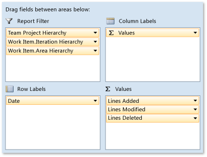

# Analyze and report on code churn and coverage using the code churn and run coverage perspectives

[!INCLUDE [temp](../_shared/tfs-report-platform-version.md)]

You can report on the software quality by using the Code Churn and Run Coverage perspectives from the SQL Server Analysis Services cube for Visual Studio Team Foundation Server.  By using these perspectives, you can view just the measures, dimensions, and attributes that are associated with the changes in lines of codes and the extent to which code is covered in builds and test runs.  
  
 These perspectives are based on the relational tables that you can use to report on code changes and coverage as a property of the build, the build assembly or platform, the test run, or the changeset. For more information, see [Code Churn tables](table-reference-code-churn.md) and [Run Coverage tables](run-coverage-tables.md).  
  
 

By using the Code Churn perspective, you can create reports that answer the following questions:
- How many files with a specific file name extension changed in a particular build?
- How many lines of code are in the source base for a particular build?
- Which changesets have been submitted, and what are the details of each change? (For example, who made the change, which files were changed, and on what date was the change made)?

By using the Run Coverage perspective, you can create reports that answer the following questions:
Which assemblies have the least test coverage? -   Which test runs cover the most code?
Which architectures or build types have the most test coverage? 

> [!NOTE]  
>If your data warehouse is using SQL Server Enterprise Edition, the list of cubes will include Team System and a set of perspectives. The perspectives provide a focused view of the data so that you do not have to scroll through all of the dimensions and measure groups in the whole Team System cube.
  
 
 
##  Example: Code Churn Report  
By using a PivotChart report in Excel, you can create a trend report that displays the code churn over time, similar to the report that the following illustration shows.  
  
   
  
 The process templates for Microsoft Solutions Framework (MSF) [Agile](../../boards/work-items/guidance/agile-process.md) and [CMMI](../../boards/work-items/guidance/cmmi-process.md) provide the Code Churn report in Excel. For more information, see [Code Churn](../excel/code-churn-excel-report.md).  
  
### Select and filter pivot fields  
   
  
 You can create a code churn report by performing the following steps:  
  
1.  In Excel, connect to the SQL Server Analysis Services cube for Visual Studio Team Foundation Server, and insert a PivotChart report.  
  
     For more information, see [Create Excel reports from a work item query](../excel/create-status-and-trend-excel-reports.md).  
  
2.  Right-click the chart and then choose **Change Chart Type**, **Area**, **Stacked Area**.  
  
3.  For each report filter, open the shortcut menu for each of the following fields, specify the hierarchies, weeks, or other elements of interest, and then drag the field to the **Report Filter** area.  
  
    -   **Team Project Hierarchy** from the **Team Project** dimension  
  
    -   **Work Item.Iteration Hierarchy** from the **Work Item** dimension  
  
    -   **Work Item.Area Hierarchy** from the **Work Item** dimension  
  
    -   **Year Week Date** from the **Date** dimension  
  
4.  In the **Date** dimension, expand **More fields**, and drag the **Date**, **Week**, or **Month** fields to the **Axis Fields (Categories)** area based on how granular a report you want to generate.  
  
5.  Drag the **Lines Added**, **Lines Modified**, and **Lines Deleted** fields from the **Code Churn** measure group to the **Values** area. You must drag each field separately.  
  
 
##  Code churn measures  
 Code churn measures quantify how much change is occurring in your project. In general, high levels of churn indicate project instability. You should expect high rates of churn at the start of a product cycle or after the team has implemented many changes. Toward the end of an iteration or before a release, you should expect the level of churn to decrease, which indicates that your project is more stable.  
  
 The following table describes the measures in the Code Churn measure group. By using these measures, you can create reports that show how many file versions are stored in Team Foundation version control and how much the code has changed. You can analyze metrics by file directory, build, or team member who checked in changes, and you can determine how those metrics change over time.  
  
 For information about similar metrics that you can collect for builds, see [Builds](perspective-build-analyze-report-build-details-coverage.md).  
  
|Measure|Description|  
|-------------|-----------------|  
|Code Churn Count|The number of times that the team changed files in version control.|  
|Lines Added|The number of lines of code that the team added to files for the dimensions that you specify.|  
|Lines Deleted|The number of lines of code that the team deleted from files for the dimensions that you specify.|  
|Lines Modified|The number of lines of code that the team modified during the time period that you specify.|  
|Total Churn|Churn in the code, computed as: [Lines Added] + [Lines Deleted] + [Lines Modified].|  
|Total Lines|The number of lines in the part of the file path hierarchy that you specify. You must also specify one or more builds to indicate the point or points at which to perform this calculation. If you do not specify one or more builds, NULL is returned. The number of lines is calculated by aggregating the lines added and lines deleted that have contributed to a specific combination of build type and operating system. **Tip:**  The Total Lines measure can cause the OLAP query to timeout. If your report takes too long to render, consider shortening the changeset, build, test run, or date range.|  
  
 
##  Run coverage measures  

The following table describes the measures in the Run Coverage measure group. By using these measures, you can create reports that show the extent to which the code was covered by tests in a test run. For information about similar metrics that you can collect for builds, see [Builds](perspective-build-analyze-report-build-details-coverage.md).  
  
|Measure|Description|  
|-------------|-----------------|  
|Run Coverage|The number of test runs that have code coverage statistics associated with them.|  
|Run Coverage Blocks Covered|The number of blocks that all tests in a run cover. However, coverage across the tests might overlap.|  
|Run Coverage Blocks Not Covered|The number of blocks that are not covered by any tests in a run. However, coverage across the tests might overlap.|  
|Run Coverage Lines Covered|The number of lines that all tests in a run cover. However, coverage across the tests might overlap.|  
|Run Coverage Lines Not Covered|The number of lines that are not covered by any tests in a run. However, coverage across the tests might overlap.|  
|Run Coverage Lines Partially Covered|The number of lines that tests in a run partially cover. However, coverage across the tests might overlap.|  
  
 
##  Dimension and attributes in the Code Churn Perspective that support filtering and categorization  
 The following table describes the dimensions and attributes in the Code Churn perspective. These attributes supplement the **Team Project** and **Date** shared dimensions, which [Working with Shared Dimensions](shared-dimensions-in-the-analysis-services-cube.md) describes. You can aggregate the measures along each of these attributes.  
  
|Dimension|Attribute|Description|  
|---------------|---------------|-----------------|  
|Build|Build Definition Name|The name that is assigned to the build definition for which a build was run.|  
||Build ID|The number that is assigned to the build. Each time that a particular build definition is run, this attribute is incremented by 1.|  
||Build Name|The name or expression that uniquely identifies a build. For more information, see [build definition options](../../pipelines/build/options.md).|  
||Build Start Time|The date and time when the build started.|  
||Build Type|The reason why the build was run. Build types are associated with the trigger that was defined for the build. Team Foundation Server supports the following types of builds: manual, continuous (triggered by every check-in), rolling (accumulate check-ins until the previous build finishes), gated check-in, and scheduled. For more information, see [Build definition triggers](../../pipelines/build/triggers.md).|  
||Drop Location|The Uniform Resource Locator (URL) for the completed build. A URL specifies the protocol with which web browsers will locate Internet resources. Each URL includes the name of the server on which the details of the build reside. You can also include the path to a resource.|  
|Version Control Changeset|Changeset ID|The number that is assigned to the changeset that included the file changes.|  
||Checked In By|The user name of the team member who checked in the changeset.|  
||Description|The check-in comment that is associated with the changeset.|  
||Policy Override Comment|The comment that is provided when a policy is overridden. If a policy was not overridden with this changeset, this field is null.|  
|Version Control File|Version Control File.File Hierarchy|The full network path of the source file.|  
||Version Control File.File Extension|The extension of the name of the source file.|  
|Work Item|Work Item Type and more|For more information, see [Test cases and work items](perspective-test-analyze-report-work.md).|  
  
 
##  Dimensions and attributes in the Run Coverage Perspective that support filtering and categorization  
 The following table describes the dimensions and attributes in the Run Coverage perspective. These attributes supplement the **Team Project** and **Date** shared dimensions that [Working with Shared Dimensions](shared-dimensions-in-the-analysis-services-cube.md) describes later in this article. You can aggregate the measures along each of these attributes.  
  
> [!NOTE]  
> Before you can use the **Assembly** or **Build Flavor** attributes, the test team must specify them and publish the test results to the data store for Team Foundation Server. For more information, see [Required activities](#tracking) later in this article.  
  
|Dimension|Attribute|Description|  
|---------------|---------------|-----------------|  
|Assembly|Assembly|(Published test results only) The name of the code of the application that is tested as part of the build. For more information, see [continuous testing](../../pipelines/languages/dotnet-core.md#run-your-tests).|  
|Build|Build Definition Name|The name that is assigned to the build definition for which a build was run.|  
||Build ID|The number that is assigned to the build. Each time that a particular build definition is run, the **Build ID** is incremented by 1.|  
||Build Name|The name or expression that uniquely identifies a build. For more information, see [build definition options](../../pipelines/build/options.md).|  
||Build Start Time|Date and time when the build started.|  
||Build Type|The reason why the build was run. Build types are associated with the trigger that was defined for the build. Team Foundation Server supports the following types of builds: manual, continuous (triggered by every check-in), rolling (accumulate check-ins until the previous build finishes), gated check-in, and scheduled. For more information, see [Build definition triggers](../../pipelines/build/triggers.md).|  
||Drop Location|The Uniform Resource Locator (URL) for the completed build. A URL specifies the protocol with which web browsers will locate Internet resources. The URL also includes the name of the server on which the resource resides. You can also specify the path to a resource.|  
|Build Flavor|Build Flavor|(Published test results only) A name that designates the category that is assigned to a set of completed builds that were published as part of a test run. For example, you can use a build flavor to designate a beta release or final release.|  
|Build Platform|Build Platform|(Published test results only) The name of the machine platform for which an end-to-end (not desktop) build was made and that was published as part of a test run (for example, **x86** or **Any CPU**). For an example of a report that uses this attribute, see [Build Summary](build-summary-report.md).|  
|Test Run|Complete Date Hierarchy by Month or by Week   Creation Date Hierarchy by Month or by Week|Date dimensions that are based on the date when the test run was created and finished. For more information, see [Shared dimensions](shared-dimensions-in-the-analysis-services-cube.md).|  
  
##   Required activities  
 To create reports that contain code churn and code coverage data, team members should review the information in the following topics:  
  
-   [Continuous testing](../../pipelines/languages/dotnet-core.md#run-your-tests)  
-   [Using Code Coverage to Determine How Much Code is being Tested](https://msdn.microsoft.com/library/dd537628.aspx)  
  
-   [Configure unit tests by using a .runsettings file](https://msdn.microsoft.com/library/jj635153.aspx)  
  
## Related notes
-  [Code Churn](../excel/code-churn-excel-report.md)   
-  [Code Churn](../excel/code-coverage-excel-report.md)  
-  [Code Churn tables](table-reference-code-churn.md)   
-  [Run Coverage tables](run-coverage-tables.md)   
-  [Perspectives and measure groups in the Analysis Services cube](perspective-measure-groups-cube.md)
