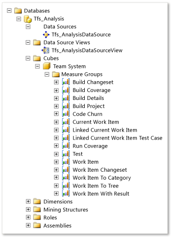
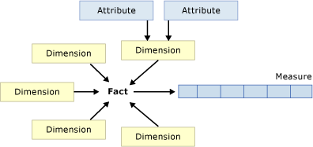

# Perspectives and measure groups 

[!INCLUDE [temp](../_shared/tfs-report-platform-version.md)]

By using the SQL Server Analysis Services cube for Visual Studio Team Foundation Server, you can generate reports of aggregated information about the data that is stored in team project collections. You can easily use this data to create PivotTable and PivotChart reports in Office Excel. You can drag the cube elements onto PivotTable or PivotChart reports to formulate questions and retrieve answers quickly. The cube is optimized to answer questions such as "How many bugs were active, resolved, and closed on each day of the project?"  
  
> [!NOTE]  
>  If your data warehouse for Visual Studio ALM is using SQL Server Enterprise Edition, the list of cubes will include Team System and a set of perspectives. The perspectives provide a focused view of the data so that you do not have to scroll through all of the dimensions and measure groups that are defined for the whole Team System cube.  
  
  
 
##  Perspectives and measure groups  
 The following table describes the measure groups, which are grouped according to their cube perspective. The Team System cube contains all measure groups in addition to the ones that are listed as belonging just to the Team System perspective. Most measure groups contain one or more cumulative counts. You can use cumulative counts to generate trend reports. In some cases, the name for a cumulative count has a trend label (for example, Build Result Count Trend and Point Count Trend).  
  
> [!NOTE]  
>  All measure groups contain cumulative counts based on the start, end, creation, and completion dates for test results.  
  
|Perspectives and Measure Groups|Related topic and description|  
|-------------------------------------|-----------------------------------|  
||[Builds](perspective-build-analyze-report-build-details-coverage.md)   Provides metrics that describe builds, such as build time and build frequency, and that can be analyzed by various dimensions, such as who performed the build, the build type, the build flavor, and the build outcome.   -   Which builds failed, and which builds succeeded? -   Which builds have a significant number of changes to the code? -   How much of the code in a build or a group of builds did the tests cover?|  
||[Code churn and code coverage](perspective-code-analyze-report-code-churn-coverage.md)   Supports reports that are focused on the number of file versions that are stored in Team Foundation version control and the extent to which the code has changed. Metrics can be analyzed by file directory, build, or team member who is checked in code. All totals can be analyzed over time so that you can answer the following types of questions:   -   How many files of a specific file name extension changed in a particular build? -   How many lines of code are in the source base for a particular build? -   Which changesets have been submitted, and what were the details of each change (for example, who performed the change, what files were modified, and on what date was the change made).|  
||[Code churn and code coverage](perspective-code-analyze-report-code-churn-coverage.md)   Provides metrics about how many lines and blocks of code were tested in various build and run configurations. You can use the Run Coverage perspective to create reports that answer the following questions:   -   Which assemblies and projects have the least code coverage? -   Which test runs give you the most code coverage? -   Which architectures or build types have the most code coverage?|  
||[Test results](perspective-test-analyze-report-test-results.md)   Provides metrics about test runs and test results. Test results are tracked over time and can be analyzed by their outcome, the build they were testing, the type of test, and other dimensions. By using the Test perspective, you can create reports that answer the following questions:   -   What is the status of testing of specific user stories or product areas? -   What is the quality of builds based on the number of failed and passed tests? -   How many test cases have never been run? -   Which test cases have never been run?|  
||[Test cases and work items](perspective-test-analyze-report-work.md)   Provides metrics and detailed information about work items, including historical information that enables total work item counts to be analyzed over time or as of a current date. You can use this measure group to answer the following types of questions:   -   What was the total count of active bugs each day in the last iteration? -   How many scenarios were active each month during the last year? -   How many bugs of each priority have been active each day in the last month?|  
||Provides all metrics for all measure groups that appear previously in this table.|  
  
##   Combining dimensions and measures  
 Not all combinations of dimensions and measures will produce useful results. For you to get meaningful results, the measures must relate to the dimensions in your reports. To determine which dimensions relate to a specific measure, you can check the fact tables in the data warehouse by using SQL Server Management Studio.  
  
 If you are using Excel, you can use the **Show fields related to** box to specify a group of measures and dimensions that cover a specific section of the cube. By working within a single set of related fields, you can find data more easily because not all fields in the cube appear, and you are much more likely to get useful numbers.  
  
 You can combine measures from different groups of fields as long as the measures have a common set of dimensions that are used in the report. The Date dimension, for example, appears in multiple groups of fields. Therefore, you could combine the Remaining Work or Completed Work data with test result counts for a day or days that you specify because both these sets of measures have Date as a related dimension.  
  
##   Cube terms and definitions  
 A cube represents a set of measures that are grouped into measure groups and hierarchically organized by dimensions. The cube is constructed from data retrieved from relational database. The following illustration shows the relationship that exists between different aspects of the cube.  
  
   
  
 The following table describes the terms and definitions that are used when referring to different aspects of the cube.  
  
|Term|Description|  
|----------|-----------------|  
|Attribute|Each attribute is connected to a column in a corresponding dimension table in the data warehouse. Each dimension is associated with a set of attributes and potentially a set of hierarchies. Area and iteration paths are examples of hierarchies.   Some work item dimension attributes are also stored as numeric and date filter values. When you use one of these dimension attributes in the rows or columns section, you can use these values to filter the report. For example, you can filter a report to show work items that were created after Oct 1, 2009, by using the value filter "System_CreatedDate is greater than Oct 1, 2009." You can also use the measure values to filter a report. For example, you can filter the report to show only work items that have more than two hours of work remaining by using the value filter "Remaining Work is greater than 2." |  
|Dimension|Dimensions enable you to extract different views of data. Data values are associated with a set of dimensions that allow you to show aggregate results that are filtered using a specific set of dimension values.   You can use dimensions to disaggregate the data and show more detail. For example, you can use the Date dimension in the rows or columns section of a PivotTable or PivotChart report to show a trend over time. You can also use dimensions to filter the report. Place a dimension or dimension attribute in the filter area, and then specify the values that you want to include in the report.   Some dimensions are used in more than one measure group. For example, all measure groups share the Date, Team Project, Person, Area, and Iteration dimensions. The following illustration shows the dimensions in the cube.      Dimensions are groups of attributes that are based on columns from tables or views in a data source view. Dimensions exist outside of a cube, can be used in multiple cubes, can be used multiple times in a single cube, and can be linked between Analysis Services instances. A dimension that exists outside of a cube is referred to as a database dimension, and an instance of a database dimension within a cube is referred to as a cube dimension.|  
|Fact and fact table|A fact represents data that can be associated with multiple dimensions. This data may also be aggregated. Fact tables hold these values.   Each data warehouse includes one or more fact tables. Central to a "star" or "snowflake" schema, a fact table captures the data that measures the team's operations. Fact tables usually contain large numbers of rows, especially when they contain one or more years of history for a large team project.   A key characteristic of a fact table is that it contains numerical data (facts) that can be summarized to provide information about the history of the operation of the organization. Each fact table also includes a multipart index that contains, as foreign keys, the primary keys of related dimension tables. The related dimensions contain attributes of the fact records. Fact tables should not contain descriptive information or any data other than the numerical measurement fields and the index fields that relate the facts to corresponding entries in the dimension tables.   For a list of the fact tables that are defined for the data warehouse, see [Table reference for the relational warehouse database](table-reference-relational-warehouse-database.md).|  
|KPIs|In business terminology, a key performance indicator (KPI) is a quantifiable measurement for gauging business success.   In Analysis Services, a KPI is a collection of calculations that are associated with a measure group in a cube and that are used to evaluate business success. Typically, these calculations are a combination of Multidimensional Expressions (MDX) expressions or calculated members. KPIs also have additional metadata that provides information about how client applications should display the results of the KPI's calculations.|  
|Measure|Measures are values that correspond to columns in the corresponding fact table. Also, fields whose reportable attribute is set to Measure appear as measures in the cube. The following illustration shows the measures in the cube.   |  
|Measure group|Each measure group contains measures, such as Work Item Count, and dimensions, such as Date and Team Project. The measures are the numeric values that provide summaries at different levels of aggregation. You can use them in the Values section of a PivotTable or PivotChart report. The following illustration indicates the measure groups for Team Foundation.   |  
|Perspective | By using perspectives, you can view portions of a cube, making it easier to focus on just the set of information that is of interest for creating a report. |  

> [!NOTE]  
>Perspectives are available only when your data warehouse is using SQL Server Enterprise Edition. Otherwise, you will see only a single perspective, the Team System cube. Each perspective provides a focused view of the data so that you do not have to scroll through all of the dimensions and measure groups that are defined for the whole cube. A perspective is a subset of the features and objects of a cube.
  
## Related notes
-  [Resolve schema conflicts occurring in the data warehouse](../admin/resolve-schema-conflicts.md)   
-  [Create status and trend reports in Excel](../excel/create-status-and-trend-excel-reports.md)   
-  [Manage reports, data warehouse, and cube](../admin/manage-reports-data-warehouse-cube.md)
-  [Dashboards and reports](../overview.md)   