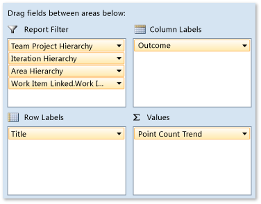

# Analyze and report on test results using the test perspective 

[!INCLUDE [temp](../_shared/tfs-report-platform-version.md)]

 By using the Test perspective in the SQL Server Analysis Services cube, you can view just the measures, dimensions, and attributes that pertain to reporting on tests results and test runs. For example, you can use these measures to determine the overall quality of each build, the tests that a particular build affected, and the number of test cases that were run. You can also answer questions about changes to the result outcomes.  
  
The Test measure group is based on the Test Results relational table, which enables reporting on test results as either a property of the tests or an independent outcome. For more information, see [Test Result tables](test-result-tables.md).  
  
 

By using the Test perspective, you can create reports that answer the following questions:

**Status reports:**  
- What is the status of testing of specific user stories or product areas?  
- What is the quality of builds based on the number of failed and passed tests?  
- How many test cases have never been run?  
- Which test cases have never been run?  

**Trend reports:**  
- How many tests are blocked, passing, or failing over time?  
- How many tests are regressing?  
- How consistent is the manual test activity over time?   

> [!NOTE]
> If your data warehouse is using SQL Server Enterprise Edition, the list of cubes will include Team System and a set of perspectives. The perspectives provide a focused view of the data so that you do not have to scroll through all of the dimensions and measure groups in the whole Team System cube.
  
 To use many Test measures and dimension attributes, the test team must publish the test results to the data store for Team Foundation Server. For more information, see [Required activities](#tracking) later in this article.  
  
 
  
##  Example: Progress report for testing user stories  
 By using PivotTable and PivotChart reports in Excel, you can create a status report that shows the test progress on user stories, similar to the report in the following illustration.  
  
   
  
 The [Agile](../../boards/work-items/guidance/agile-process.md) and [CMMI](../../boards/work-items/guidance/cmmi-process.md) process templates include the [User Story Test Status](../excel/user-story-test-status-excel-report-agile.md) and [Requirement Test Status](../excel/requirement-test-status-excel-report-cmmi.md) in Excel, respectively.  
  
### Specify and filter pivot fields  

   
  
 By performing the following steps, you can create a progress report for testing user stories:  
  
1.  In Excel, connect to the Analysis Services cube for Team Foundation Server, and then insert a PivotChart report.  
  
     For more information, see [Create Excel reports from a work item query](../excel/create-status-and-trend-excel-reports.md).  
  
2.  Right-click the chart, then choose **Change Chart Type**, **Area**, **Stacked Bar**.  
  
3.  For each report filter, right-click each of the following fields, specify the hierarchies or elements of interest, and then drag the field to the **Report Filter** area.  
  
    -   **Team Project Hierarchy** from the **Team Project** dimension  
  
    -   **Area Path** from the **Team Project** dimension  
  
    -   **Iteration Path** from the **Test Case** dimension  
  
    -   **Work Item Type** from the **Work Item Linked** dimension  
  
         Specify the type as user story, requirement, or another type of work item that has test cases linked to it that you want to report.  
  
4.  Drag the **Point Count Trend** field from under the **Test** measure group to the **Values** area.  
  
5.  Drag the **Outcome** field from under the **Test Result** dimension to the **Column Labels** area.  
  
##   Test measures  
 The following table describes the measures that the Test measure group includes. You can analyze test results by the aggregate of tests results and their outcome for a particular build or by the changed outcome for a test result.  
  
|**Measure**|**Description**|  
|-----------------|---------------------|  
|Build Result Count Trend|Counts the most recent version of each result in a particular build.   For an example of a report that uses this measure, see [Build Quality](../excel/build-quality-excel-report.md).|  
|Point Count Trend|Count of the most recent version of each test result in a particular build. If a test is run multiple times against a build, the Point Count Trend counts the most recent result for that test using that build. If a test case is not included in the build, the test case is counted as "Never Run."   Use this measure to determine which tests or how many tests are failing in the current build.|  
|Result Count|Counts the most recent version of each test result. Use this measure when you want to determine the overall volume of testing.   For an example of a report that uses this measure, see [Build Quality Indicators](build-quality-indicators-report.md).|  
|Result Transition Count|Counts all the results whose outcome changed in a particular build. Use this measure when you want to determine which tests were affected by a particular build.|  
|Test Case Count|Number of test cases. Use this measure when you want to determine how many test cases were run for a particular test run or build.|  
  
##   Dimensions and attributes in the Test Perspective that support filtering and categorization  
 By using the attributes that this section describes, you can aggregate a measure, filter a report, or specify a report axis. These attributes are in addition to the **Team Project** and **Date** shared dimensions that [Working with shared dimensions](shared-dimensions-in-the-analysis-services-cube.md) describes.  
  
###   Build, build flavor, and build platform dimensions  
 You can filter test reports based on build pipeline, build flavor, or build platform by using the attributes that the following table describes.  
  
|Dimension|Attribute|Description|  
|---------------|---------------|-----------------|  
|Build|Build Pipeline Name|The name that is assigned to the build pipeline for which a build was executed.   For an example of a report that uses this attribute, see [Build Quality](../excel/build-quality-excel-report.md).|  
||Build ID|The number that is assigned to the build. Each time that a particular build pipeline is run, the **Build ID** is incremented by 1.|  
||Build Name|The name or expression that uniquely identifies a build. For more information, see [build pipeline options](../../pipelines/build/options.md).|  
||Build Start Time|The date and time when the build started.|  
||Build Type|The reason why the build was run. Build types are associated with the trigger that was defined for the build. Team Foundation Server supports the following types of build: manual, continuous (triggered by every check-in), rolling (accumulate check-ins until the previous build finishes), gated check-in, and scheduled. For more information, see [Build pipeline triggers](../../pipelines/build/triggers.md).|  
||Drop Location|The drop folder that is defined for the build and that is specified as a Uniform Resource Locator (URL). A URL specifies the protocol with which web browsers will locate Internet resources. The URL also includes the name of the server on which the resource resides. You can also include the path to a resource.   For more information, see [Utility: Publish Build Artifacts](../../pipelines/tasks/utility/publish-build-artifacts.md).|  
|Build Flavor|Build Flavor|(Published test results only) A name that designates the category of builds that are assigned to a set of completed builds that were published as part of a test run. For example, a build flavor can be used to designate a beta release or a final release.|  
|Build Platform|Build Platform|The name of the machine platform for which an end-to-end (not desktop) build was made (for example, **x86** or **Any CPU**). |  
  
 T
###  Test case, test configuration, test plan, and test suite dimensions  

The Test Case, Test Configuration, Test Plan, and Test Suite dimensions correspond to how you can organize, configure, automate, and run tests by using Microsoft Test Manager.  
  
 The test case corresponds to a type of work item that the test team uses to define both manual and automated tests that your team can run and manage by using Microsoft Test Manager. A test plan consists of test configurations and test suites. A test configuration defines the software or hardware on which you want to run your tests. A test suite defines a hierarchy within the plan so that you can group test cases together.  
  
 For more information, see [Testing overview](../../test/index.md).  
  
|Dimension|Attribute|Description|  
|---------------|---------------|-----------------|  
|Test Case|Area Hierarchy and more|The Work Item and Test Case dimensions contain all attributes that relate to work items, such as State, Work Item Type, and Work Item ID. For information about the structure of the Test Case dimension, see [Test cases and work items](perspective-test-analyze-report-work.md).   For a description of each attribute, see [Work item field index](../../boards/work-items/guidance/work-item-field.md).   For information about how to work with date, area, and iteration hierarchies, see [Shared dimensions](shared-dimensions-in-the-analysis-services-cube.md).   This measure group contains additional attributes when custom fields in the definition for a type of work item specify `Dimension` as the reportable attribute. For more information about how to use the optional `reportable` attribute and its values, see [Add or modify work item fields to support reporting](../../reference/xml/add-or-modify-work-item-fields-to-support-reporting.md).|  
|Test Configuration|Configuration ID and Configuration Name|The number that the system assigns and the name of a test configuration.|  
|Test Plan|Area Hierarchy, Area Path, Iteration Hierarchy, and Iteration Path|The product area and milestone that is assigned to the test plan.   For more information, see [Test cases and work items](perspective-test-analyze-report-work.md).|  
||End Date Hierarchy By Month or By Week   Start Date Hierarchy By Month or By Week|Optional values that a test plan owner can assign to the test plan. They represent the date on which the test plan should start and the date on which the test plan should finish.   For more information about how to work with date hierarchies, see [Shared dimensions](shared-dimensions-in-the-analysis-services-cube.md).|  
||Test Plan Id and Test Plan Name|The number that the system assigns and the name that the test plan owner assigns.|  
||Test Plan Owner|The user name of the test team member who created or currently is assigned as the owner of the test plan.|  
||Test Plan ID and State|The system-assigned number and name of the state of the test plan. For example, **Inactive** indicates that the test plan is being defined, and **Active** indicates that the test plan is ready to be reviewed and run.|  
|Test Suite|Test Suite Hierarchy|Provides a mechanism to specify multiple filters based on project collection, team project, and test suite.|  
||Suite Path|Corresponds to the hierarchy of test suites that are configured for all team projects in all team project collections.|  
  
 
###  Test result dimension  
 The following table lists all dimensions and attributes that are specific to the test measures in the cube. Before you can report on **Failure Type** or **Resolution**, the test team must populate this information as part of their test activities.  
  
|Attribute|Description|  
|---------------|-----------------|  
|Failure Type and Failure Type Id|Corresponds to one of the following reasons why a test failed: **None**, **Known Issue**, **New Issue**, or **Regression**.   Microsoft Test Manager automatically assigns a number or an ID to each reason. The test team can, but is not required to, assign a failure type to each failed test. **Note:**  You cannot add to or change the set of failure types.    For an example of a trend report that shows the outcome of test results based on failure type, see [Failure Analysis](../excel/failure-analysis-excel-report.md).|  
|Outcome and Outcome Id|The outcome of the test (for example, **Passed**, **Failed**, or **Inconclusive**).   For an example of a trend report that shows the outcome of test plans and test configurations, see [Test Plan Progress](test-plan-progress-report.md).|  
|Readiness State and Readiness State Id|The state of a particular test within a test run. Valid values are **Completed**, **InProgress**, **None**, **NotReady**, and **Ready**.|  
|Resolution State|(Optional) The name of the **Resolution** with which a tester identified the cause of a failed test. By default, all MSF process templates have the following resolution states: **Needs investigation**, **Test issue**, **Product issue**, and **Configuration issue**. The test team can, but is not required to, assign a resolution state to each failed test. **Note:**  You can change these states or add states using the `tcm` command line tool. See [tcm: Customize and manage the test experience](../../reference/witadmin/tcm-customize-manage-test-experience.md).|  
|Test Result Executed By|The name of the user or other account under which the test was run.   For an example of a report that uses this attribute, see [Test Team Productivity](../excel/test-team-productivity-excel-report.md).|  
|Test Result Owner|The name of the user or other account that is assigned as the owner of the test result. The assignment corresponds to the value that is set by using the `tcm /resultowner` switch.|  
|Test Result Priority|The priority of a particular test within a test run.|  
  
 
###  Test run dimension  

The following table describes the attributes that are defined for the Test Run dimension. Many of these attributes correspond to parameters that the test team specifies when it runs tests.  
  
|Attribute|Description|  
|---------------|-----------------|  
|Complete Date, Creation Date, Start Date Hierarchy By Month or By Week|Dates when the test run was created, completed, or started. You can use these attributes to filter or structure a report. For more information, see [Shared dimensions](shared-dimensions-in-the-analysis-services-cube.md).|  
|Is Automated|Flag that indicates that the test run contains one or more automated tests.   For an example of a report that uses this attribute, see [Build Quality](../excel/build-quality-excel-report.md).|  
|Is Build Verification Run|Flag that indicates whether the test run contains build verification tests that check the basic functionality of the build. This flag corresponds to the `tcm /buildverification` switch.   For an example of a report that uses this attribute, see [Build Quality](../excel/build-quality-excel-report.md).|  
|Test Run Id|The number that the system assigned to the test run.|  
|Test Run Owner|Corresponds to the owner who is assigned to the test run that the test team created or published. Corresponds to the `tcm /owner` switch.|  
|Test Run State and Id|Name or number that is assigned to the state of a test run (for example, **Aborted**, **Completed**, **In Progress**, **Not Started**, or **Unknown**).|  
|Test Run Title|Corresponds to the title that is assigned to the test run that the test team created or published. Corresponds to the `tcm /title` switch.|  
  
 
###  Work item and work item linked dimensions  
You can link test cases to other work items such as user stories, requirements, and bugs. By using the Work Item Linked dimension, you can create a report that provides test results that relate to the linked work items. The progress report for testing user stories, described earlier in this article, provides an example of using the linked work item.  
  
 For a description of each attribute, see [Index of work item fields](../../boards/work-items/guidance/work-item-field.md).  
  
##   Required activities  
To create reports that contain useful data about test efforts and test results, team members should review the information in the following topics:  
  
-   [Continuous testing](../../pipelines/languages/dotnet-core.md#run-your-tests)    
-   [Using Code Coverage to Determine How Much Code is being Tested](https://msdn.microsoft.com/library/dd537628.aspx)    
  
## Related notes
-  [Test Management Reports](../excel/test-management-reports.md)   
-  [Test Plan Progress](test-plan-progress-report.md)   
-  [Perspectives and measure groups provided in the Analysis Services cube](perspective-measure-groups-cube.md)
