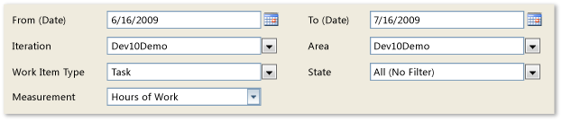

# Remaining Work Report
[!INCLUDE [temp](../_shared/tfs-report-platform-version.md)]

After the team has estimated its tasks and begun work, you can use the Remaining Work report to track the team's progress and identify any problems in the flow of work.  
  
 For information about how to access, refresh, or manage reports, see [Reporting Services Reports](reporting-services-reports.md).  
  
> [!NOTE]
>  This report requires that the team project collection that contains your team project was provisioned with SQL Server Reporting Services. This report is not available if  **Reports** does not appear when you open Team Explorer and expand your team project node.  
  

**You can use this report to answer the following questions**:   -   What is the cumulative flow of work? -   Is the team likely to finish the iteration on time? -   Is the amount of work or number of work items in the iteration growing? -   Does the team have too much work in progress? -   How is the team doing in estimating work for the iteration?
  
 **Required Permissions**  
  
 To view the report, you must be assigned or belong to a group that has been assigned the **Browser** role in Reporting Services. For more information, see [Add users to team projects](../admin/grant-permissions-to-reports.md).  
  
##   Data in the Report  
 The Remaining Work report summarizes the data that was captured during the specified time interval for each task, user story, or bug based on the filter criteria that were specified for the report. The data is derived from the data warehouse.  
  
 You can view this report in either the **Hours of Work** view or the **Number of Work Items** view. The first view displays the total number of hours of work for the specified time period and the team's progress toward completing that work. The second view displays the number of work items for the specified time period and the number of work items in each state. Each view provides an area graph that charts the progress of completed work against the total estimated work for the specified time duration.  
  
 You can filter the report in the following ways:  
  
-   Change the start and end dates for the report.  
  
-   Filter the tasks, stories, and bugs that are counted in the report by specifying iteration and area paths, types of work items, and states.  
  
 For more information, see [Filtering the Report and Changing the Display](#Changing) later in this article.  
  
### Hours of Work  
 The following illustration shows an example of the Remaining Work report in the **Hours of Work** view. This example is healthy in that a steady rate of work is being completed. However, the team significantly underestimated the amount of work that was required to complete the iteration, as shown by the hours remaining at the start and the hours completed at the end.  
  
   
  
### Number of Work Items  
 The following illustration shows the same report as in the previous illustration but in the **Number of Work Items** view, with the work items grouped by state. Although the team made good progress resolving and closing work items, the estimate of work items increased from the start of the iteration to almost three times more by the end of the iteration.  
  
   
  
 The following table summarizes the data that the report shows, subject to which filters and display option you specify.  
  
|Hours|Number of Work Items|  
|-----------|--------------------------|  
|-   **Hours Remaining**: The cumulative value of all remaining hours for all tasks. -   **Hours Completed**: The cumulative value of all completed hours for all tasks.|-   **Active**: The cumulative value of all stories, tasks, and bugs that are in the **Active** (blue) state. -   **Resolved**: The cumulative value of all stories or bugs and that are in the **Resolved** (gold) state. -   **Closed**: The cumulative value of all stories, tasks, and bugs in the **Closed** (green) state.|  
  
### Required Activities for Tracking Work Items  
 For the Remaining Work report to be useful and accurate, the team must perform the following activities to track work items:  
  
-   Define tasks, stories, and bugs, and specify the **Iteration** and **Area** paths for each work item.  
  
    > [!NOTE]
    >  For information about how to define iteration and area paths, see [Define area paths](../../organizations/settings/set-area-paths.md) or [Define iteration paths](../../organizations/settings/set-iteration-paths-sprints.md) .  
  
-   Specify and update the **HoursCompleted** and **HoursRemaining** fields for each task or subtask as the team makes progress on each work item.  
  
    > [!IMPORTANT]
    >  If you subdivide a task into subtasks, specify hours only for the subtasks. These hours are rolled up as summary values for the parent task and user story. For more information, see [Address inaccuracies published for summary values](address-inaccuracies-published-for-summary-values.md).  
  
-   Update the **State** of each task, story, and bug as it progresses from active to closed.  
  
##   Setting the Duration of the Iteration  
 To understand the progress made for your current iteration, the start and end dates for the report must match those of your current iteration cycle.  
  
#### To change the duration of the iteration  
  
1.  Next to **Iteration Start (Date)** or **Iteration End (Date)**, click the calendar icon, and then click a date.  
  
2.  Click **View Report**.  
  
##   Interpreting the Report  
 The Remaining Work report displays information that you can use to understand how well the team is progressing and whether the team will finish the tasks within the allocated time.  
  
### Questions That the Report Answers  
 You can review the report to determine the progress within an iteration or over time. Specifically, you can find answers to these questions:  
  
-   How fast is the team burning down remaining work?  
  
-   Is work being added during the iteration? Is the team expanding the scope of the work?  
  
-   How much progress can the team make in the available time?  
  
-   Approximately when can the team finish the work?  
  
-   Is too much work in progress?  
  
-   Is the flow of work being impeded or blocked?  
  
-   When will the team finish the current iteration?  
  
### Healthy Version of Report  
 A healthy Remaining Work report shows steady progress in resolving and closing tasks, as the following illustration shows. The rectangular shape of the diagram indicates that the estimated work closely matched the required work.  
  
   
  
### Unhealthy Version of Report  
 The following illustration shows an unhealthy version of the Remaining Work report. Little progress is made for several weeks at a time, as indicated by the flat line of work items remaining in an unchanged state. Also, the number of work items increases past the midpoint of the iteration, which indicates that more features have been introduced.  
  
   
  
 An unhealthy Remaining Work report might show one or more of the following indicators:  
  
-   **Number of hours completed or number of work items resolved or closed remains flat**.  
  
     This situation indicates that one or more issues might be blocking progress or that the team has not resolved and closed work items that it has completed, fixed, and verified.  
  
-   **Number of remaining hours or active work items increases**.  
  
     This situation indicates that either the team did not accurately estimate the work at the start of the iteration or that the team added features after the iteration started. When required effort is larger than estimated effort, team members might be underestimating the difficulty, time, or other factors. This area is worth inquiring about to determine root causes. For example, you might want to determine how granular the tasks are.  
  
##   Filtering the Report and Changing the Display  
 You can filter the Remaining Work report or change its display in the following ways:  
  
-   Change the start and end dates for the report.  
  
-   Filter the user stories, bugs, and tasks that appear in the report by specifying iteration and area paths, types of work items, and work item states.  
  
-   Switch the view in which the report appears.  
  
 The following illustration shows the available filters and display options:  
  
   
  
#### To filter the tasks, user stories, and bugs that appear in the report  
  
1.  Perform one or more of the following actions:  
  
    -   In the **Iteration** or **Area** list, select the check box of each iteration or product area to include.  
  
    -   In the **Work Item Type** or **State** list, select the check box of each work item type or state to include.  
  
2.  Click **View Report**.  
  
#### To switch between displaying the number of work hours and number of work items  
  
1.  In the **Measurement** list, click **Hours of Work** or **Number of Work Items**.  
  
    -   The **Hours of Work** view displays the cumulative value of work hours for all tasks based on the filters that you applied to the report.  
  
    -   The **Number of Work Items** view displays the cumulative states of all work items based on the filters that you applied to the report.  
  
2.  Click **View Report**.  
  
## Related notes
 [Reporting Services Reports](reporting-services-reports.md)