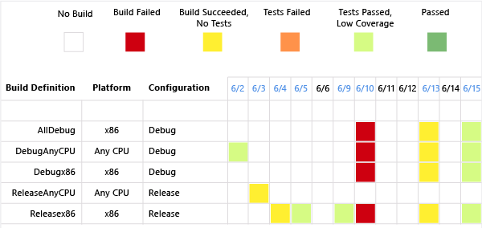
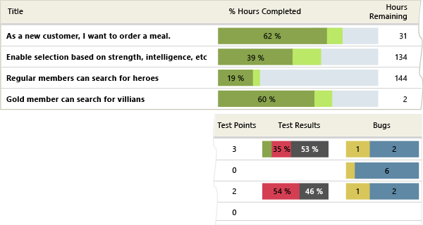
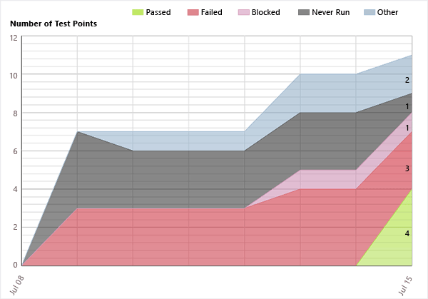
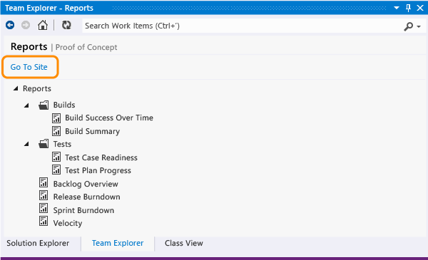

# Reporting Services Reports
[!INCLUDE [temp](../_shared/tfs-report-platform-version.md)]

You can analyze the progress and quality of your project by using the reports in SQL Server Reporting Services. These reports aggregate metrics from work items, version control, test results, and builds. These reports answer questions about the actual state of your project.  
  
 Most of these reports provide filters that you can use to specify contents to include in the report. Filters include time period, iteration and area paths, work item types, and work item states. The questions that they answer relate to all types of work items such as user stories, test cases, tasks, and bugs.  
  
 **Requirements**  
  
-   Your TFS on-premises deployment must be provisioned with SQL Server Reporting Services. These reports are not available if your Team Explorer home page does not contain a link to **Reports**.  
  
     Also, your team project must be provisioned with reports.  
  
     If you need to provision your deployment with Reporting Services or add reports to an existing team project, see [Add reports to a team project](../admin/add-reports-to-a-team-project.md).  
  
-   To view these reports, you must be assigned or belong to a group that has been assigned the **Browser** or **Team Foundation Content Manager** role in Reporting Services. For more information, see [Grant permissions to view or create reports](../admin/grant-permissions-to-reports.md).  
  

##Monitor code quality
Build reports track the quality of software under development. By defining tests to run automatically as part of each build pipeline and instrumenting tests to gather code coverage data, you can gain insight about the quality of the builds, tests, and code. 

<table>
<tr valign="top">
<td>
<b>Build and test activities</b> 
<ol>
<li>[Configure a build system](../../pipelines/agents/agents.md)</li>
<li>[Get started with CI/CD](../../pipelines/get-started-designer.md)</li>
<li>[Run tests in your build process](../../pipelines/languages/dotnet-core.md#run-your-tests)</li>
<li>(Optional) [Rate completed builds](https://msdn.microsoft.com/library/ms181734.aspx) to populate the Build Quality dimension.</li>
</ol>
</td>
<td>
<b>Build reports</b>
<ul>
    <li>[Build Quality Indicators](build-quality-indicators-report.md) (Agile and CMMI only)</li>
    <li>[Build Success Over Time](build-success-over-time-report.md) (pictured)</li>
    <li>[Build Summary](build-summary-report.md)</li>
</ul>
    </td>
</tr>
</table>

**Sample build success over time report**  

  

##Monitor progress
Project management reports provide insight into how much work the team is tackling within a sprint or release, and the rate of their progress. By linking work items and updating specific fields as work is performed, you can track the progress of individual stories and be able to more accurately estimate future activities. 

<table width="100%">
<tr valign="top">
<td width="60%">
<b>Work item tracking activities</b>
    <ol>
        <li>[Create the backlog](../../boards/backlogs/create-your-backlog.md).
            <ul>
                <li>Create product backlog items and specify the <b>Effort</b> (Scrum).</li>
                <li>Create user stories and specify the <b>Story Points</b> (Agile).</li>
                <li>Create requirements and specify the <b>Size</b> (CMMI).</li>
            </ul>
        </li>
        <li>[Work in sprints](../../boards/sprints/assign-work-sprint.md). Assign backlog items to sprints, create tasks and link them to parent backlog items, and assign to a team member.</li>
        <li>
            [Update Remaining Work for tasks](../../boards/sprints/task-board.md). For Agile and CMMI team projects, update <b>Completed Work</b> as well.
             
            <b>Tip</b>
             
            The only report that references <b>Original Estimate</b> is [Status on All Iterations](status-on-all-iterations-report.md).
        </li>
        <li>Create test cases and bugs, link them to their parent backlog item, and update their <b>State</b>.</li>
        <li>(Optional) Assign work items to areas to filter reports.</li>
    </ol>
</td>
    <td width="40%">
        <b>Project management (Scrum) reports</b>
        <ul>
    <li>[Backlog Overview (Scrum)](backlog-overview-scrum.md)</li>
    <li>[Release Burndown](release-burndown.md)</li>
    <li>[Sprint Burndown (Scrum)](sprint-burndown-scrum.md)</li>
        </ul>
        <b>Project management (Agile and CMMI) reports</b>
        <ul>
    <li>[Burndown and Burn Rate](burndown-and-burn-rate-report.md)</li>
    <li>[Remaining Work](remaining-work-report.md)</li>
    <li>[Requirements Overview (CMMI)](requirements-overview-report-cmmi.md)</li>
    <li>[Requirements Progress (CMMI)](requirements-progress-report-cmmi.md)</li>
    <li>[Status on All Iterations](status-on-all-iterations-report.md)</li>
    <li>[Stories Overview (Agile)](stories-overview-report-agile.md)</li>
    <li>[Stories Progress (Agile)](stories-progress-report-agile.md)</li>
    <li>[Unplanned Work](unplanned-work.md)</li>
</ul>
    </td>
</tr>
</table>

**Sample stories overview report**  
  

##Monitor test plans and bug tracking
Test planning reports support monitoring the test progress and coverage of backlog items or user stories. Bug tracking reports illustrate the team's capacity to find and resolve bugs.

<table width="100%">
<tr valign="top">
<td width="60%">
<b>Test planning and bug tracking activities</b>
<ol>
<li>Define test plans and test cases, and update their <b>State</b> as work progresses.</li>
<li>[Mark the results of each validation step in manual tests](../../test/run-manual-tests.md) as either passed or failed.</li>
<li><b>Create bugs</b>, specify the <b>Priority</b> and <b>Severity</b>, assign to a team member, and update the <b>State</b>.</li>
<li>(Optional) Assign test cases and bugs to areas and iterations to filter reports.</li>
</ol>
</td>
<td width="40%">
<b>Bug and test reports</b>
<ul>
    <li>[Bug Status](bug-status-report.md)</li>
    <li>[Bug Trends](bug-trends-report.md)</li>
    <li>[Reactivations](reactivations-report.md)</li>
    <li>[Test Case Readiness](test-case-readiness-report.md)</li>
    <li>[Test Plan Progress](test-plan-progress-report.md)</li>
</ul>
</td>
</tr>
</table>

**Sample test plan progress report**   
  

  
##   Open a report  
 You can open a report from Team Explorer, your team project portal, or any team home page in the web access portal.  
  
 Open the report site from the **Reports** page in Team Explorer.  
  
   
  
 Here's a view of reports for a Scrum project in Report Manager.  
  
   
  
> [!NOTE]  
>  If a red X icon appears on the **Reports** node in Team Explorer, you might not have permissions to access the reports or Team Explorer might have lost communication with the server that hosts SQL Server Reporting Services. In these instances, check with your project administrator to make sure that you have permissions to access the reports node and that the server that hosts Reporting Services is running.  
>   
>  The red X icon might appear on the **Reports** node if both of the following conditions are true:  
>   
>- If Team Explorer is running on the same computer as SQL Server Reporting Services  
>- You are not logged on as the administrator, or enhanced security is enabled for Internet Explorer.  
>   
>To correct this issue, log onto your computer as an administrator, or open Internet Explorer, open Internet Options, choose the **Security** tab, and clear the **Enabled Protected Mode** check box.  

   
##  Refreshing a report  
 All data captured for work items is written to the WIT data store, but only select data is written to the Analysis Services data warehouse. The WIT data store is updated in real-time as team members create and modify work items. Incremental updates are then written to the relational warehouse database every two minutes and the OLAP cube every two hours. To change these settings, see [Change the Data Warehouse Refresh Frequency](../admin/change-a-process-control-setting.md).  
  
 The following table describes how you can refresh the report.  
  
|Option|Result|  
|------------|------------|  
|Refresh button on the browser window|Refreshes the display with the report that is stored in the session cache. A session cache is created when a user opens a report. Reporting Services uses browser sessions to maintain a consistent viewing experience when a report is open.|  
||Causes the server that is running Reporting Services to rerun the query and update report data if the report runs on-demand. If the report is cached or a snapshot, the report that is stored in the report server database appears.|  
|CTRL+F5 keyboard combination|Produces the same result as choosing **Refresh** on the report toolbar.|  
  
##   Manage and work with published reports  
 You can also perform the following tasks when you view a report in Reporting Services:  
  
-   Zoom in or out of the report.  
  
-   Search for text that the report contains.  
  
-   Open a related report.  
  
-   Export the report to another format such as XML, CSV, PDF, MHTML, Excel, TIFF, or Word.  
  
-   Refresh the report.  
  
-   Print the report.  
  
-   Create a subscription for the report.  
  
## Q & A  
  
### Q: Do reports handle stories and substories or tasks and subtasks?  
 **A:**  Yes, you can subdivide stories or backlog items as well as tasks, creating a nested hierarchy of both backlog items and tasks. You can nest items several levels deep. If you subdivide a task into subtasks, specify hours only for the subtasks. These hours are rolled up as summary values for the parent task and their parent backlog item. To correct reports you believe are in error, see [Address inaccuracies published for summary values](address-inaccuracies-published-for-summary-values.md).  
  
### Q: Which reports depend on linking work items?  
 **A:**  The overview and progress reports depend on linking tasks, test cases, and bugs to backlog items. You must link these items using the parent-child link for tasks and bugs and the Tested By link for test cases.  
   
### Q: Why isn't code churn and code coverage data appearing in my reports?  
 **A:** If you use Git for version control, code churn and code coverage report data are not available.  
  
### Q:  Are these reports the same as the charts that appear in the web portal?  
 **A:**  While some reports do display similar information, such as sprint burndown and velocity or status on all iterations, these reports are formatted differently and support additional filters.  
  
### Q: Do you want to create additional product areas or release milestones?  
 **A:** See [Create areas or iterations](../../organizations/settings/set-area-paths.md).  
  
### Q: Do you want to bulk edit work items to assign them to an area, iteration, team member, or priority?  
 **A:**  See [Bulk modify work items](../../boards/backlogs/bulk-modify-work-items.md).  
  
### Q: Do you want to add a field to track additional data?  
**A:**  See [Add or modify a work item field to support reporting](../../reference/xml/add-or-modify-work-item-fields-to-support-reporting.md).   

