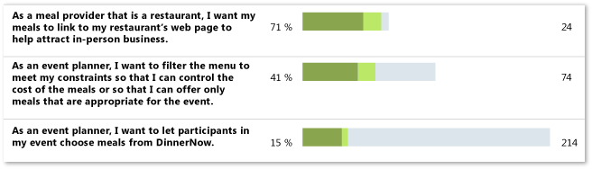

# Requirements Overview Report (CMMI)
[!INCLUDE [temp](../_shared/tfs-report-platform-version.md)]

The Requirements Overview report lists all requirements, filtered by area and iteration and in order of importance. For information about how to open this report, refresh the data, or manage reports, see [Reporting Services Reports](reporting-services-reports.md).  
  
> [!NOTE]
>  This report requires that the team project collection that contains your team project was provisioned with SQL Server Reporting Services. This report is not available if  **Reports** does not appear when you open Team Explorer and expand your team project node.  
  

**You can use this report to answer the following questions**:   -   How much work does each Requirement require? -   How much work has the team completed for each Requirement? -   Are the tests for each Requirement passing? -   How many active bugs does each Requirement have?
  
 **Required Permissions**  
  
 To view the report, you must be assigned or belong to a group that has been assigned the **Browser** role in Reporting Services. For more information, see [Add users to team projects](../admin/grant-permissions-to-reports.md).  
  
##   Data in the Report  
 The Requirements Overview report presents a snapshot of the work that has been performed for the filtered set of requirements to the current date, as the following illustration shows:  
  
   
  
 This report displays the following information for each user story that it lists:  
  
 **Work Progress**  
  
-   **% Hours Completed**: A numeric value and visual representation that shows the percentage of completed work based on the rollup of baseline and completed hours for all tasks that are linked to the requirement or its child requirements.  
  
-   **Hours Remaining**: A numeric value for the rollup of all remaining hours for all tasks that are linked to the requirement or its child requirements.  
  
 **Test Status**  
  
-   **Tests**: A numeric value that represents the number of test cases that are linked to the requirement or its child requirements.  
  
-   **Test Results**: A numeric value and visual representation that shows the percentage of test cases, grouped according to the status of their most recent test run, where the options are **Passed** (green), **Failed** (red), or **Not Run** (black).  
  
-   **Bugs**: A numeric value and visual representation that shows the number of bugs that are linked to the test case or requirement, where the options are **Active** (blue) and **Resolved** (gold). If a requirement is linked to one or more child requirements, the values represent a rollup of all bugs for the requirement and its child requirements.  
  
### Requirements that Appear in the Report  
 The Requirements Overview report lists and highlights requirements according to the following criteria:  
  
-   Requirements appear in order of their importance, based on their assigned ranking.  
  
-   Requirements appear in bold type when they are in the active or resolved state.  
  
-   Requirements appear in normal type when they are in the closed state.  
  
-   Requirements appear in gray type when their assigned iteration or area is outside the filtered set, but they have Tasks or child Requirements that are within the filtered set of iterations or product areas.  
  
    > [!NOTE]
    >  For information about how to define iteration and area paths, see [Define area paths](../../organizations/settings/set-area-paths.md) or [Define iteration paths](../../organizations/settings/set-iteration-paths-sprints.md) .  
  
### Required Activities for Tracking Work Items  
 For the Requirements Overview report to be useful and accurate, the team must perform the following activities to track work items:  
  
-   Define requirements and tasks, create a **Child** link from each task to a requirement, and create a **Child** link from any subtasks to its parent task.  
  
-   Define and update the **Completed** and **Remaining** fields for each task or subtask during the iteration or release.  
  
    > [!IMPORTANT]
    >  If you subdivide a task into subtasks, team members should specify hours only for the subtasks. These hours are rolled up as summary values for the parent task and requirement.  
  
-   Define test cases, and create a **Tested By** link from each test case to a requirement.  
  
-   For each bug, create either a **Tested By** link to the test case that identified the code defect or a **Related** link to the requirement to which the bug relates.  
  
-   Set the **State** of each bug to **Resolved** when it is fixed.  
  
-   Specify the **Iteration** and **Area** paths for each requirement, task, test case, and bug.  
  
    > [!NOTE]
    >  For information about how to define iteration and area paths, see [Define area paths](../../organizations/settings/set-area-paths.md) or [Define iteration paths](../../organizations/settings/set-iteration-paths-sprints.md) .  
  
##   Interpreting the Report  
 The Requirements Overview report shows overall work progress in the three areas that are important to completing and closing a Requirement:  
  
-   Tasks implemented to complete each requirement.  
  
-   Tests run to ensure the quality of the implemented requirements.  
  
-   Bugs identified that indicate problems with the quality of the requirements.  
  
 Depending on your area of focus, you can filter the report in the following ways:  
  
-   Specify the **Iteration** and **Area** paths of interest.  
  
     For more information, see [Filtering the Report](#Changing) later in this article.  
  
-   Click  or  to expand or collapse a requirement and display child requirements. Parent requirements display a rollup of all task hours that are assigned to it and its child requirements.  
  
### Questions That the Report Answers  
 You can review the report to determine the overall progress for each requirement of interest. For example, you can find answers to the following questions:  
  
#### Work Progress  
  
-   Does the amount of work that remains for each requirement correspond to your expectations?  
  
-   Are top-ranked requirements being implemented first?  
  
-   How many test cases are defined for each requirement? How many tests are passing?  
  
-   What requirements are being implemented that have no test cases defined for them?  
  
#### Quality Progress  
  
-   How many tests have run for each requirement, and how many have passed?  
  
-   How many active bugs does each requirement have?  
  
-   Are bugs being found for requirements that are being tested?  
  
-   Are bugs being resolved or are they remaining active?  
  
#### Risk Assessment  
  
-   Which requirements are at risk?  
  
-   Which requirements are not stable enough for release?  
  
-   Which requirements can the team ship today?  
  
### Healthy Version of the Report  
 A healthy Requirements Overview report shows more progress on requirements that appear near the top of the report. As the following illustration shows, the team has accomplished more work for those requirements that appear first in the report. Requirements are always listed according to their ranking.  
  
   
  
### Unhealthy Version of the Report  
 An unhealthy Requirements Overview report shows one or more of the following indications:  
  
-   The team is making more progress on requirements that have a lower rank than on requirements that have a higher rank.  
  
-   More tests are failing than are passing.  
  
-   Tests are failing for a requirement, but no bug work items are being created.  
  
##   Filtering the Report  
 You can filter the Requirements Overview report to show only those requirements that are defined for the iterations or product areas that you specify.  
  
#### To specify which Requirements appear in the report  
  
1.  In the **Iteration** or **Area** list, select the check box of each iteration or product area to include.  
  
2.  Click **View Report** to refresh the report based on the new filter criteria.  
  
## Related notes 
 [Reporting Services Reports](reporting-services-reports.md)
