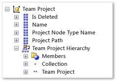
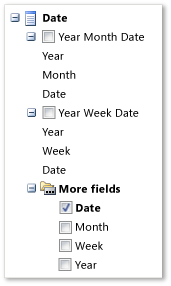
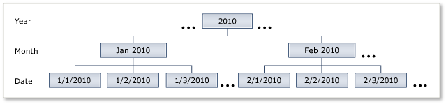

# Shared dimensions in the Analysis Services Cube
[!INCLUDE [version-lt-azure-devops](../../includes/version-lt-azure-devops.md)]

You can report data from across team project collections because all reportable data in a deployment of Azure DevOps is written to the SQL Server Analysis Services cube for Azure DevOps Server. Use the Team Project dimension to show the data for only those team projects that you specify. Also, use the Date dimension to create trend reports that show changes over a day, a week, a month, or a year. All perspectives in the cube share these dimensions.  
  
You can use dimension attributes to summarize the measures in the cube according to various categories. For example, you can use the Priority, Work Item Type, State, Closed By, and Closed Date attributes to determine how many priority one bugs were closed by a specific team member in November.  
  

## Filter Reports or mine data based on project collections and team projects  

You can use the Team Project dimension to filter a report or highlight specific details of a project collection or team project. All measures and dimensions in the Team System cube record data that is specific to a team project and project collection. The following illustration shows the attributes within the Team Project dimension as it appears in the Report Builder Query Designer. The Team Project Hierarchy node contains two hierarchical attributes, the first at the collection level and the second at the team-project level.  
  
  
  
You can filter the report to the team projects of interest by specifying one or more of the attributes in the following table: 
  
|Attribute|Description|  
|---------------|-----------------|  
|Team Project Hierarchy|The hierarchy of project collections and team projects. Use this field when you must filter a report from many project collections and team projects.|  
|Is Deleted|A Boolean value that specifies whether a project is deleted.|  
|Name|The name of a team project or project collection.|  
|Project Node Type Name|The name of the node. Valid values are **Team Project** and **Team Project Collection**.|  
|Project Path|A flat list of team project paths that start with the project collection.|  

## Create and Filter Trend Reports  

By using the Date dimension, you can create trend reports that summarize changes that occur over time to these items in version control:
- Work items
- Builds
- Tests
- Files

Reports that include the Date dimension show information for the specific day on which an action occurred. All information in the data warehouse is tracked as it appeared at the end of each day.  
  
> [!NOTE]
>  The dates in the Date dimension are stored according to the date that is set for the application-tier server that runs the warehouse adapters that move data from the data stores to the relational warehouse database. Dates are not adjusted based on time zone.

You can use date dimension hierarchies to aggregate values by day, week, month, or year. For example, you can compare the percentage of opened versus closed bugs from one month to another.

The first two attributes, **Year Month Date** and **Year Week Date**, correspond to hierarchical tree filters. The first hierarchy, as the following illustration shows, supports filtering by month. The second hierarchy supports filtering by week.

Under **More fields**, you can specify the granularity of the time axis for displaying trend reports as **Date**, **Month**, **Week**, or **Year**.

You can use the Date hierarchy with the **Year Month Day** attribute to aggregate measures by year, month, and the day of the month.

You can use the Date hierarchy with the **Year Week Day** attribute to aggregate measures by year, week of year, and the day of the week.
  
## Related articles
 
- [Perspectives and measure groups provided in the Analysis Services cube](perspective-measure-groups-cube.md)
