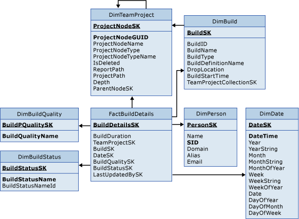

# Build Details tables

[!INCLUDE [version-lt-azure-devops](../../includes/version-lt-azure-devops.md)]

Use FactBuildDetails and the associated dimension tables to query for data. Find out about things like the status and quality of builds.

> [!IMPORTANT]  
> Build tables are only applicable for XAML builds, which are deprecated for TFS 2018 and later versions. If your build process isn't based on XAML builds, these tables and the TFS Warehouse for builds won't yield any meaningful data.    

For information about the measures and dimensions that are associated with these tables in the SQL Server Analysis Services cube, see [Builds](perspective-build-analyze-report-build-details-coverage.md).  
  
  
  
FactBuildDetails is associated with the following dimension tables:  
  
- DimBuild  
- DimBuildQuality    
- DimBuildStatus    
- DimDate    
- DimPerson    
- DimTeamProject  
  
For more information, see these articles:
- [Builds](perspective-build-analyze-report-build-details-coverage.md)   
- [Build Quality Indicators](build-quality-indicators-report.md)   
- [Build Success Over Time](build-success-over-time-report.md)   
- [Build Summary](build-summary-report.md)   
- [Table reference for the relational warehouse database](table-reference-relational-warehouse-database.md) 
- [Continuous integration on any platform](../../pipelines/get-started/what-is-azure-pipelines.md)
