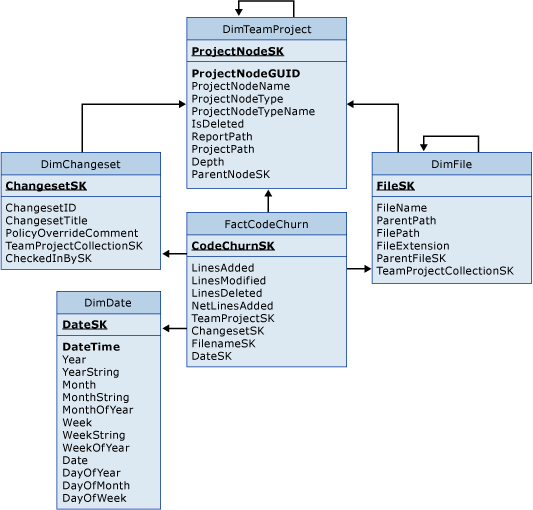

# Code Churn tables

[!INCLUDE [version-lt-azure-devops](../../includes/version-lt-azure-devops.md)]

Use FactCodeChurn and the associated dimension tables to query for data. Find out about the changes in the code that is under version control. The fact table contains one record for each revision of a file in each changeset.  
  
For a description of the measures and dimensions that are associated with these tables in the Analysis Services cube, see [Code churn and code coverage](perspective-code-analyze-report-code-churn-coverage.md).  
  
  
  
FactCodeChurn is associated with the following dimension tables:  
  
- DimChangeset  
  
- DimDate  
  
- DimFile  
  
- DimTeamProject  
  
For more information, see these articles:
- [Code churn and code coverage](perspective-code-analyze-report-code-churn-coverage.md)   
- [Code Churn](/previous-versions/azure/devops/report/excel/code-churn-excel-report)   
- [Run Coverage tables](run-coverage-tables.md)   
- [Table reference for the relational warehouse database](table-reference-relational-warehouse-database.md)
