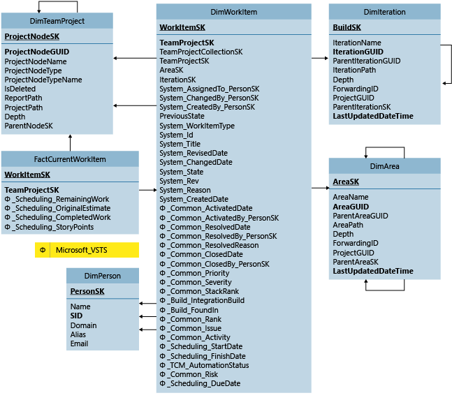

# Current Work Item tables

[!INCLUDE [version-lt-azure-devops](../../includes/version-lt-azure-devops.md)]

Use the FactCurrentWorkItem table and the associated dimension tables to query for data. Find out about the current state of bugs, tasks, and other types of work items.
  
For information about the measures and dimensions that are associated with these tables in the SQL Server Analysis Services cube, see [Test cases and work items](perspective-test-analyze-report-work.md).  
  
  
  
FactCurrentWorkItem is associated with the following dimension tables:  
  
- DimArea  
  
- DimIteration  
  
- DimPerson  
  
- DimTeamProject  
  
- DimWorkItem  
  
For more information, see these articles:
- [Test cases and work items](perspective-test-analyze-report-work.md)   
- [Work Item History tables](work-item-history-tables.md)   
- [Table reference for the relational warehouse database](table-reference-relational-warehouse-database.md)