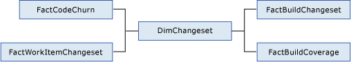

# Table reference for the relational warehouse database

[!INCLUDE [temp](../_shared/tfs-report-platform-version.md)]

You can create reports and query for data by using the warehouse database. The data in the warehouse is collected from the TFS operational stores and organized in a set of tables, views, and table-valued functions that are designed for creating reports.  
  
   
  
 The warehouse contains data about builds, source code, test results and code coverage, and work items such as tasks and bugs. The relationships between these sets of data are created in Visual Studio ALM and retained in the warehouse. Therefore, you can create queries to explore relationships between these integrated sets of data and better understand what is happening on your projects.  
  
  
 The data in the warehouse is stored in fact and dimension tables. This pattern for storing data in star and snowflake schemas is described in the following topic on the Microsoft Web site: [Introduction to Dimensions](https://msdn.microsoft.com/library/ms175439.aspx).  
  
 Some other common patterns occur in the warehouse:  
  
-   All fact tables reference DimTeamProject, because all data in Visual Studio ALM is organized by team projects and team project collections. Some dimensions also reference the DimTeamProject so that you can more easily use them as project-filter parameters in your reports.  
  
-   All fact tables reference DimDate to indicate the date on which the fact occurred.  
  
-   Many fact tables reference DimPerson, sometimes more than once. For example, the work item facts reference DimPerson to indicate to whom a work item is assigned to and who changed it most recently.  
  
##   Builds  
 You can query for data about builds by using four fact tables, as the following illustration shows. Each fact table uses the build dimension table DimBuild to store many details about the builds.  
  
   
  
|Fact Table|Description|  
|----------------|-----------------|  
|[Build Details tables](table-reference-build-details.md)|Basic information about each build, such as the build status and quality.|  
|[Build Changeset tables](table-reference-build-changeset.md)|Changesets that were included in each build.|  
|[Build Project tables](table-reference-build-project.md)|Files that were built and the platforms and flavors of the builds.|  
|[Build Coverage tables](table-reference-build-coverage.md)|The extent to which the code was covered by tests that were performed against the build.|  
  
 For more information about builds, see [Build](../../pipelines/overview.md).  
  
##   Source Code  
 You can query for data about code and other files that are under version control by using the fact tables in the following illustration. DimFile and DimChangeset are the two primary dimensions that are associated with these fact tables. DimFile provides information about files and folders, without regard to specific versions of those files. DimChangeset provides information about the changesets.  
  
   
  
|Fact Table|Description|  
|----------------|-----------------|  
|[Code Churn tables](table-reference-code-churn.md)|Basic information about each build.|  
|[Build Changeset tables](table-reference-build-changeset.md)|Changesets that were included in the build.|  
|[Build Project tables](table-reference-build-project.md)|Files that were built and the platforms and flavors that were used.|  
|[Work Item Changeset tables](work-item-changeset-tables.md)|Links between work items and changesets.|  
  
 For more information about version control, see [Code](../../repos/tfvc/overview.md).  
  
##   Tests  
 You can query for information about test results and analyze how well the tests cover the code by using the tables in the following illustration.  
  
   
  
|Fact Table|Description|  
|----------------|-----------------|  
|[Test Result tables](test-result-tables.md)|Tests and their results.|  
|[Run Coverage tables](run-coverage-tables.md)|The extent to which the code was covered by tests in a test run.|  
|[Build Coverage tables](table-reference-build-coverage.md)|The extent to which the code was covered by tests that were performed against the build.|  
|[Work Item Test Result tables](work-item-test-result-tables.md)|Links between work items and test results.|  
  
 For more information, see [Testing overview](../../test/index.md) and [Using Code Coverage to Determine How Much Code is being Tested](https://msdn.microsoft.com/library/dd537628.aspx).  
  

##  Tasks, Bugs and Other Types of Work Items  
 You can query for information about tasks, bugs, and other types of work items by using the work item tables in the following illustration. Each work item fact table uses the work item dimension table to store many details about the work items.  
  
   
  
|Fact Table|Description|  
|----------------|-----------------|  
|[Current Work Item tables](table-reference-current-work-items.md)|The current state of each work item.|  
|[Work Item History tables](work-item-history-tables.md)|The full history of each work item.|  
|[Work Item Link History tables](work-item-link-history-tables.md)|The full history of links between work items.|  
|[Work Item Category tables](work-item-category-tables.md)|The categories that are used to associate similar types of work items.|  
|[Work Item Changeset tables](work-item-changeset-tables.md)|Links between work items and changesets.|  
|[Work Item Test Result tables](work-item-test-result-tables.md)|Links between work items and test results.|  
  
 
