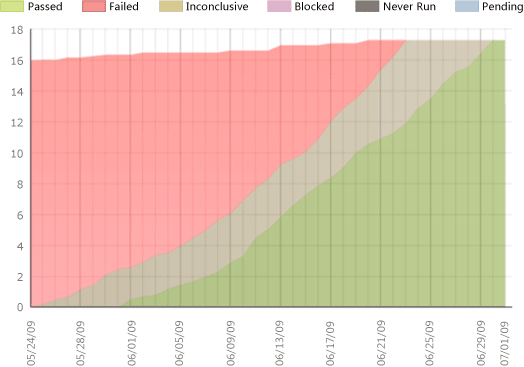

# Test Plan Progress Report

[!INCLUDE [temp](../_shared/tfs-report-platform-version.md)]

After the team creates test plans and starts to run tests by using the test management tools provided with Team Foundation Server (TFS) which include Test Runner, Microsoft Test Manager, or web portal **Test**. With the Test Plan Progress report, you can track the team's progress in testing the product.  
  
 For information about how to define test suites and test plans, see [Plan your tests](../../test/create-test-cases.md).  
  
 For information about how to access, refresh, or manage reports, see [Reporting Services Reports](reporting-services-reports.md).  
  
**You can use this report to answer the following questions**:   -   How much testing has the team completed? -   Is the team likely to finish the testing on time? -   How many tests are left to be run? -   How many tests are passing? -   How many tests are failing? -   How many tests are blocked?
  
 **Requirements**  
  
-   To view the report, you must be assigned or belong to a group that has been assigned the **Browser** role in Reporting Services. For more information, see [Add users to team projects](../admin/grant-permissions-to-reports.md).  
  
-   The team project collection that contains your team project was provisioned with SQL Server Reporting Services. This report is not available if  **Reports** does not appear when you open Team Explorer and expand your team project node. If you need to add reports, see [Add reports to a team project](../admin/add-reports-to-a-team-project.md).  
  
##   Data in the Report  
 The data that appears in the Test Plan Progress report is derived from the data warehouse and the test results that are generated when tests are run by using Microsoft Test Manager. The report presents an area graph that shows the most recent result of running any test in the specified test plans over time. For more information, see [Run your tests](../../test/run-manual-tests.md).  
  
 The following illustration shows an example of a Test Plan Progress report:  
  
   
  
 The horizontal axis shows days in a sprint or iteration, and the vertical axis shows test points. A test point is a pairing of a test case with a test configuration in a specific test suite. For more information about test points, see [Reporting on testing progress for test plans](../../test/track-test-status.md). The following table describes the meaning of each test result:  
  
|Test result|Description|  
|-----------------|-----------------|  
|**Passed**|Number of test cases that passed.|  
|**Failed**|Number of test cases that failed.|  
|**Inconclusive**|Number of test cases that ran and were assigned a status of Inconclusive.|  
|**Blocked**|Number of test cases that are currently blocked from running.|  
|**Never Run**|Number of test cases that have never been run.|  
|**Other**|Number of test cases that were run and assigned one of the following states: Aborted, Not Executed, PassedButRunAborted, NotRunnable, Disconnected, Timeout, Pending, In Progress, or Inconclusive.|  
  
 You can filter the Test Plan Progress report in the following ways:  
  
-   Change the start and end dates for the report.  
  
-   Filter the test plans that are counted in the report by specifying iteration paths, area paths, and the names or states of the test plans.  
  
 For more information, see [Filtering the Report](#Changing) later in this article.  
  
### Required Activities for Managing Test Cases and Test Plans  
 For the Test Plan Progress report to be useful and accurate, the team must perform the following activities to manage test plans:  
  
-   Define test cases, and specify the **Iteration** and **Area** paths for each test case.  
  
-   Define test plans, and specify their current state.  
  
-   For manual tests, mark the results of each validation step in the test case as passed or failed.  
  
    > [!IMPORTANT]
    >  Testers must mark a test step with a status if it is a validation test step. The overall result for a test reflects the status of all the test steps that were marked. Therefore, the test will have a status of failed if any test step is marked as failed or not marked.  
  
     For automated tests, each test is automatically marked as passed or failed.  
  
-   To support filtering, assign **Iteration** and **Area** paths to test cases.  
  
##   Interpreting the Report  
 You can track how many test plans have been run and how many are failing. The Test Plan Progress report displays the cumulative value of all test plans, grouped by result status.  
  
### Questions Answered by the Report  
 You can review the report to determine the progress within a sprint or iteration or over time. For example, you can answer these questions:  
  
-   How much testing has the team completed?  
  
-   Is the team likely to finish the testing on time?  
  
-   How many tests are left to be run?  
  
-   How many tests are passing?  
  
-   How many tests are failing?  
  
-   How many tests are blocked?  
  
### Healthy Version of the Report  
 A healthy Test Plan Progress report shows a steady progress in test plans running and passing as the following illustration shows. Ideally, the report shows a relatively flat number of test cases for a given plan. As the development cycle progresses, the number of passing test cases should increase, and the numbers of test cases in other states should decrease.  
  
   
  
### Unhealthy Version of the Report  
 An unhealthy Test Plan Progress report shows one or more of the following indicators:  
  
-   **A high number of test cases are failing**.  
  
     When the chart shows more red than green, more test cases are failing then passing. Depending on where you are in the product cycle, you might investigate why so many test cases are failing.  
  
-   **The number of test cases that are passing remains flat**.  
  
     As the following illustration shows, the number of test cases that are passing, failing, or never run is flat. You might want to investigate the specific causes that affect each area.  
  
       
  
##   Filtering the Report  
 You can filter the Test Plan Progress report to show only those test cases that are defined for the iteration, product areas, test plans, or test plan states that you specify. The following illustration shows the available filters:  
  
   
  
#### To change the time interval of the report  
  
1.  Next to **Iteration Start (Date)** or **Iteration End (Date)**, click the calendar icon, and then click the appropriate date.  
  
2.  Click **View Report**.  
  
#### To filter the test plans or test cases that are counted in the report  
  
1.  Perform one or both of the following actions:  
  
    -   In the **Iteration** or **Area** lists, select the check box of each iteration path and product area to include.  
  
    -   In the **Test Plan** and **Test Plan State** lists, select the check box of each test plan and test plan state to include.  
  
2.  Click **View Report**.  
  
## Related notes
-  [Reporting Services Reports](reporting-services-reports.md)   
-  [Agile process](../../boards/work-items/guidance/agile-process.md)
