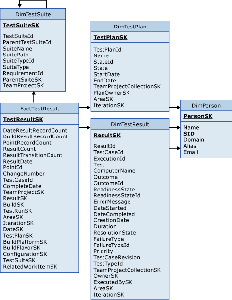
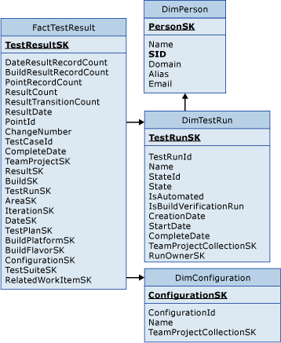
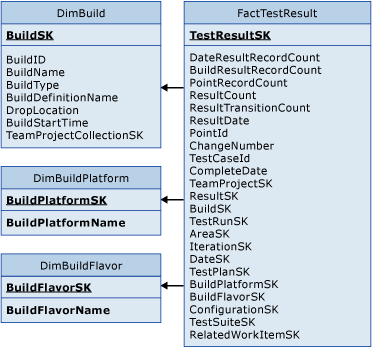
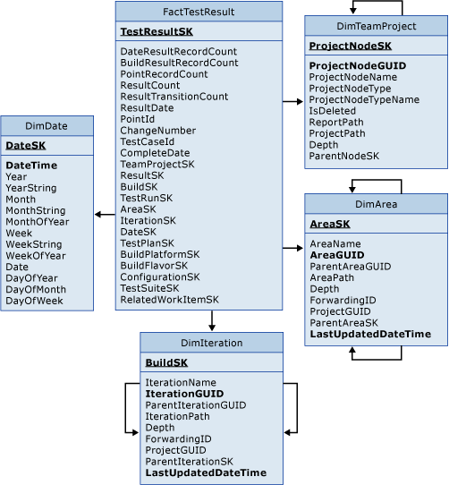

# Test Result tables

[!INCLUDE [version-lt-azure-devops](../../includes/version-lt-azure-devops.md)]

Use the FactTestResult table and the associated dimension tables to query for data about test results. For information about the measures and dimensions that are associated with these tables in the SQL Server Analysis Services cube, see [Test results](perspective-test-analyze-report-test-results.md).  
 
  
## Test results, test suites, and test plans

The DimTestResult table provides details about the test results themselves. You can use the DimTestPlan and DimTestSuite tables to organize the results by test plan and test suite.  
  
  

## Test results and test runs  

You can use the DimTestRun, DimConfiguration, and DimPerson dimension tables to include data about how the tests were run.  
  
  
  
## Test results and builds  

You can use the DimBuild, DimBuildFlavor, and DimBuildPlatform dimension tables, to include data about the build that was used to create the test results.  
  
  
  
  
## Test results and team project data  

You can use the DimTeamProject, DimArea, and DimIteration tables to obtain details about how the tests are organized in the team project. You can use DimDate to show when the test results were created.  

  

## Related articles 
- [Test results](perspective-test-analyze-report-test-results.md)   
- [Test Management Reports](/previous-versions/azure/devops/report/excel/test-management-reports)   
- [Testing overview](../../test/index.yml)   
- [Work Item Test Result tables](work-item-test-result-tables.md)   
- [Table reference for the relational warehouse database](table-reference-relational-warehouse-database.md)
