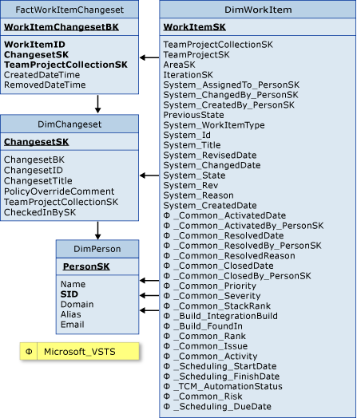

# Work Item Changeset tables  

[!INCLUDE [temp](../includes/tfs-report-platform-version.md)]

You can query for data about work items that are linked to changesets by using FactWorkItemChangeset and the associated dimensions. For information about the measures and dimensions that are associated with these tables in the SQL Server Analysis Services cube, see [Test cases and work items](perspective-test-analyze-report-work.md).  
  
   
  
 FactWorkItemChangeset is associated with the following dimension tables:  
  
-   DimChangeset  
  
-   DimPerson  
  
-   DimWorkItem  
  
## Related articles 
-  [Test cases and work items](perspective-test-analyze-report-work.md)   
-  [Find and view changesets](../../repos/tfvc/find-view-changesets.md)   
-  [Table reference for the relational warehouse database](table-reference-relational-warehouse-database.md)