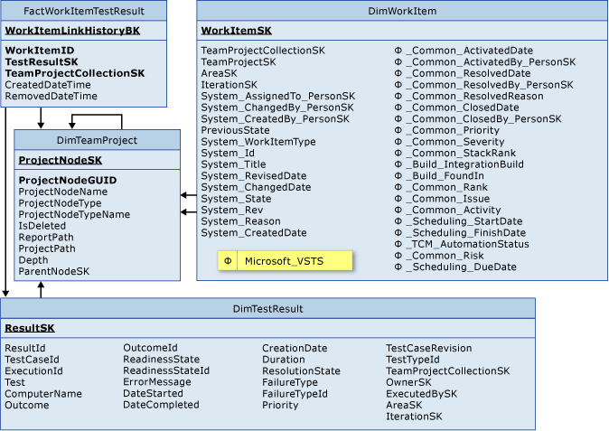

# Work Item Test Result tables
[!INCLUDE [temp](../_shared/tfs-report-platform-version.md)]

You can query for data about work items that are linked to test results by using FactWorkItemTestResult and the associated dimension tables. For information about the measures and dimensions that are associated with these tables in the SQL Server Analysis Services cube, see [Test results](perspective-test-analyze-report-test-results.md).  
  
   
  
 FactWorkItemTestResult is associated with the following dimension tables:  
  
-   DimTeamProject  
  
-   DimTestResult  
  
-   DimWorkItem  
  
## Related notes  
 [Test results](perspective-test-analyze-report-test-results.md)   
 [Test Result tables](test-result-tables.md)   
 [Current Work Item tables](table-reference-current-work-items.md)   
 [Test Management Reports](../excel/test-management-reports.md)   
 [Testing overview](../overview.md)   
 [Table reference for the relational warehouse database](table-reference-relational-warehouse-database.md)
