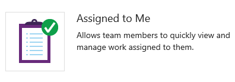
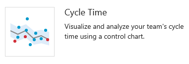
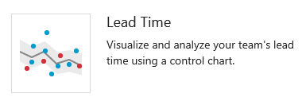
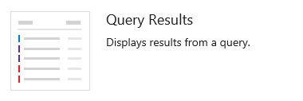
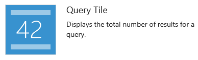
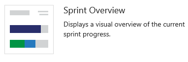
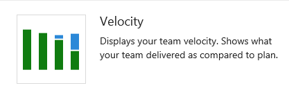
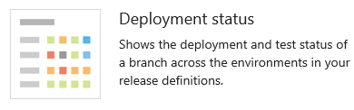
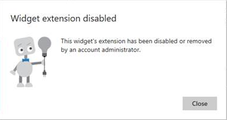

# Widget catalog 

<b>Team Services | TFS 2017 | TFS 2015.1-2015.3  </b>  

>[!NOTE]  
>**Feature availability**: You can access the widget catalog from Team Services or the web portal for TFS 2015.1 or later version. All widgets listed below are available from the web portal for Team Services. Some widgets listed below are only available when you connect to TFS 2015 Update 2 or later version.  
>
>With TFS 2015, you have access to a [single team dashboard](team-dashboard.md) with which you can pin items but can't add widgets to the dashboard. Install [TFS 2015 Update 1](https://www.visualstudio.com/news/tfs2015-update1-vs.aspx) or later version to get access to the widget catalog and [multiple team dashboards](dashboards.md). 
To determine the platform and version you're on, see [Provide product and content feedback, Platforms and version support](../provide-feedback.md#platform-version). 

To add a widget to a dashboard or copy a widget from one dashboard to another, see [Add a widget to a dashboard](add-widget-to-dashboard.md).  

## User-focused and team-scoped widgets 

User-focused widgets display information based on the logged-in user. 

Team-scoped widgets display data based on the selected team context.  
 

## Code

 
### Code tile	

Adds a configurable tile to display the summary of a code folder or Git repository. To configure, simply click the added tile, select a repository, select a branch (Git only) and select a path. The code tile supports both TFVC and Git repositories. 

----

 
### Pull request (user-focused or team-scoped)  

<blockquote style="font-size: 13px"><b>Feature availability: </b> Available from Team Services or TFS 2015.2 or later version. </blockquote>  

Adds a configurable tile to display active pull requests requested by the team, or assigned to or requested by the person logged in. Select the Git repository for the pull requests of interest. 

You need to add a widget for each Git repository of interest.

To learn more about pull requests, see [Review code with pull requests](../git/pull-requests.md).

## Plan and track work  

### Assigned to me (user-focused)  
 

  
<blockquote style="font-size: 13px"><b>Feature availability: </b> You can access this widget from Team Services and TFS 2017. </blockquote>  

Displays the list of work items currently assigned to the currently logged in user. The list ignores closed or deleted work items.

 

 

----
### Chart for work items  
 
	

  
<blockquote style="font-size: 13px"><b>Feature availability: </b> You can access this widget from Team Services or TFS 2015.2 or later version. For TFS 2015.1 and earlier versions, see [Add charts to a dashboard](add-widget-to-dashboard.md#add-charts) to add shared query charts to a dashboard.  </blockquote>  

Adds a tile to display a progress or trend chart that builds off a shared work item query. 

From the configuration dialog, select a shared query and [specify the chart type and values](charts.md#add-chart-widget).   

   

----

 
### Cumulative flow diagram (team-scoped)  

  
<blockquote style="font-size: 13px"><b>Feature availability:</b> This widget is available for Team Services.  To add it to your dashboard, you first need to install the [Analyics Marketplace extension](https://marketplace.visualstudio.com/items?itemName=ms.vss-analytics). You can then [add the widget(s) to your dashboard](add-widget-to-dashboard.md). You must be an account owner or a member of the [Project Collection Administrator group](../setup-admin/add-administrator-tfs.md) to add extensions. 
</blockquote> 

Displays the cumulative flow of backlog items based on the time frame, team, backlog level and swimlane you select. 

From the configuration dialog, [specify the team, backlog level, and other parameters you want](guidance/cumulative-flow.md#configure-widget).

Hover over each color within the chart to see the count of items for a particular Kanban column.  

 

----
 
### Cycle time (team-scoped)  

  
<blockquote style="font-size: 13px"><b>Feature availability:</b> This widget is available for Team Services.  To add it to your dashboard, you first need to install the [Analyics Marketplace extension](https://marketplace.visualstudio.com/items?itemName=ms.vss-analytics). You can then [add the widget(s) to your dashboard](add-widget-to-dashboard.md). You must be an account owner or a member of the [Project Collection Administrator group](../setup-admin/add-administrator-tfs.md) to add extensions. 
</blockquote> 

Displays the cycle time of work items closed in a specified timeframe for a single team and backlog level. The cycle time of a work item is defined as the time taken to close a work item after work on it has started. 

Each marker on the chart corresponds to one or more work items with a particular cycle time. The lower the cycle time, the faster work is progressing through your development pipeline.

  

----
 
### Lead time (team-scoped)  

  
<blockquote style="font-size: 13px"><b>Feature availability:</b> This widget is available for Team Services. To add it to your dashboard, you first need to install the [Analyics Marketplace extension](https://marketplace.visualstudio.com/items?itemName=ms.vss-analytics). You can then [add the widget(s) to your dashboard](add-widget-to-dashboard.md). You must be an account owner or a member of the [Project Collection Administrator group](../setup-admin/add-administrator-tfs.md) to add extensions. 
</blockquote> 

Displays the lead time of work items closed in a specified timeframe for a single team and backlog level. The lead time of a work item is defined as the time taken to close a work item after it was created. 

Each marker on the chart corresponds to one or more work items with a particular lead time. The lower the lead time, the faster work is being delivered to the customer.

  
----

### New Work item (team-scoped) 
	

Enables you to add work items from the dashboard. You [use work items to plan and track work](../work/backlogs/add-work-items.md).    

Work items that you add using this widget are automatically scoped to the team's default area path and the team's current sprint (TFS) or the default iteration (Team Services). To change team defaults, see [Set team defaults](../work/scale/set-team-defaults.md).

   

----

 
### Other links (team-scoped) 

  

Provides links to the following features: 

<ul>
<li>Opens a form to initiate a [request to provide feedback](../work/connect/get-feedback.md).</li>
<li>Opens the team's quick dialog to add or modify the active sprints or iteration paths for your team. To learn more see [Define sprints](../work/scrum/define-sprints.md).</li>
<li>Opens the team's quick dialog to modify your [team's area path](../work/scale/multiple-teams.md). </li> 
</ul>

For on-premises TFS, additional links are displayed when the corresponding resource is configured for the team project: 

**On-premises TFS with configured resources**
  

<ul>
<li>[View project portal](sharepoint-dashboards/share-information-using-the-project-portal.md) (opens either a SharePoint site or URL that's been configured as the team project's portal.  </li>
<li>[View process guidance](sharepoint-dashboards/configure-or-redirect-process-guidance.md) (opens either a SharePoint site or URL that's been configured as the team project's process guidance.  </li>
<li>[View reports](sql-reports/reporting-services-reports.md) (opens SQL Server Reporting Services). To add or update reports for a team project, see [Add reports to a team project](./admin/add-reports-to-a-team-project.md). </li> 
</ul>

   

----

 
### Query results 
	

Adds a configurable tile that lists the results of a shared query. 

From the configuration dialog, select either a team favorite or shared query.  

To create a shared query, see [Use the query editor to list and manage queries](../work/track/using-queries.md).
 

   

----
 
### Query tile 

Adds a configurable tile to display the summary of a shared query results.

From the configuration dialog, select either a team favorite or shared query. You can optionally specify rules to change the query tile color based on the number of work items returned by the query. 

To create a shared query, see [Use the query editor to list and manage queries](../Work/track/using-queries.md).
 

   

---- 

 
### Sprint burndown (team-scoped) 

Adds the team's burndown chart for the current sprint to the dashboard. This chart always displays data for the current sprint.

Teams [use the burndown chart to mitigate risk and check for scope creep](../work/scrum/sprint-burndown.md) throughout the sprint cycle. 

 

---- 

 
### Sprint capacity (team-scoped) 

Inserts the team's capacity bar chart for the current sprint.

Teams [specify their capacity to plan and monitor their sprint resources](../work/scale/capacity-planning.md). 

 

---- 
 
### Sprint overview (team-scoped) 

For Team Services, inserts a configurable overview of sprint progress. You can choose between a count of story points or number of work items. 
 

For on-premises TFS, inserts a visual overview of sprint progress indicating the number of backlog items in progress, completed, or not started.

Teams [plan their sprints by defining sprints](../work/scale/set-team-defaults.md) and [assigning backlog items to an iteration](../work/scrum/sprint-planning.md). 

 
 
---- 
 
### Velocity (team-scoped) 

<blockquote style="font-size: 13px"><b>Feature availability:</b> This widget is available for Team Services. To add it to your dashboard, you first need to install the [Analyics Marketplace extension](https://marketplace.visualstudio.com/items?itemName=ms.vss-analytics). You can then [add the widget to your dashboard](add-widget-to-dashboard.md). You must be an account owner or a member of the [Project Collection Administrator group](../setup-admin/add-administrator-tfs.md) to add extensions.
</blockquote>

The velocity widget tracks a team's capacity to deliver work sprint after sprint. You configure the widget by selecting a team, a work item type, an aggregation field, and the number of sprints. The widget takes advantage of the Analytics service. You can track the velocity for a single team, not multiple teams.   
 

For additional guidance, see [Velocity](guidance/team-velocity.md). 

 

---- 
 
### Work links (team-scoped) 

Provides quick access to open the following Agile tools and team resources:

<ul>
<li>[Backlog](../Work/backlogs/create-your-backlog.md)</li>
<li>[Kanban Board](../Work/kanban/kanban-basics.md)</li>
<li>[Task board](../Work/scrum/task-board.md)</li>
<li>[Queries](../Work/track/using-queries.md) </li> 
</ul>

 

## Build, test, release   

 
### Chart for build history  

   
<blockquote style="font-size: 13px"><b>Feature availability: </b> You can access this widget from Team Services or TFS 2015.2 or later version. For TFS 2015.1 and earlier versions, see [Add widgets and charts to a dashboard](add-widget-to-dashboard.md#add-charts) to add a build summary chart to a dashboard. </blockquote> 

Adds a tile to display a histogram of all builds run for the configured build definition.

From the configuration dialog, select the build you want to monitor. 

Hover over a bar to learn how long the build took to complete. Click the bar to open the summary for that specific build. Bar color indicates: green-completed, red-failed, and yellow-completed without tests. 

---- 

 
### Deployment status 

  
<blockquote style="font-size: 13px"><b>Feature availability: </b> You can access this widget from Team Services or TFS 2017.1 or later versions. </blockquote> 

 

Configurable widget that shows a consolidated view of the deployment status and test pass rate across multiple environments for a recent set of builds. You configure the widget by specifying a build definition, branch, and linked release definitions. 

To learn more, see [View and manage releases](../build/actions/view-manage-releases.md#release-overview).

---- 
 
### Release definition overview 

  
<blockquote style="font-size: 13px"><b>Feature availability: </b> You can access this widget from Team Services. </blockquote>  

Configurable widget that you can use to view and track the status of a release definition. The widget shows the release as a series of environments, with the name of the release and the date or time it was started. The color of the heading and the icon in each environment indicate the current status of the release, which are the same as are used on the **Releases** page. Select a release definition in the left column to filter the list to just releases for that definition.

To learn more, see [Add release information to the dashboard](../build/actions/view-manage-releases.md#add-widget). 

---- 
 
### Requirements quality 
  

  
<blockquote style="font-size: 13px"><b>Feature availability: </b> You can access this widget from Team Services or TFS 2017. </blockquote>  

Configurable widget that you can use to track quality continuously from a build or release definition.
 

To learn more, see [Associate automated test results with requirements](../test/continuous-testing/associate-automated-results-with-requirements.md). 

---- 

### Test results trend 

<blockquote style="font-size: 13px"><b>Feature availability: </b> You can access this widget from Team Services or TFS 2017. </blockquote>  

Adds a configurable tile that displays the trend of test results, such as passed or failed tests, for the selected build definition.
 

From the configuration dialog, select the build whose test results you'd like to monitor. Then, choose the type of chart you want displayed. You can track the trend of test duration by adding an optional line chart. 

To learn more about creating charts for tracking test results, see [Track your test results](../test/manual-exploratory-testing/getting-started/track-test-status.md).
 

 

## Informational content and other links 

 
### Embedded web page 

<blockquote style="font-size: 13px"><b>Feature availability: </b> You can access this widget from Team Services or TFS 2017 or later version. </blockquote> 

 

Adds a configurable tile to display the contents of a web page. Only webpages that allow [iframe embedding](http://go.microsoft.com/fwlink/?LinkId=808035) are supported.

---- 
 

### Markdown 

<blockquote style="font-size: 13px"><b>Feature availability: </b> For Team Services and TFS 2015.2 or later versions, you can configure the widget to point to a file stored in your repository. </blockquote> 

 

Adds a configurable tile to display any type of information, guidance, or links that you want.

From the configuration dialog, add the information you want to share with your team. 

To learn more about markdown format, see [Markdown guidance](../reference/markdown-guidance.md).
 

---- 
 
### Team members (team-scoped) 

Shows team member profiles and, on-hover, their user account alias.

For team admins, supports access to the quick dialog to [add or remove team members](../work/scale/multiple-teams.md).
  

 > [!NOTE]  
 > This widget is a convenient way to add team members to specific teams within projects.  If you remove it, you can still [add members to your team from the team administration page](../work/scale/multiple-teams.md#add-team-members). 

---- 
 
### Team room (team-scoped) 

Provides status and access to [team rooms](../collaborate/collaborate-in-a-team-room.md).

Team rooms support increased team productivity by providing a space to discuss work in progress, ask questions, share status, and clarify issues that arise. Team administrators can create additional team rooms.
  

---- 
 
### Visual Studio Shortcuts 

Provides links to open or download Visual Studio. The Visual Studio IDE client comes with the [Team Explorer plug-in](../connect/work-team-explorer.md) which provides quick access to several features (some of which aren't available through the web portal).

---- 

### Welcome 

Provides links to the Work, Code, and Build hubs and reference documentation on how to add charts.

  
## Related notes

These represent the basic widgets. Look forward to more widgets becoming available in the coming months. 

See also these additional resources for tracking and monitoring progress: 

- [Get started with Agile tools to monitor progress and trends](monitor-progress-trends.md)
- [Dashboards](dashboards.md)
- [Charts](charts.md)
- [Add widgets and charts to a dashboard](add-widget-to-dashboard.md)

### Marketplace widgets

You may find additional widgets of interest from the [Marketplace](https://marketplace.visualstudio.com/search?term=webpage%20widget&target=VSTS&sortBy=Relevance).  

If your account or project collection administrator disables a marketplace widget, you'll see the following image: 

   

To regain access to it, request your admin to reinstate or reinstall the widget. 

### Extensibility 

Using the REST API service, you can [create a dashboard widget](../integrate/extensions/develop/add-dashboard-widget.md). To learn more about the REST APIs for dashboards and widgets, see [Dashboards (API)](https://www.visualstudio.com/en-us/docs/integrate/api/dashboard/overview).

[!INCLUDE [temp](_shared/help-support-shared.md)]  
