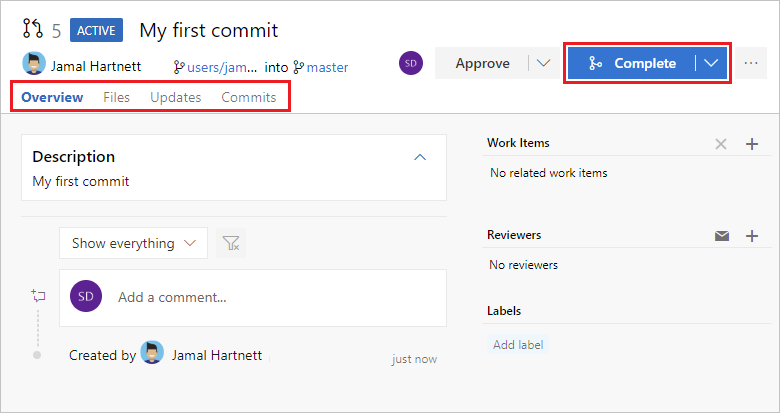

# Code with Git

After you create a new organization and team project in Azure DevOps Services, you can begin sharing your code with others.

In this article, we'll show you how to start working with your code in Azure Repos with a simple walkthrough that covers:

> [!div class="checklist"]
> * Installing Git command line tools
> * Cloning a Git repository
> * Working in a branch
> * Sharing your changes
> * Creating a pull request

## Install Git command-line tools 

Install one of the following Git command-line tools:

  - To install Git for Windows, including Git Credential Manager, see [Install Git Credential Manager for Windows](../git/set-up-credential-managers.md#windows).
  - To install on macOS or Linux, check out the [Installing Git](https://git-scm.com/book/en/v2/Getting-Started-Installing-Git) chapter in the open-source _Pro Git_ book. For macOS and Linux, we recommend [configuring SSH authentication](../git/use-ssh-keys-to-authenticate.md)

## Get your code

To get a copy of the source code, you clone the Git repo that contains the code. Cloning creates both a local copy of the source code so you can work with it, and all the version control information so Git can manage the source code.

If you're just getting started with Azure Repos, your code might be in one of several places:

- [I just created my organization in Azure DevOps, so I don't have any code](#i-just-created-my-organization-in-azure-devops-so-i-dont-have-any-code)
- [The code is in my (or my organization's) Azure Repos Git repo](#the-code-is-in-my-or-my-organizations-azure-repos-git-repo)
- [The code is in another Git repo such as GitHub or another Azure Repos Git repo](#the-code-is-in-another-git-repo)
- [The code is on my local computer and not yet in version control](#the-code-is-on-my-local-computer-and-not-yet-in-version-control)

### I just created my organization in Azure DevOps, so I don't have any code

If you just signed up for Azure DevOps Services, by default you have a project named `MyFirstProject` and a Git repo named `MyFirstProject`. If you want to work in that repo, you can [clone it](#clone-the-repo) and then add your code to that repo.

If you want to make a new repo, follow the steps in [Create a new Git repo in your project](../git/create-new-repo.md#create-a-repo-using-the-web-portal) and then [clone](#clone-the-repo) the new repo and add your code there.

### The code is in my (or my organization's) Azure Repos Git repo

If the code is in your (or your organization's) Azure Repo, you can clone the Git repo to your local computer and start working with it by jumping down to [Clone the repo](#clone-the-repo).

### The code is in another Git repo

If the code is in another Git repo, such as a GitHub repo or a different Azure Repo instance, you can import it into a new or existing empty Git repo. Follow the steps in [Import a Git repo](../git/import-git-repository.md), and then return to this article and jump down to [Clone the repo](#clone-the-repo).

### The code is on my local computer and not yet in version control

If your code is not yet in version control, you have a couple of options:

- Create a new repository and add your code there. To do this, follow the steps in [Create a new Git repo in your project](../git/create-new-repo.md#create-a-repo-using-the-web-portal) and then come back to this article and jump down to [Clone the repo](#clone-the-repo).
- Add your code to an existing repository. To do this, jump down to [Clone the repo](#clone-the-repo).

After the repository is cloned, we'll show you how to add your existing code to the repo.

## Clone the repo

To work with a Git repo, you clone it to your computer. Cloning a repo creates a complete local copy of the repo for you to work with. Cloning also downloads all [commits](../git/commits.md) and [branches](../git/branches.md) in the repo and sets up a named relationship with the repo on the server. Use this relationship to interact with the existing repo, pushing and pulling changes to share code with your team.

::: moniker range=">= azure-devops-2019"

1. From your web browser, open the team project for your organization and select **Repos** > **Files**. If you don't have a team project, [create one now](sign-up-invite-teammates.md). 

   

2. Select **Clone** in the upper-right corner of the **Files** window and copy the clone URL.

   

3. Open the Git command window (Git Bash on Git for Windows) and browse to the folder where you want the code from the repo stored on your computer. Run `git clone` followed by the path copied from the **Clone URL** in the previous section, as shown in the following example.

   ```
   git clone https://dev.azure.com/contoso-ltd/MyFirstProject/_git/contoso-demo
   ```

   Git downloads a copy of the code, including all [commits](../git/commits.md) and [branches](../git/branches.md) from the repo, into a new folder for you to work with.

4. Switch your directory to the repository that you just cloned.

   ```
   cd fabrikam-web
   ```

  Keep this command window open, because you'll use it in the following steps.

::: moniker-end

::: moniker range="<= tfs-2018"

1. From your web browser, open the team project for your organization and select the **Code** page. If you don't have a team project, [create one now](sign-up-invite-teammates.md). 

2. Select **Clone** in the upper-right corner of the **Code** page and copy the **Clone URL**.

   

3. Open the Git command window (Git Bash on Git for Windows) and browse to the folder where you want the code from the repo stored on your computer. Run `git clone` followed by the path copied from the **Clone URL** in the previous section, as shown in the following example.

   ```
   git clone https://regius@dev.azure.com/regius/FabrikamFiber%20Web/_git/SmartHotel360
   ```

   Git downloads a copy of the code, including all [commits](../git/commits.md) and [branches](../git/branches.md) from the repo, into a new folder for you to work with.

4. Switch your directory to the repository that you just cloned.

   ```
   cd SmartHotel360
   ```

  Keep this command window open, because you'll use it in the following steps.

::: moniker-end

## Work in a branch

Git [branches](../git/branches.md) isolate your changes from other work being done in the project. The recommended [Git workflow](../git/gitworkflow.md) uses a new branch for every feature or fix that you work on.

Create branches by using the `branch` command. This command creates a reference in Git for the new branch and a pointer back to the parent commit so Git can keep a history of changes as you add commits to the branch.

Git always adds new commits to the current local branch. Check what branch you're working on before you commit so that you don't commit changes to the wrong branch. 

Switch between local branches by using the `checkout` command. Git will change the files on your computer to match the latest commit on the checked-out branch.

In this step, we'll create a working branch and make a change to the files on your computer in that branch.

Use the `branch` command to create the branch and `checkout` to switch to that branch. In the following example, the new branch is named `users/jamal/feature1`.

```
git branch users/jamal/feature1
git checkout users/jamal/feature1
```

When you create a branch from the command line, the branch is based on the currently checked-out branch. If you just cloned the repository, the default branch (typically `master`) is checked out. Because you just cloned, your local copy of `master` has the latest changes.

If you're working with a previously cloned repository, ensure that you have checked out the right branch (`git checkout master`) and that it's up to date (`git pull origin master`) before you create your new branch.

```
git checkout master
git pull origin master
git branch users/jamal/feature1
git checkout users/jamal/feature1
```

You can replace the first three commands in the previous example with the following command, which creates a new branch named `users/jamal/feature1` based on the latest `master` branch.

```
git pull origin master:users/jamal/feature1
```

Switch back to the Git Bash window that you used in the previous section. Run the following commands to create and check out a new branch based on the master branch.
 
```
git pull origin master:users/jamal/feature1
git checkout feature1
```

Browse to the location of the repository on your local computer, make an edit to one of the files, and save it. If you're adding code from your local computer to the repository, you can add it here by copying it to the folder where you cloned the repository.

## Share your changes

When you're happy with the changes on your local computer, you can share them back to the remote repository.

1. Commit your changes by entering the following command in the Git command window:

   ```
   git add .
   git commit -m "My first commit"
   ```

   The `git add .` command stages your files, and `git commit -m "My first commit"` commits the staged files with the specified commit message.

1. Push your changes to the Git repo on the server by entering the following command in the Git command window:

   ```
   git push origin users/jamal/feature1
   ```

Your code is now shared to the remote repository, in a branch named `users/jamal/feature1`. To merge the code from your working branch into the `master` branch, use a pull request.

## Review and merge your changes with a pull request

Pull requests combine the review and merge of your code into a single collaborative process. After you’re done fixing a bug or new feature in a branch, create a new pull request. Add the members of the team to the pull request so they can review and vote on your changes. Use pull requests to review works in progress and get early feedback on changes. There’s no commitment to merge the changes because you can abandon the pull request at any time.

This example shows the basic steps of creating and completing a pull request.

::: moniker range=">= azure-devops-2019"

1. From your web browser, open the team project for your organization and select **Repos** > **Files**. If you kept your browser open after getting the clone URL, you can just switch back to it.

   

2. Select **Create a pull request** in the upper-right corner of the **Files** window. If you don't see a message like **You updated users/jamal/feature1 just now**, refresh your browser.

   

3. New pull requests are configured to merge your branch into the default branch, which in this example is `master`. The title and description are pre-populated with your commit message.

   

   You can [add reviewers](../git/pull-requests.md#add-and-remove-reviewers) and [link work items](../git/pull-requests.md#link-work-items) to your pull request.

   You can review the files included in the pull request at the bottom of the **New Pull Request** window.

   

   Select **Create** to create the pull request.

4. You can view the details of your pull request from the **Overview** tab, and view the changed files, updates, and commits in your pull request from the other tabs. Select **Complete** to begin the process of completing the pull request.

   

5. Select **Complete merge** to complete the pull request and merge your code into the `master` branch.

   

>[!NOTE]
>This example shows the basic steps of creating and completing a pull request. To learn more about pull requests, including voting and reviewing, commenting, autocomplete, and more, see [Pull requests overview](../git/pull-requests-overview.md).

::: moniker-end

::: moniker range="<= tfs-2018"

1. From your web browser, open the team project for your organization and select the **Code** page. If you don't have a team project, [create one now](sign-up-invite-teammates.md). 

2. Select **Clone** in the upper-right corner of the **Code** page and copy the **Clone URL**.

   

3. Open the Git command window (Git Bash on Git for Windows) and browse to the folder where you want the code from the repo stored on your computer. Run `git clone` followed by the path copied from the **Clone URL** in the previous section, as shown in the following example.

   ```
   git clone https://dev.azure.com/contoso-ltd/MyFirstProject/_git/contoso-demo
   ```

   Git downloads a copy of the code, including all [commits](../git/commits.md) and [branches](../git/branches.md) from the repo, into a new folder for you to work with.

4. Switch your directory to the repository that you just cloned.

   ```
   cd fabrikam-web
   ```

  Keep this command window open, because you'll use it in the following steps.

::: moniker-end

Your changes are now merged into the `master` branch, and your `users/jamal/feature1` branch is deleted on the remote repository. To delete your local copy of the branch, switch back to your Git Bash command prompt and run the following commands.

```
git checkout master
git pull origin master
git branch -d users/jamal/feature1
```

The `git checkout master` command switches you to the `master` branch. The `git pull origin master` command pulls down the latest version of the code in the master branch, including your changes and the fact that `users/jamal/feature1` was merged. The `git branch -d users/jamal/feature1` command deletes your local copy of that branch.

Now you're ready to create a new branch, write some code, and do it again.

## Try this next  

> [!div class="nextstepaction"]
> [Set up continuous integration and delivery](../../pipelines/get-started-designer.md?toc=/azure/devops/user-guide/toc.json&bc=/azure/devops/user-guide/breadcrumb/toc.json)
> or
> [learn more about working with a Git repo](../git/index.md).
