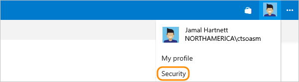

0.  Sign in to your Azure DevOps organization (```http://[youraccount].visualstudio.com```).

0. From your home page, open your profile. Go to your security details.

	**Azure DevOps Services**

	

    **TFS 2017**

	

0. Enable alternate authentication credentials for this account. Then provide a secondary username and password.

   

