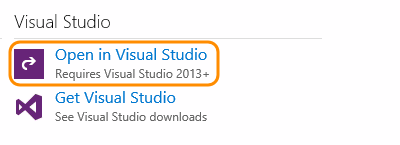

##	Open your project in Visual Studio

0. Before you start, if you haven't already:

   * [Sign up and create your project](../../../organizations/accounts/create-organization.md).
   * Install [Visual Studio 2013 or later](https://visualstudio.microsoft.com/downloads).

1. Go to your project's page 
   (```http://dev.azure.com/{yourorganization}/{yourteamproject}```)
   and then open Visual Studio to connect to your project.

	

2. Sign in to Azure DevOps Services from Visual Studio. 