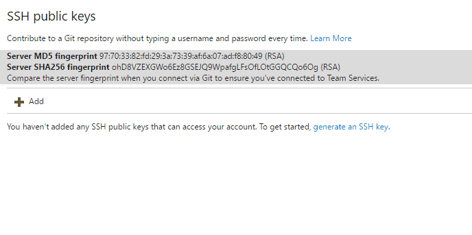

# Authentication overview

#### Azure Repos | TFS 2018 | TFS 2017 | TFS 2015 Update 3

Choose a method to securely login and access the code in your Azure Repos/TFS Git repo.
Use these credentials with Git on the command line or from any Git client that supports HTTPS or SSH authentication.
Limit the scope of access and revoke these credentials from the web when they are no longer needed.

> Using Visual Studio? Team Explorer handles authentication with Azure Repos for you.

## Authentication comparison

| Authentication Type | When to use | Secure? | Ease of setup | Additional tooling required |   
|---------------------|:-------------:|:------------:|:---------------------|-------------|   
| Personal access tokens | When you need an easy to configure credential or need configurable access controls | Very secure (when using HTTPS) |  Easy | Optional ([Git credential managers](set-up-credential-managers.md)) |   
| SSH | When you already have SSH keys set up, or are on macOS or Linux | Very secure | Intermediate | Windows users will need the SSH tools included with [Git for Windows](https://git-for-windows.github.io/)  |
| Alternate credentials | When you can't use personal access tokens or SSH |  Least secure | Easy | No |

## Personal access tokens

Personal access tokens let you create a password for use with the command line or other Git client without using your Azure DevOps Services username and password directly.
An expiration date is set on these tokens when they are created and you can restrict the scope of the data they can access.
Use personal access tokens to authenticate if you don't already have SSH keys set up on your system or if you need to restrict the permissions granted by the credential.

* [Learn more about personal access tokens and how to create one](../../organizations/accounts/use-personal-access-tokens-to-authenticate.md)

### Use credential managers to generate tokens

[Git credential managers](set-up-credential-managers.md) are an optional tool that makes it easy to create personal access tokens when working with Azure Repos. 
Normally you'd need to log into the Azure DevOps Services web portal, generate a token, then use the token as your password when connecting to Azure Repos. 

Personal access tokens are generated on demand when you have the credential manager installed. 
The credential manager creates the token in Azure DevOps Services and saves it locally for use with the Git command line or other client. 

>[!NOTE]
>Current versions of [Git for Windows](https://git-for-windows.github.io/) include the Git credential manager as an optional feature during installation.
>
>

## SSH key authentication

Key authentication with SSH works through a public and private key pair that you create on your computer. 
You associate the public key with your username from the web. Azure DevOps Services will encrypt the data sent to you with that key when you work with Git.
You decrypt the data on your computer with the private key, which is never shared or sent over the network.

SSH is a great option if you've already got it set up on your system&mdash;just add a public key to Azure DevOps Services and clone your repos using SSH. 
If you don't have SSH set up on your computer, you should use personal access tokens and HTTPS instead-it's secure and easier to set up.

Learn more about [setting up SSH with Azure DevOps Services](use-ssh-keys-to-authenticate.md)

::: moniker range="azure-devops"

## Alternate credentials

>[!IMPORTANT]
> - Use of alternate credentials is not recommended.
> - Alternate credentials are not supported on TFS.
> - The username specified for the alternate credentials must be unique across Azure DevOps Services and can't be reused.

Create an alternate user name and password to access your Git repository using alternate credentials.
Unlike personal access tokens, this login doesn't expire and can't be scoped to limit access to your Azure DevOps Services data.
Use alternate credentials as a last resort when you can't use personal access tokens or SSH keys.

::: moniker-end