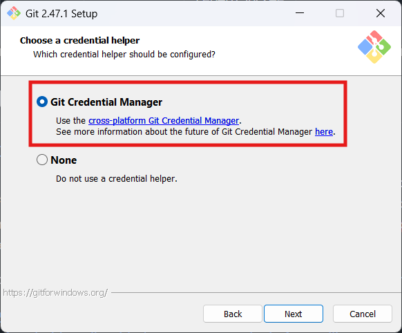

# Authentication overview

[!INCLUDE [version-ts-tfs-2015-2016](../../includes/version-ts-tfs-2015-2016.md)]

Choose a method to securely access the code in Azure Repos, Azure DevOps Server 2019, or Team Foundation Server (TFS) Git repositories.
Use these credentials with Git at a command prompt. These credentials also work with any Git client that supports HTTPS or SSH authentication.
Limit the scope of access and revoke these credentials when they're no longer needed.

[!INCLUDE [alt-creds-deprecation-notice](../../includes/alt-creds-deprecation-notice.md)]

Azure DevOps Server was formerly named Visual Studio Team Foundation Server.

> [!TIP]
> Using Visual Studio? Team Explorer handles authentication with Azure Repos for you.

[!INCLUDE [temp](includes/note-new-git-tool.md)]

## Authentication comparison

| Authentication Type | When to use | Secure? | Ease of setup | Additional tools |   
|---------------------|:-------------:|:------------:|:---------------------|-------------|   
| Personal access tokens | You need an easy to configure credential or need configurable access controls | Very secure (when using HTTPS) |  Easy | Optional ([Git credential managers](set-up-credential-managers.md)) |   
| SSH | You already have SSH keys set up, or are on macOS or Linux | Very secure | Intermediate | Windows users will need the SSH tools included with [Git for Windows](https://git-for-windows.github.io/)  |

## Personal access tokens

Personal access tokens (PATs) give you access to Azure DevOps and Team Foundation Server (TFS), without using your username and password directly.
These tokens have an expiration date from when they're created. You can restrict the scope of the data they can access.
Use PATs to authenticate if you don't already have SSH keys set up on your system or if you need to restrict the permissions that are granted by the credential.

* [Learn more about personal access tokens and how to create one](../../organizations/accounts/use-personal-access-tokens-to-authenticate.md)

### Use Git Credential Manager to generate tokens

The [Git Credential Manager Core](set-up-credential-managers.md) is an optional tool that makes it easy to create PATs when you're working with Azure Repos. 
Sign in to the web portal, generate a token, and then use the token as your password when you're connecting to Azure Repos. 

PATs are generated on demand when you have the credential manager installed. 
The credential manager creates the token in Azure DevOps and saves it locally for use with the Git command line or other client. 

>[!NOTE]
>Current versions of [Git for Windows](https://git-for-windows.github.io/) include the Git credential manager as an optional feature during installation.
>
>

## SSH key authentication

Key authentication with SSH works through a public and private key pair that you create on your computer. 
You associate the public key with your username from the web. Azure DevOps will encrypt the data sent to you with that key when you work with Git.
You decrypt the data on your computer with the private key, which is never shared or sent over the network.

SSH is a great option if you've already got it set up on your system&mdash;just add a public key to Azure DevOps and clone your repos using SSH. 
If you don't have SSH set up on your computer, you should use PATs and HTTPS instead - it's secure and easier to set up.

Learn more about [setting up SSH with Azure DevOps](use-ssh-keys-to-authenticate.md)

## OAuth

Use [OAuth](../../integrate/get-started/authentication/oauth.md) 
to generate tokens for accessing [REST APIs](/rest/api/azure/devops/). The [Accounts](/rest/api/azure/devops/account) 
and [Profiles](/rest/api/azure/devops/profile) 
APIs support only OAuth. 

- [SSH authentication](../../repos/git/use-ssh-keys-to-authenticate.md) 
to generate encryption keys when you use Linux, macOS, 
or Windows running [Git for Windows](https://www.git-scm.com/download/win) 
and can't use 
[Git credential managers](../../repos/git/set-up-credential-managers.md) 
or [personal access tokens](../../organizations/accounts/use-personal-access-tokens-to-authenticate.md) for HTTPS authentication.
