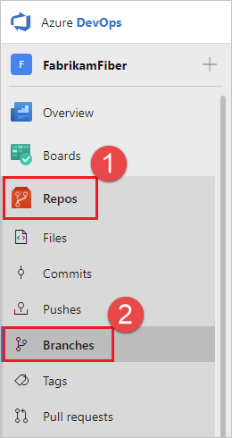

# Set branch permissions

#### Azure Repos | TFS 2018 | TFS 2017 Update 1

## Overview

Set up permissions to control who can read and update the code in a branch on your Git repo.
You can set permissions for individual users and groups, and inherit and override permissions as needed from your [repo permissions](../../organizations/security/set-git-tfvc-repository-permissions.md#git-repository).

## Use the branches view to configure security

1. Open the **Branches** page by navigating to your project in the web portal and selecting **Repos**, **Branches**.

  

  If you're not using the new navigation preview, select **Code**, **Branches**.

  

1. Locate your branch in the page. You can browse the list or you can search for your branch using the **Search all branches** box in the upper right.

  

0. Open the context menu by selecting the **...** icon next to the branch name. Select **Branch security** from the menu.

   

## Add users or groups

> Avoid trouble:  You can only add permissions for users and groups already in your Project. [Add new users and groups to your Project](../../organizations/security/add-users-team-project.md) before setting branch permissions. 

Add users or groups to your branch permissions by selecting **Add** 
Enter the sign-in address or group alias, then select **Save Changes**.

## Remove users or groups

Remove permissions for a user or group by selecting the user or Azure DevOps group, then selecting **Remove**. 
The user or group will still exist in your Project and this change will not affect other permissions for the user or group.    

 
## Set permissions 

Control branch permission settings from the branch permission view. Users and groups with permissions set at the repo level will
[inherit those permissions](../../organizations/security/about-permissions.md#inheritance) by default. 

> [!NOTE] 
> These permissions have changed in TFS 2017 Update 1 and Azure DevOps Services.
> Ensure you are viewing the correct version of this documentation for permissions by choosing your product version
> in the upper left corner of the window.
>
> 

::: moniker range=">= tfs-2017 <= tfs-2018" 

### Permissions in TFS 2017 Update 1 through TFS 2018 Update 2

| Permission | Description |
|------------|-------------|
| Contribute                                       | Users with this permission can push new commits to the branch and lock the branch.                          |
| Edit Policies                                    | Can edit [branch policies](branch-policies.md).                                                                                   |
| Exempt from policy enforcement                   | Users with this permission are exempt from the [branch policy](branch-policies.md) set for the branch when completing pull requests and can override the policies by checking **Override branch policies and enable merge** when completing a PR. Users with this permission can also push to a branch that has branch policies enabled. |
| Force Push (Rewrite History and Delete Branches) | Can force push to a branch, which can rewrite history. This permission is also required to delete a branch. |
| Manage Permissions                               | Can set permissions for the branch.                                                                         |
| Remove Others' Locks                             | Can remove [locks](lock-branches.md) set on branches by other users.                                                            |

::: moniker-end 

::: moniker range="<= tfs-2017" 

### Permissions in TFS 2017 and lower 

| Permission   | Description                                                                                                                                                                                  |
|-----------------------------------------------------------------------|----------------------------------------------------------------------------------------------------------------------------------------------------------------------------------------------|
| Administer                                                            | Users with this permission can set branch permissions for other users, delete the branch, and lock the branch.                                                                               |
| Contribute                                                            | Users with this permission can push new commits to the branch. Users with this permission cannot rewrite the existing commits on the branch. Users with this permission can lock the branch. |
| Exempt from policy enforcement                                        | Users with this permission are exempt from the [branch policy](branch-policies.md) set for the branch.                                                                                                             |
| Rewrite and destroy history (force push)                              | Can force push to a branch. This permission is also required to delete a branch.   Users with this permission can modify the commit history of a branch.    |                                                        

::: moniker-end    

::: moniker range="azure-devops" 

### Permissions in Azure DevOps Services

>[!NOTE]
>[In Azure DevOps Services](/azure/devops/release-notes/2018/jul-10-vsts#allow-bypassing-branch-policies-without-giving-up-push-protection), the **Exempt from policy enforcement** permission (which is still available in TFS 2015 through TFS 2018 Update 2) was removed and its functionality divided into the following two new permissions:
>
>- **Bypass policies when completing pull requests**
>- **Bypass policies when pushing**
>
>Users that previously had **Exempt from policy enforcement** enabled now have the two new permissions enabled instead. See the following table for more details on these two new permissions.

| Permission  | Description |
|-------------|-------------|
| Contribute                                       | Users with this permission can push new commits to the branch and lock the branch.                          |
| Edit Policies                                    | Can edit [branch policies](branch-policies.md).                                                                                   |
| Bypass policies when completing pull requests    | Users with this permission are exempt from the [branch policy](branch-policies.md) set for the branch when completing pull requests and can opt-in to override the policies by checking **Override branch policies and enable merge** when completing a PR.                            |
| Bypass policies when pushing   | Users with this permission can push to a branch that has branch policies enabled. Note that when a user with this permission makes a push that would override branch policy, the push automatically bypasses branch policy with no opt-in step or warning.  |
| Force Push (Rewrite History and Delete Branches) | Can force push to a branch, which can rewrite history. This permission is also required to delete a branch. |
| Manage Permissions                               | Can set permissions for the branch.                                                                         |
| Remove Others' Locks                             | Can remove [locks](lock-branches.md) set on branches by other users.                                                            |

::: moniker-end 
