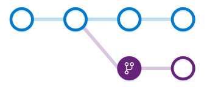

# About branches and branch policies

[!INCLUDE [version-lt-eq-azure-devops](../../includes/version-lt-eq-azure-devops.md)]

Branch policies are an important part of the Git workflow and enable you to:

* Isolate work in progress from the completed work in your main branch
* Guarantee changes build before they get to main
* Limit who can contribute to specific branches
* Enforce who can create branches and the naming guidelines for the branches
* Automatically include the right reviewers for every code change
* Enforce best practices with required code reviewers

The following table summarizes the policies you can define to customize a branch. For an overview of all repository and branch policies and settings, see [Git repository settings and policies](repository-settings.md). 

:::row:::
   :::column span="2":::
      **Policy**
   :::column-end:::
   :::column span="1"::: 
      **Default**
   :::column-end:::
   :::column span="3"::: 
      **Description**
   :::column-end:::
:::row-end:::
---
:::row:::
   :::column span="2":::
      [**Require a minimum number of reviewers**](branch-policies.md#require_reviewers)
   :::column-end:::
   :::column span="1"::: 
       Off  
   :::column-end:::
   :::column span="3"::: 
      Require approval from a specified number of reviewers on pull requests.
   :::column-end:::
:::row-end:::

:::row:::
   :::column span="2":::
      [**Check for linked work items**](branch-policies.md#check-linked-wi)
   :::column-end:::
   :::column span="1"::: 
       Off  
   :::column-end:::
   :::column span="3"::: 
      Encourage traceability by checking for linked work items on pull requests.
   :::column-end:::
:::row-end:::

:::row:::
   :::column span="2":::
      [**Check for comment resolution**](branch-policies.md#check-comment-resolution)
   :::column-end:::
   :::column span="1"::: 
       Off  
   :::column-end:::
   :::column span="3"::: 
      Check to see that all comments have been resolved on pull requests.
   :::column-end:::
:::row-end:::

::: moniker range=">= azure-devops-2020"
:::row:::
   :::column span="2":::
      [**Limit merge types**](branch-policies.md#limit-merge-types)
   :::column-end:::
   :::column span="1"::: 
       Off  
   :::column-end:::
   :::column span="3"::: 
      Control branch history by limiting the available types of merge when pull requests are completed.
   :::column-end:::
:::row-end:::
::: moniker-end
:::row:::
   :::column span="2":::
      [**Add Build Validation policies**](branch-policies.md#build-validation)
   :::column-end:::
   :::column span="1"::: 
       Off  
   :::column-end:::
   :::column span="3"::: 
      Add one or more policies to validate code by pre-merging and building pull request changes. Can also enable or disable policies.
   :::column-end:::
:::row-end:::
:::row:::
   :::column span="2":::
      [**Add Status Check policies**](branch-policies.md#require-approval-from-external-services)
   :::column-end:::
   :::column span="1"::: 
       Off  
   :::column-end:::
   :::column span="3"::: 
      Add one or more policies to require other services to post successful status to complete pull requests. Can also enable or disable policies.
   :::column-end:::
:::row-end:::
:::row:::
   :::column span="2":::
      [**Automatically included reviewers**](branch-policies.md#include-code-reviewers)
   :::column-end:::
   :::column span="1"::: 
       Off  
   :::column-end:::
   :::column span="3"::: 
      Add one or more policies to designate code reviewers to automatically include when pull requests change certain areas of code. Can also enable or disable policies.
   :::column-end:::
:::row-end:::

 

## Adopt a Git branching strategy

There are a few critical branches in your repo that the team relies on always being in good shape, such as your `main` branch.

[Require pull requests](branch-policies.md) to make any changes on these branches.
Developers pushing changes directly to the protected branches will have their pushes rejected.

Keep your branch strategy simple by building your strategy from these three concepts:

1. Use feature branches for all new features and bug fixes.
2. Merge feature branches into the main branch using pull requests. 
3. Keep a high quality, up-to-date main branch.  

A strategy that extends these concepts and avoids contradictions results in a version control workflow for your team that is consistent and easy to follow. 

- [Adopt a branching strategy](git-branching-guidance.md)
- [How to configure branch policies](branch-policies.md)
- [Branch permissions](branch-permissions.md)
- [Require branch folders](require-branch-folders.md)
- [Configure a branch policy for an external service](pr-status-policy.md)

## Create work in branches  

Git branches aren't much more than a small reference that keeps an exact history of commits, so they're cheap to create.

[Committing](commits.md) changes to a branch won't affect other branches. You can share branches with others without having to merge the changes into the main project.

You can create new branches to isolate changes for a feature or a bug fix from your main branch and other work. 

Since the branches are lightweight, switching between branches is quick and easy. 
Git doesn't create multiple copies of your source when working with branches&mdash;it uses the history information stored in commits to recreate the files on a branch when you start working on it.

Your [Git workflow](gitworkflow.md) should create and use branches for managing features and bug fixes.

The rest of the Git workflow, such as [sharing code](pushing.md) and [reviewing code with pull requests](pull-requests.md) all work through branches.

Isolating work in branches makes it simple to change what you are working on by changing your current branch.

## How are Git branches created?

You create branches by using the `branch` command. `Branch` creates a reference in Git for the new branch and a pointer back to the parent commit so Git can keep a history of changes as you add commits to the branch. 

When you're working with a branch that someone else shared, Git keeps an upstream tracking relationship. The relationship associates the branch on the local repo with the corresponding branch on the remote repo.

Upstream tracking makes it simple to sync changes with others using [push](pushing.md) and [pull](pulling.md).

In this screenshot, you can see a new branch that was created from the main branch. Work continues on both branches and commits are added to both branches. 

Git always adds new commits to the current local branch. Check what branch you're working on before you commit so that you don't commit changes to the wrong branch. 

Swap between local branches using the `checkout` command. Git will change the files on your computer to match the latest commit on the checked out branch.

When your work in the branch is ready to share with the rest of the team, you [push](pushing.md) the changes to update the remote branch. 

A common mistake is to make some changes and `commit` them, realize you're on an incorrect branch, then `checkout` to the correct branch.

Your most recent changes will no longer be on the filesystem since each branch has its own version of code. 

Git brings the files' state back to the last commit on the branch you swapped into, not the previous branch where you made your changes. 

You'll need to either [cherry-pick](cherry-pick.md) the commits from the branch or [merge](pulling.md#update-branches-with-merge-or-rebase) the changes into the correct branch.

## Use branches to manage development

Git keeps track of which branch you're working on and makes sure that when you `checkout` a branch your files match the most recent commit on the branch. 

Branches let you work with multiple versions of the source code in the same local Git repository at the same time. 

Tell Git which branch you want to work on with `checkout`, and Git takes care of setting the right file versions for that branch.

You don't need more than one repo on your system when you use branches to isolate your work. 

Set up your development environment one time after you [clone](clone.md). Then, use Git branches to swap between feature work and bug fixing. 

## Branching how to guides

Learn how to complete common tasks when working with branches.

- [Branches tutorial](./create-branch.md)
- [How to create a branch](create-branch.md)
- [How to delete a branch](delete-branch.md)
- [Restore a deleted branch](restore-deleted-branch.md)
- [How to lock branches](lock-branches.md)

## Related articles

- [Improve code quality with branch policies](branch-policies.md)
- [Git repository settings and policies](repository-settings.md)
- [Configure Git repository policies using a configuration file](../../cli/policy-configuration-file.md)
- [Default Git permissions (Security)](../../organizations/security/default-git-permissions.md?toc=/azure/devops/repos/toc.json&bc=/azure/devops/repos/breadcrumb/toc.json)
- [Set permissions (Security)](set-git-repository-permissions.md)
- [Cross-service integration overview](../../cross-service/cross-service-overview.md?toc=/azure/devops/repos/toc.json&bc=/azure/devops/repos/breadcrumb/toc.json)
