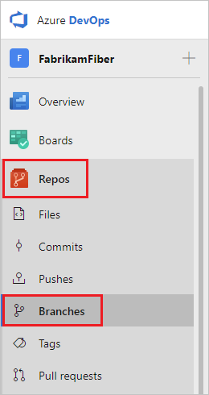
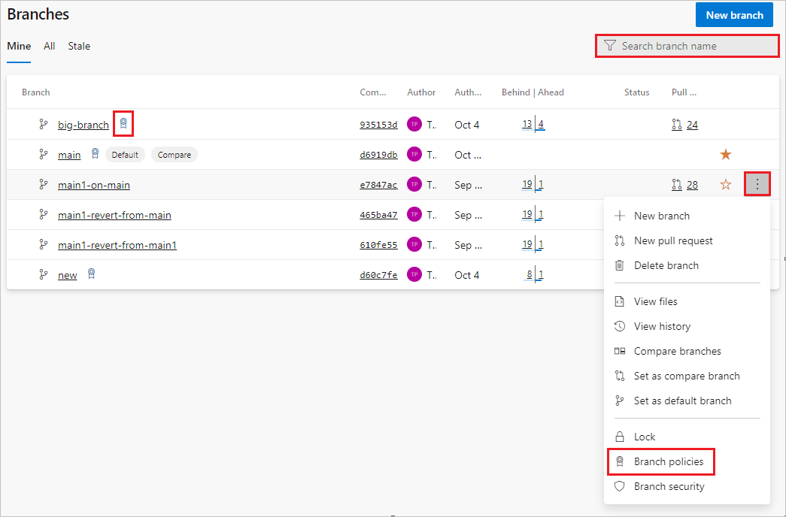
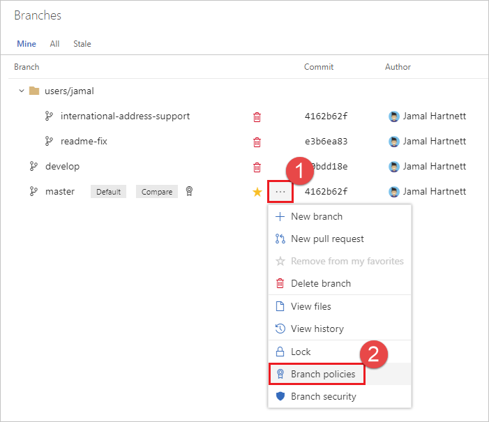
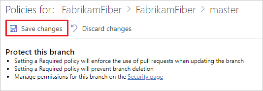
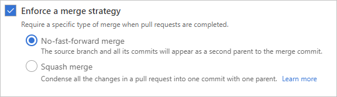
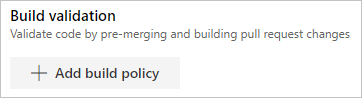
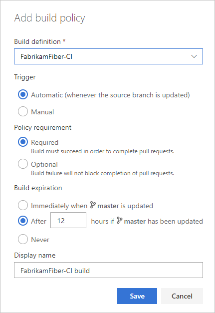
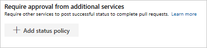

# Branch policies and settings

[!INCLUDE [version-lt-eq-azure-devops](../../includes/version-lt-eq-azure-devops.md)]

Branch policies help teams protect their important [branches](./create-branch.md) of development. Policies enforce your team's code quality and change management standards. This article describes how to set and manage branch policies. For an overview of all repository and branch policies and settings, see [Git repository settings and policies](repository-settings.md).

A branch that has required policies configured can't be deleted, and requires pull requests (PRs) for all changes.

## Prerequisites 

::: moniker range="azure-devops"

- To set branch policies, you must be a member of the Project Administrators security group or have repository-level **Edit policies** permissions. For more information, see [Set Git repository permissions](set-git-repository-permissions.md).

- If you want to use Azure DevOps CLI [az repos policy](/cli/azure/repos/policy) commands to manage branch policies, follow the steps in [Get started with Azure DevOps CLI](../../cli/index.md).
::: moniker-end

::: moniker range="< azure-devops"
- To set branch policies, you must be a member of the Project Administrators security group or have repository-level **Edit policies** permissions. For more information, see [Set Git repository permissions](set-git-repository-permissions.md).
::: moniker-end

## Configure branch policies

# [Browser](#tab/browser)

To manage branch policies, select **Repos** > **Branches** to open the **Branches** page in the web portal.



You can also get to branch policy settings with **Project Settings** > **Repository** > **Policies** > **Branch Policies** > **\<Branch Name>**.

::: moniker range=">= azure-devops-2020"

Branches that have policies display a policy icon. You can select the icon to go directly to the branch's policy settings.

To set branch policies, locate the branch you want to manage. You can browse the list or search for your branch in the **Search branch name** box at upper right.

Select the **More options** icon next to the branch, and then select **Branch policies** from the context menu.



::: moniker-end

::: moniker range="< azure-devops-2020"

Locate your branch in the page. You can browse the list or you can search for your branch using the **Search all branches** box in the upper right.


Select the **...** button. Select **Branch policies** from the context menu.



::: moniker-end

::: moniker range=">= azure-devops-2020"

Configure policies on the branch's settings page. See the following sections for descriptions and instructions for each policy type.

::: moniker-end

::: moniker range="< azure-devops-2020"

Configure your policies in the **Policies** page. See the following sections for descriptions of each policy type. Select **Save changes** to apply your new policy configuration.

  

::: moniker-end

# [Azure DevOps CLI](#tab/azure-devops-cli)

::: moniker range="azure-devops" 

You can use Azure DevOps CLI to list or show policies for a branch or repository.

### List policies

To list all policies in a project, use [az repos policy list](/cli/azure/repos/policy#az-repos-policy-list).

```azurecli
az repos policy list [--branch]
                     [--detect {false, true}]
                     [--org]
                     [--project]
                     [--query-examples]
                     [--repository-id]
                     [--subscription]
```

**Parameters**

|Parameter|Description|
|---------|-----------|
|`branch`|Branch name to filter results by exact match. The `--repository-id` parameter is required to use the branch filter. For example: `--branch main`.|
|`detect`|Automatically detect organization. Accepted values: `false`, `true`.|
|`org`, `organization`|Azure DevOps organization URL. You can configure the default organization by using `az devops configure -d organization=<ORG_URL>`. **Required** if not configured as default or picked up via git config. Example: `https://dev.azure.com/MyOrganizationName/`.|
|`project`, `p`|Name or ID of the project. You can configure the default project using `az devops configure -d project=<NAME_OR_ID>`. **Required** if not configured as default or picked up via git config.|
|`query-examples`|Recommended JMESPath string. You can copy one of the queries and paste it after the `--query` parameter in double quotation marks to see the results. You can add one or more positional keywords so suggestions are based on these keywords.|
|`repository-id`|ID of the repository to filter results by exact match. For example, `--repository-ID e556f204-53c9-4153-9cd9-ef41a11e3345`.|
|`subscription`|Name or ID of subscription. You can configure the default subscription using `az account set -s <NAME_OR_ID>`.|

**Example**

The following command returns all the branch policies in effect in the `main` branch of the Fabrikam repository, ID `d28cd374-e7f0-4b1f-ad60-f349f155d47c`. You can get the repository ID by running `az repos list`.

This example uses the following default configuration: `az devops configure --defaults organization=https://dev.azure.com/fabrikamprime project="Fabrikam Fiber"`.

```azurecli
az repos policy list --repository-id d28cd374-e7f0-4b1f-ad60-f349f155d47c --branch main --output table

ID    Name                         Is Blocking    Is Enabled    Repository Id                         Branch
----  ---------------------------  -------------  ------------  ------------------------------------  ---------------
3     Work item linking            False          True          d28cd374-e7f0-4b1f-ad60-f349f155d47c  refs/heads/main
5     Minimum number of reviewers  True           True          d28cd374-e7f0-4b1f-ad60-f349f155d47c  refs/heads/main
6     Comment requirements         False          True          d28cd374-e7f0-4b1f-ad60-f349f155d47c  refs/heads/main
12    Required reviewers           True           False         d28cd374-e7f0-4b1f-ad60-f349f155d47c  refs/heads/main
13    Required reviewers           False          True          d28cd374-e7f0-4b1f-ad60-f349f155d47c  refs/heads/main
```

### Show details of a policy

To show the details of any policy, use [az repos policy show](/cli/azure/repos/policy#az-repos-policy-show).

```azurecli
az repos policy show --id
                     [--detect {false, true}]
                     [--org]
                     [--project]
                     [--query-examples]
                     [--subscription]
```
**Parameters**

|Parameter|Description|
|---------|-----------|
|`id`, `policy-id`|ID of the policy. **Required**.|
|`detect`|Automatically detect organization. Accepted values: `false`, `true`.|
|`org`, `organization`|Azure DevOps organization URL. You can configure the default organization by using `az devops configure -d organization=<ORG_URL>`. **Required** if not configured as default or picked up via git config. Example: `https://dev.azure.com/MyOrganizationName/`.|
|`project`, `p`|Name or ID of the project. You can configure the default project using `az devops configure -d project=<NAME_OR_ID>`. **Required** if not configured as default or picked up via git config.|
|`query-examples`|Recommended JMESPath string. You can copy one of the queries and paste it after the `--query` parameter in double quotation marks to see the results. You can add one or more positional keywords so suggestions are based on these keywords.|
|`subscription`|Name or ID of subscription. You can configure the default subscription using `az account set -s <NAME_OR_ID>`.|

::: moniker-end

[!INCLUDE [temp](../../includes/note-cli-not-supported.md)]


***


<a name="require_reviewers"></a>

## Require a minimum number of reviewers

Code reviews are important for software development projects. To ensure that teams review and approve PRs, you can require approval from a minimum number of reviewers. The basic policy requires that a specified number of reviewers approve the code, with no rejections.

# [Browser](#tab/browser)

To set the policy, under **Branch Policies**, set **Require a minimum number of reviewers** to **On**. Enter the required number of reviewers, and select any of the following options:

::: moniker range=">= azure-devops-2020"

:::image type="content" source="media/branch-policies/require-minimum-reviewers-2020.png" alt-text="Screenshot that shows the Enable the Require Code Reviews policy.":::

- Select **Allow requestors to approve their own changes** to allow a PR's creator to vote on its approval. Otherwise, the creator can still vote **Approve** on the PR, but their vote won't count toward the minimum number of reviewers.

- Select **Prohibit the most recent pusher from approving their own changes** to enforce segregation of duties. By default, anyone with push permission on the source branch can both add commits and vote on PR approval. Selecting this option means the most recent pusher's vote doesn't count, even if they can ordinarily approve their own changes.

- Select **Allow completion even if some reviewers vote to wait or reject** to allow PR completion even if some reviewers vote against approval. The minimum number of reviewers must still approve.

::: moniker-end

::: moniker range=">= azure-devops-2020"

- Under **When new changes are pushed**:
  - Select **Require at least one approval on the last iteration** to require at least one approval vote for the last source branch change.
  - Select **Reset all approval votes (does not reset votes to reject or wait)** to remove all approval votes, but keep votes to reject or wait, whenever the source branch changes.
  - Select **Reset all code reviewer votes** to remove all reviewer votes whenever the source branch changes, including votes to approve, reject, or wait.

::: moniker-end

::: moniker range=">= azure-devops-2022"

- Under **When new changes are pushed**:
  - Select **Require at least one approval on every iteration** to require at least one approval vote for the last source branch change. The user's approval is not counted against any previous unapproved iteration pushed by that user. As a result, additional approval on the last iteration is required to be done by another user.
  - Select **Require at least one approval on the last iteration** to require at least one approval vote for the last source branch change.
  - Select **Reset all approval votes (does not reset votes to reject or wait)** to remove all approval votes, but keep votes to reject or wait, whenever the source branch changes.
  - Select **Reset all code reviewer votes** to remove all reviewer votes whenever the source branch changes, including votes to approve, reject, or wait.

::: moniker-end

::: moniker range="< azure-devops-2020"

  

- If **Requestors can approve their own changes** isn't selected, the creator of the pull request can still vote **Approve** on their pull request, but their vote won't count toward the **Minimum number of reviewers**.
- If any reviewer rejects the changes, the pull request can't complete unless you select **Allow completion even if some reviewers vote to wait or reject**.
- You can reset code reviewer votes when new changes are pushed to the source branch. Select **Reset code reviewer votes when there are new changes**.

::: moniker-end

If all other policies pass, the creator can complete the PR when the required number of reviewers approve it.

# [Azure DevOps CLI](#tab/azure-devops-cli)

::: moniker range="azure-devops" 

You can manage pull request required approver counts with [az repos policy approver-count](/cli/azure/repos/policy/approver-count).

### Create approver count policy

To create an approver count policy, use [az repos policy approver-count create](/cli/azure/repos/policy/approver-count#az-repos-policy-approver-count-create).

```azurecli
az repos policy approver-count create --allow-downvotes {false, true}
                                      --blocking {false, true}
                                      --branch
                                      --creator-vote-counts {false, true}
                                      --enabled {false, true}
                                      --minimum-approver-count
                                      --repository-id
                                      --reset-on-source-push {false, true}
                                      [--branch-match-type {exact, prefix}]
                                      [--detect {false, true}]
                                      [--org]
                                      [--project]
                                      [--subscription]
```

**Parameters**

|Parameter|Description|
|---------|-----------|
|`allow-downvotes`|Allow downvotes. Accepted values: `false`, `true`. **Required**.|
|`blocking`|Block if the policy isn't met. Accepted values: `false`, `true`. **Required**.|
|`branch`|Branch name to filter results by exact match. The `--repository-id` parameter is required to use the branch filter. For example: `--branch main`. **Required**.|
|`creator-vote-counts`|Count the creator's vote. Accepted values: `false`, `true`. **Required**.|
|`enabled`|Enable the policy. Accepted values: `false`, `true`. **Required**.|
|`minimum-approver-count`|Minimum number of approvers required. For example: `2`. **Required**.|
|`repository-id`|ID of the repository to filter results by exact match. For example, `--repository-ID e556f204-53c9-4153-9cd9-ef41a11e3345`. **Required**.|
|`reset-on-source-push`|Reset votes when changes are pushed to the source. Accepted values: `false`, `true`. **Required**.|
|`branch-match-type`|Use the `branch` argument to apply the policy. If the value is `exact`, the policy applies on a branch that exactly matches the `--branch` argument. If the value is `prefix`, the policy applies across all branch folders that match the prefix in the `--branch` argument. Accepted values: `exact`, `prefix`. Default value: `exact`.|
|`detect`|Automatically detect organization. Accepted values: `false`, `true`.|
|`org`|Azure DevOps organization URL. You can configure the default organization by using `az devops configure -d organization=<ORG_URL>`. **Required** if not configured as default or picked up via git config. Example: `https://dev.azure.com/MyOrganizationName/`.|
|`project`, `p`|Name or ID of the project. You can configure the default project using `az devops configure -d project=<NAME_OR_ID>`. **Required** if not configured as default or picked up via git config.|
|`subscription`|Name or ID of subscription. You can configure the default subscription using `az account set -s <NAME_OR_ID>`.|

**Example**

The following example sets the minimum number of required approvals to `2` for pull requests in the `main` branch of the Fabrikam repository. The policy allows downvotes, meaning that pull requests can complete even if some reviewers vote not to approve, as long as the minimum number vote to approve. Pushes to the source branch don't reset votes. The policy also allows pull request creators to approve their own pull requests.

This example uses the default configuration `az devops configure --defaults organization=https://dev.azure.com/fabrikamprime project="Fabrikam Fiber"`.

```azurecli

az repos policy approver-count create --allow-downvotes true --blocking true --branch main --creator-vote-counts true --enabled true --minimum-approver-count 2 --repository-id d28cd374-e7f0-4b1f-ad60-f349f155d47c --reset-on-source-push false --output table

ID    Name                         Is Blocking    Is Enabled    Repository Id                         Branch
----  ---------------------------  -------------  ------------  ------------------------------------  ---------------
27    Minimum number of reviewers  True           True          d28cd374-e7f0-4b1f-ad60-f349f155d47c  refs/heads/main
```

### Update approver count policy

To update an approver count policy, use [az repos policy approver-count update](/cli/azure/repos/policy/approver-count#az-repos-policy-approver-count-update).

```azurecli
az repos policy approver-count update --id
                                      [--allow-downvotes {false, true}]
                                      [--blocking {false, true}]
                                      [--branch]
                                      [--branch-match-type {exact, prefix}]
                                      [--creator-vote-counts {false, true}]
                                      [--detect {false, true}]
                                      [--enabled {false, true}]
                                      [--minimum-approver-count]
                                      [--org]
                                      [--project]
                                      [--repository-id]
                                      [--reset-on-source-push {false, true}]
                                      [--subscription]
```

**Parameters**

|Parameter|Description|
|---------|-----------|
|`id`, `policy-id`|ID of the policy. **Required**.|
|`allow-downvotes`|Allow downvotes. Accepted values: `false`, `true`.|
|`blocking`|Block if the policy isn't met. Accepted values: `false`, `true`.|
|`branch`|Branch name to filter results by exact match. The `--repository-id` parameter is required to use the branch filter. For example: `--branch main`.|
|`branch-match-type`|Use the `branch` argument to apply the policy. If the value is `exact`, the policy applies on a branch that exactly matches the `--branch` argument. If the value is `prefix`, the policy applies across all branch folders that match the prefix in the `--branch` argument. Accepted values: `exact`, `prefix`. Default value: `exact`.|
|`creator-vote-counts`|Count the creator's vote. Accepted values: `false`, `true`.|
|`detect`|Automatically detect organization. Accepted values: `false`, `true`.|
|`enabled`|Enable the policy. Accepted values: `false`, `true`.|
|`minimum-approver-count`|Minimum number of approvers required. For example: `2`.|
|`org`|Azure DevOps organization URL. You can configure the default organization by using `az devops configure -d organization=<ORG_URL>`. **Required** if not configured as default or picked up via git config. Example: `https://dev.azure.com/MyOrganizationName/`.|
|`project`, `p`|Name or ID of the project. You can configure the default project using `az devops configure -d project=<NAME_OR_ID>`. **Required** if not configured as default or picked up via git config.|
|`repository-id`|ID of the repository to filter results by exact match. For example, `--repository-ID e556f204-53c9-4153-9cd9-ef41a11e3345`.|
|`reset-on-source-push`|Reset votes when changes are pushed to the source. Accepted values: `false`, `true`.|
|`subscription`|Name or ID of subscription. You can configure the default subscription using `az account set -s <NAME_OR_ID>`.|

::: moniker-end

[!INCLUDE [temp](../../includes/note-cli-not-supported.md)]


***


<a id="check-linked-wi" />

## Check for linked work items

For [work item management tracking](../../boards/backlogs/connect-work-items-to-git-dev-ops.md), you can require associations between PRs and work items. Linking work items provides more context for changes, and ensures that updates go through your work item tracking process.

# [Browser](#tab/browser)

To set the policy, under **Branch Policies**, set **Check for linked work items** to **On**. This setting requires that work items be linked to a PR for the PR to merge. Make the setting **Optional** to warn when there are no linked work items, but allow completion of the pull request.

::: moniker range=">= azure-devops-2020"

:::image type="content" source="media/branch-policies/check-linked-work-items-2020.png" alt-text="Screenshot of requiring linked work items in pull requests.":::

::: moniker-end

::: moniker range="< azure-devops-2020"


::: moniker-end
 

# [Azure DevOps CLI](#tab/azure-devops-cli)

::: moniker range="azure-devops" 

You can use Azure CLI [az repos policy work-item-linking](/cli/azure/repos/policy/work-item-linking#az-repos-policy-work-item-linking) to create and update work item linking policies for a branch or repository.

<a id="create-wi-policy" /> 

### Create work item linking policy

Use [az repos policy work-item-linking create](/cli/azure/repos/policy/work-item-linking#az-repos-policy-work-item-linking-create) to create a work item linking policy for a repository or branches.

```azurecli
az repos policy work-item-linking create --blocking {false, true}
                                         --branch
                                         --enabled {false, true}
                                         --repository-id
                                         [--branch-match-type {exact, prefix}]
                                         [--detect {false, true}]
                                         [--org]
                                         [--project]
                                         [--subscription]
```

**Parameters**

|Parameter|Description|
|---------|-----------|
|`blocking`|Block if the policy isn't met. Accepted values: `false`, `true`. **Required**.|
|`branch`|Branch name to filter results by exact match. The `--repository-id` parameter is required to use the branch filter. For example: `--branch main`. **Required**.|
|`enabled`|Enable the policy. Accepted values: `false`, `true`. **Required**.|
|`repository-id`|ID of the repository to filter results by exact match. For example, `--repository-ID e556f204-53c9-4153-9cd9-ef41a11e3345`.|
|`branch-match-type`|Use the `branch` argument to apply the policy. If the value is `exact`, the policy applies on a branch that exactly matches the `--branch` argument. If the value is `prefix`, the policy applies across all branch folders that match the prefix in the `--branch` argument. Accepted values: `exact`, `prefix`. Default value: `exact`.|
|`detect`|Automatically detect organization. Accepted values: `false`, `true`.|
|`org`|Azure DevOps organization URL. You can configure the default organization by using `az devops configure -d organization=<ORG_URL>`. **Required** if not configured as default or picked up via git config. Example: `https://dev.azure.com/MyOrganizationName/`.|
|`project`, `p`|Name or ID of the project. You can configure the default project using `az devops configure -d project=<NAME_OR_ID>`. **Required** if not configured as default or picked up via git config.|
|`subscription`|Name or ID of subscription. You can configure the default subscription using `az account set -s <NAME_OR_ID>`.|

<a id="update-wi-policy" /> 

### Update work item linking policy

Use [az repos policy work-item-linking update](/cli/azure/repos/policy/work-item-linking#az-repos-policy-work-item-linking-update) to update a work item linking policy for a repository or one or more branches.

```azurecli
az repos policy work-item-linking update --id
                                         [--blocking {false, true}]
                                         [--branch]
                                         [--branch-match-type {exact, prefix}]
                                         [--detect {false, true}]
                                         [--enabled {false, true}]
                                         [--org]
                                         [--project]
                                         [--repository-id]
                                         [--subscription]
```

**Parameters**

|Parameter|Description|
|---------|-----------|
|`id`, `policy-id`|ID of the policy. **Required**.|
|`blocking`|Block if the policy isn't met. Accepted values: `false`, `true`.|
|`branch`|Branch name to filter results by exact match. The `--repository-id` parameter is required to use the branch filter. For example: `--branch main`.|
|`branch-match-type`|Use the `branch` argument to apply the policy. If the value is `exact`, the policy applies on a branch that exactly matches the `--branch` argument. If the value is `prefix`, the policy applies across all branch folders that match the prefix in the `--branch` argument. Accepted values: `exact`, `prefix`. Default value: `exact`.|
|`detect`|Automatically detect organization. Accepted values: `false`, `true`.|
|`enabled`|Enable the policy. Accepted values: `false`, `true`.|
|`minimum-approver-count`|Minimum number of approvers required. For example: `2`.|
|`org`|Azure DevOps organization URL. You can configure the default organization by using `az devops configure -d organization=<ORG_URL>`. **Required** if not configured as default or picked up via git config. Example: `https://dev.azure.com/MyOrganizationName/`.|
|`project`, `p`|Name or ID of the project. You can configure the default project using `az devops configure -d project=<NAME_OR_ID>`. **Required** if not configured as default or picked up via git config.|
|`repository-id`|ID of the repository to filter results by exact match. For example, `--repository-ID e556f204-53c9-4153-9cd9-ef41a11e3345`.|
|`subscription`|Name or ID of subscription. You can configure the default subscription using `az account set -s <NAME_OR_ID>`.|

**Example**

The following example updates the policy ID `3` for the `main` branch of the Fabrikam repository to be enabled but optional. The example uses the default configuration `az devops configure --defaults organization=https://dev.azure.com/fabrikamprime project="Fabrikam Fiber"`.

```azurecli
>az repos policy work-item-linking update --id 3 --blocking false --branch main --enabled true --repository-id d28cd374-e7f0-4b1f-ad60-f349f155d47c --output table


ID    Name               Is Blocking    Is Enabled    Repository Id                         Branch
----  -----------------  -------------  ------------  ------------------------------------  ---------------
3     Work item linking  False          True          d28cd374-e7f0-4b1f-ad60-f349f155d47c  refs/heads/main
```

::: moniker-end

[!INCLUDE [temp](../../includes/note-cli-not-supported.md)]


***


<a id="check-comment-resolution"></a>

## Check for comment resolution

The **Check for comment resolution** policy checks whether all PR comments are resolved.

# [Browser](#tab/browser)

::: moniker range=">= azure-devops-2020" 

Configure a comment resolution policy for your branch by setting **Check for comment resolution** to **On**. Then select whether to make the policy **Required** or **Optional**.

:::image type="content" source="media/branch-policies/check-comment-resolution-2020.png" alt-text="Check for comment resolution":::

For more information on working with pull request comments, see [Review pull requests](review-pull-requests.md#make-comments).

::: moniker-end

::: moniker range="< azure-devops-2020"

Configure a comment resolution policy for your branch by selecting **Check for comment resolution**.


For more information on working with pull request comments, see [Review pull requests](review-pull-requests.md#make-comments).

::: moniker-end

# [Azure DevOps CLI](#tab/azure-devops-cli)

::: moniker range="azure-devops" 

You can use Azure DevOps CLI [az repos policy comment-required](/cli/azure/repos/policy/comment-required) to set and update comment resolution policy.

### Create comment resolution policy

To create a comment resolution policy, use [az repos policy comment-required create](/cli/azure/repos/policy/comment-required#az-repos-policy-comment-required-create).

```azurecli
az repos policy comment-required create --blocking {false, true}
                                        --branch
                                        --enabled {false, true}
                                        --repository-id
                                        [--branch-match-type {exact, prefix}]
                                        [--detect {false, true}]
                                        [--org]
                                        [--project]
                                        [--subscription]
```

**Parameters**

|Parameter|Description|
|---------|-----------|
|`blocking`|Block if the policy isn't met. Accepted values: `false`, `true`. **Required**.|
|`branch`|Branch name to filter results by exact match. The `--repository-id` parameter is required to use the branch filter. For example: `--branch main`. **Required**.|
|`enabled`|Enable the policy. Accepted values: `false`, `true`. **Required**.|
|`repository-id`|ID of the repository to filter results by exact match. For example, `--repository-ID e556f204-53c9-4153-9cd9-ef41a11e3345`. **Required**.|
|`branch-match-type`|Use the `branch` argument to apply the policy. If the value is `exact`, the policy applies on a branch that exactly matches the `--branch` argument. If the value is `prefix`, the policy applies across all branch folders that match the prefix in the `--branch` argument. Accepted values: `exact`, `prefix`. Default value: `exact`.|
|`detect`|Automatically detect organization. Accepted values: `false`, `true`.|
|`org`|Azure DevOps organization URL. You can configure the default organization by using `az devops configure -d organization=<ORG_URL>`. **Required** if not configured as default or picked up via git config. Example: `https://dev.azure.com/MyOrganizationName/`.|
|`project`, `p`|Name or ID of the project. You can configure the default project using `az devops configure -d project=<NAME_OR_ID>`. **Required** if not configured as default or picked up via git config.|
|`subscription`|Name or ID of subscription. You can configure the default subscription using `az account set -s <NAME_OR_ID>`.|

### Update comment resolution policy

To update a comment resolution policy, use [az repos policy comment-required update](/cli/azure/repos/policy/comment-required#az-repos-policy-comment-required-update).

```azurecli
az repos policy comment-required update --id
                                        [--blocking {false, true}]
                                        [--branch]
                                        [--branch-match-type {exact, prefix}]
                                        [--detect {false, true}]
                                        [--enabled {false, true}]
                                        [--org]
                                        [--project]
                                        [--repository-id]
                                        [--subscription]
```

**Parameters**

|Parameter|Description|
|---------|-----------|
|`id`, `policy-id`|ID of the policy. **Required**.|
|`blocking`|Block if the policy isn't met. Accepted values: `false`, `true`.|
|`branch`|Branch name to filter results by exact match. The `--repository-id` parameter is required to use the branch filter. For example: `--branch main`.|
|`branch-match-type`|Use the `branch` argument to apply the policy. If the value is `exact`, the policy applies on a branch that exactly matches the `--branch` argument. If the value is `prefix`, the policy applies across all branch folders that match the prefix in the `--branch` argument. Accepted values: `exact`, `prefix`. Default value: `exact`.|
|`detect`|Automatically detect organization. Accepted values: `false`, `true`.|
|`enabled`|Enable the policy. Accepted values: `false`, `true`.|
|`org`|Azure DevOps organization URL. You can configure the default organization by using `az devops configure -d organization=<ORG_URL>`. **Required** if not configured as default or picked up via git config. Example: `https://dev.azure.com/MyOrganizationName/`.|
|`project`, `p`|Name or ID of the project. You can configure the default project using `az devops configure -d project=<NAME_OR_ID>`. **Required** if not configured as default or picked up via git config.|
|`repository-id`|ID of the repository to filter results by exact match. For example, `--repository-ID e556f204-53c9-4153-9cd9-ef41a11e3345`.|
|`subscription`|Name or ID of subscription. You can configure the default subscription using `az account set -s <NAME_OR_ID>`.|

**Example**

The following example updates comment resolution policy ID `6` in the `main` branch of the Fabrikam repository to be blocking. Comments must be resolved before pull requests can merge. This example uses the default configuration `az devops configure --defaults organization=https://dev.azure.com/fabrikamprime project="Fabrikam Fiber"`.

```azurecli
az repos policy comment-required update --id 6 --blocking true --output table

ID    Name                  Is Blocking    Is Enabled    Repository Id                         Branch
----  --------------------  -------------  ------------  ------------------------------------  ---------------
6     Comment requirements  True           True          d28cd374-e7f0-4b1f-ad60-f349f155d47c  refs/heads/main
```

::: moniker-end


[!INCLUDE [temp](../../includes/note-cli-not-supported.md)]


***


::: moniker range=">= azure-devops-2020"

<a id="limit-merge-types"></a>

## Limit merge types

Azure Repos has several merge strategies, and by default, all of them are allowed. You can maintain a consistent branch history by enforcing a merge strategy for PR completion.

::: moniker-end

# [Browser](#tab/browser)

::: moniker range=">= azure-devops-2020"

Set **Limit merge types** to **On** to limit which merge types to allow in your repo.

:::image type="content" source="media/branch-policies/limit-merge-types-2020.png" alt-text="Limit merge types":::

- **Basic merge (no fast-forward)** creates a merge commit in the target whose parents are the target and source branches.
- **Squash merge** creates a linear history with a single commit in the target branch with the changes from the source branch. [Learn more about squash merging](merging-with-squash.md) and how it affects branch history.
- **Rebase and fast-forward** creates a linear history by replaying source commits onto the target branch with no merge commit.
- **Rebase with merge commit** replays the source commits onto the target and also creates a merge commit.

::: moniker-end
::: moniker range="< azure-devops-2020"
> [!NOTE]   
> This feature is available for Azure DevOps Server 2020 and later versions. 
::: moniker-end

# [Azure DevOps CLI](#tab/azure-devops-cli)


::: moniker range="azure-devops"

You can use Azure DevOps CLI [az repos policy merge-strategy](/cli/azure/repos/policy/merge-strategy) to set and update merge strategy policy.

### Create a merge strategy policy

Use [az repos policy merge-strategy create](/cli/azure/repos/policy/merge-strategy#az-repos-policy-merge-strategy-create) to create a merge strategy policy.

```azurecli
az repos policy merge-strategy create --blocking {false, true}
                                      --branch
                                      --enabled {false, true}
                                      --repository-id
                                      [--allow-no-fast-forward {false, true}]
                                      [--allow-rebase {false, true}]
                                      [--allow-rebase-merge {false, true}]
                                      [--allow-squash {false, true}]
                                      [--branch-match-type {exact, prefix}]
                                      [--detect {false, true}]
                                      [--org]
                                      [--project]
                                      [--subscription]
                                      [--use-squash-merge {false, true}]
```

**Parameters**

|Parameter|Description|
|---------|-----------|
|`blocking`|Block if the policy isn't met. Accepted values: `false`, `true`. **Required**.|
|`branch`|Branch name to filter results by exact match. The `--repository-id` parameter is required to use the branch filter. For example: `--branch main`. **Required**.|
|`enabled`|Enable the policy. Accepted values: `false`, `true`. **Required**.|
|`repository-id`|ID of the repository to filter results by exact match. For example, `--repository-ID e556f204-53c9-4153-9cd9-ef41a11e3345`. **Required**.|
|`allow-no-fast-forward`|Basic merge with no fast-forward. Preserves nonlinear history exactly as it happened during development. Accepted values: `false`, `true`.|
|`allow-rebase`|Rebase and fast-forward. Creates a linear history by replaying the source branch commits onto the target without a merge commit. Accepted values: `false`, `true`.|
|`allow-rebase-merge`|Rebase with merge commit. Creates a semi-linear history by replaying the source branch commits onto the target and then creating a merge commit. Accepted values: `false`, `true`.|
|`allow-squash`|Squash merge. Creates a linear history by condensing the source branch commits into a single new commit on the target branch. Accepted values: `false`, `true`.|
|`branch-match-type`|Use the `branch` argument to apply the policy. If the value is `exact`, the policy applies on a branch that exactly matches the `--branch` argument. If the value is `prefix`, the policy applies across all branch folders that match the prefix in the `--branch` argument. Accepted values: `exact`, `prefix`. Default value: `exact`.|
|`detect`|Automatically detect organization. Accepted values: `false`, `true`.|
|`org`|Azure DevOps organization URL. You can configure the default organization by using `az devops configure -d organization=<ORG_URL>`. **Required** if not configured as default or picked up via git config. Example: `https://dev.azure.com/MyOrganizationName/`.|
|`project`, `p`|Name or ID of the project. You can configure the default project using `az devops configure -d project=<NAME_OR_ID>`. **Required** if not configured as default or picked up via git config.|
|`subscription`|Name or ID of subscription. You can configure the default subscription using `az account set -s <NAME_OR_ID>`.|
|`use-squash-merge`|Always squash merge. This option isn't available for other merge types. Accepted values: `false`, `true`.<br /><br />**Note**: `use-squash-merge` is deprecated and will be removed in a future release. Use `--allow-squash` instead.|

**Example**

The following example sets a required merge strategy for pull requests in the `main` branch of the Fabrikam repository to allow squash merge. This example uses the default configuration `az devops configure --defaults organization=https://dev.azure.com/fabrikamprime project="Fabrikam Fiber"`.

```azurecli
az repos policy merge-strategy create --allow-squash true --blocking true --branch main --enabled true --repository-id d28cd374-e7f0-4b1f-ad60-f349f155d47c --output table

ID    Name                      Is Blocking    Is Enabled    Repository Id                         Branch
----  ------------------------  -------------  ------------  ------------------------------------  ---------------
29    Require a merge strategy  True           True          d28cd374-e7f0-4b1f-ad60-f349f155d47c  refs/heads/main
```

### Update a merge strategy policy

Use [az repos policy merge-strategy update](/cli/azure/repos/policy/merge-strategy#az-repos-policy-merge-strategy-update) to update a merge strategy policy.

```azurecli
az repos policy merge-strategy update --id
                                      [--allow-no-fast-forward {false, true}]
                                      [--allow-rebase {false, true}]
                                      [--allow-rebase-merge {false, true}]
                                      [--allow-squash {false, true}]
                                      [--blocking {false, true}]
                                      [--branch]
                                      [--branch-match-type {exact, prefix}]
                                      [--detect {false, true}]
                                      [--enabled {false, true}]
                                      [--org]
                                      [--project]
                                      [--repository-id]
                                      [--subscription]
                                      [--use-squash-merge {false, true}]
```

**Parameters**

|Parameter|Description|
|---------|-----------|
|`id`, `policy-id`|ID of the policy. **Required**.|
|`allow-no-fast-forward`|Basic merge with no fast-forward. Preserves nonlinear history exactly as it happened during development. Accepted values: `false`, `true`.|
|`allow-rebase`|Rebase and fast-forward. Creates a linear history by replaying the source branch commits onto the target without a merge commit. Accepted values: `false`, `true`.|
|`allow-rebase-merge`|Rebase with merge commit. Creates a semi-linear history by replaying the source branch commits onto the target and then creating a merge commit. Accepted values: `false`, `true`.|
|`allow-squash`|Squash merge. Creates a linear history by condensing the source branch commits into a single new commit on the target branch. Accepted values: `false`, `true`.|
|`blocking`|Block if the policy isn't met. Accepted values: `false`, `true`.|
|`branch`|Branch name to filter results by exact match. The `--repository-id` parameter is required to use the branch filter. For example: `--branch main`. |
|`branch-match-type`|Use the `branch` argument to apply the policy. If the value is `exact`, the policy applies on a branch that exactly matches the `--branch` argument. If the value is `prefix`, the policy applies across all branch folders that match the prefix in the `--branch` argument. Accepted values: `exact`, `prefix`. Default value: `exact`.|
|`detect`|Automatically detect organization. Accepted values: `false`, `true`.|
|`enabled`|Enable the policy. Accepted values: `false`, `true`.|
|`org`|Azure DevOps organization URL. You can configure the default organization by using `az devops configure -d organization=<ORG_URL>`. **Required** if not configured as default or picked up via git config. Example: `https://dev.azure.com/MyOrganizationName/`.|
|`project`, `p`|Name or ID of the project. You can configure the default project using `az devops configure -d project=<NAME_OR_ID>`. **Required** if not configured as default or picked up via git config.|
|`repository-id`|ID of the repository to filter results by exact match. For example, `--repository-ID e556f204-53c9-4153-9cd9-ef41a11e3345`.|
|`subscription`|Name or ID of subscription. You can configure the default subscription using `az account set -s <NAME_OR_ID>`.|
|`use-squash-merge`|Whether to squash merge always. This option doesn't work for other merge types. Accepted values: `false`, `true`.|

::: moniker-end 


[!INCLUDE [temp](../../includes/note-cli-not-supported.md)]

***
 

 
::: moniker range="< azure-devops-2020"

## Enforce a merge strategy

Maintain a consistent branch history by enforcing a merge strategy when a pull request completes.
Select **Enforce a merge strategy** and pick an option to require that pull requests merge using that strategy.



- **No fast-forward merge** - This option merges the commit history of the source branch when the pull request closes and creates a merge commit in the target branch.
- **Squash merge** - Complete all pull requests with a squash merge, creating a single commit in the target branch with the changes from the source branch. [Learn more about squash merging](merging-with-squash.md) and how it affects your branch history.

::: moniker-end 


<a name="build"></a>
<a name="require-the-pull-request-to-build"></a>
<a id="build-validation"></a>

::: moniker range=">= azure-devops-2020" 

## Build validation

You can set a policy requiring PR changes to build successfully before the PR can complete.
Build policies reduce breaks and keep your test results passing. Build policies help even if you're using [continuous integration](/devops/develop/what-is-continuous-integration) (CI) on your development branches to catch problems early.

A build validation policy queues a new build when a new PR is created or changes are pushed to an existing PR that targets the branch. The build policy evaluates the build results to determine whether the PR can be completed.

> [!IMPORTANT]
> Before specifying a build validation policy, you must have a build pipeline. If you don't have a pipeline, see [Create a build pipeline](../../pipelines/create-first-pipeline.md). Choose the type of build that matches your project type.

::: moniker-end 

# [Browser](#tab/browser)

::: moniker range=">= azure-devops-2020" 

To add a build validation policy

1. Select the **+** button next to **Build validation**.

   :::image type="content" source="media/branch-policies/build-validation-2020.png" alt-text="Screenshot that shows the Add button next to Build validation.":::

1. Fill out the **Set build policy** form:

   :::image type="content" source="media/branch-policies/add-build-policy-menu-2020.png" alt-text="Build policy settings":::

   - Select the **Build pipeline**.

   - Optionally set a **Path filter**. [Learn more about path filters](#path-filters) in branch policies.

   - Under **Trigger**, select **Automatic (whenever the source branch is updated)** or **Manual**.

   - Under **Policy requirement**, select **Required** or **Optional**. If you choose **Required**, builds must complete successfully to complete PRs. Choose **Optional** to provide a notification of the build failure but still allow PRs to complete.

   - Set a build expiration to make sure updates to your protected branch don't break changes for open PRs.

     - **Immediately when \<branch name> is updated**: This option sets PR build policy status to *failed* whenever the branch is updated, and requeues a build. This setting ensures that the PR changes build successfully even if the protected branch changes.

       This option is best for teams whose important branches have few changes. Teams working in busy development branches may find it disruptive to wait for a build every time the branch updates.

     - **After \<n> hours if \<branch name> has been updated**: This option expires the current policy status when the protected branch updates if the passing build is older than the threshold you enter. This option is a compromise between always or never requiring a build when the protected branch updates. This choice reduces the number of builds when your protected branch has frequent updates.

     - **Never**: Updates to the protected branch don't change the policy status. This value reduces the number of builds, but can cause problems when completing PRs that haven't updated recently.

   - Enter an optional **Display name** for this build policy. This name identifies the policy on the **Branch policies** page. If you don't specify a display name, the policy uses the build pipeline name.

1. Select **Save**.

When the PR owner pushes changes that build successfully, the policy status updates.

If you have an **Immediately when \<branch name> is updated** or **After \<n> hours if \<branch name> has been updated** build policy, the policy status updates when the protected branch updates, if the previous build is no longer valid.

::: moniker-end

::: moniker range="< azure-devops-2020"
> [!NOTE]   
> This feature is available for Azure DevOps Server 2020 and later versions. 
::: moniker-end

# [Azure DevOps CLI](#tab/azure-devops-cli)

::: moniker range="azure-devops"

You can use Azure DevOps CLI [az repos policy build](/cli/azure/repos/policy/build) to set and update build validation policy.

### Create a build validation policy

Use [az repos policy build create](/cli/azure/repos/policy/build#az-repos-policy-build-create) to create a build validation policy.

```azurecli
az repos policy build create --blocking {false, true}
                             --branch
                             --build-definition-id
                             --display-name
                             --enabled {false, true}
                             --manual-queue-only {false, true}
                             --queue-on-source-update-only {false, true}
                             --repository-id
                             --valid-duration
                             [--branch-match-type {exact, prefix}]
                             [--detect {false, true}]
                             [--org]
                             [--path-filter]
                             [--project]
                             [--subscription]
```

**Parameters**

|Parameter|Description|
|---------|-----------|
|`blocking`|Block if the policy isn't met. Accepted values: `false`, `true`. **Required**.|
|`branch`|Branch name to filter results by exact match. The `--repository-id` parameter is required to use the branch filter. For example: `--branch main`. **Required**.|
|`build-definition-id`|The build definition ID. **Required**.|
|`display-name`|Display name for this build policy to identify the policy. For example: `Manual queue policy`. **Required**.|
|`enabled`|Enable the policy. Accepted values: `false`, `true`. **Required**.|
|`manual-queue-only`|Whether to allow only manual queue of builds. Accepted values: `false`, `true`. **Required**.|
|`queue-on-source-update-only`|Whether to queue builds only when source updates. Accepted values: `false`, `true`. **Required**.|
|`repository-id`|ID of the repository to filter results by exact match. For example, `--repository-ID e556f204-53c9-4153-9cd9-ef41a11e3345`. **Required**.|
|`valid-duration`|Policy validity duration, in minutes. **Note:** `valid-duration` must be between zero and one year, and must be zero when `--queue-on-source-update-only` is `false`. **Required**.|
|`branch-match-type`|Use the `branch` argument to apply the policy. If the value is `exact`, the policy applies on a branch that exactly matches the `--branch` argument. If the value is `prefix`, the policy applies across all branch folders that match the prefix in the `--branch` argument. Accepted values: `exact`, `prefix`. Default value: `exact`.|
|`detect`|Automatically detect organization. Accepted values: `false`, `true`.|
|`org`|Azure DevOps organization URL. You can configure the default organization by using `az devops configure -d organization=<ORG_URL>`. **Required** if not configured as default or picked up via git config. Example: `https://dev.azure.com/MyOrganizationName/`.|
|`path-filter`|Path(s) on which to apply the policy is applied. Supports absolute paths, wildcards, and multiple paths separated by `;`. Examples: `/WebApp/Models/Data.cs`, `/WebApp/*`, or `*.cs,` or `/WebApp/Models/Data.cs;ClientApp/Models/Data.cs`.|
|`project`, `p`|Name or ID of the project. You can configure the default project using `az devops configure -d project=<NAME_OR_ID>`. **Required** if not configured as default or picked up via git config.|
|`subscription`|Name or ID of subscription. You can configure the default subscription using `az account set -s <NAME_OR_ID>`.|

**Example**

The following example sets a required build policy for pull requests in the `main` branch of the Fabrikam repository. The policy requires a successful build of build definition ID `1`, and allows only manual build queuing. This example uses the default configuration `az devops configure --defaults organization=https://dev.azure.com/fabrikamprime project="Fabrikam Fiber"`.

```azurecli
az repos policy build create --blocking true --branch main --build-definition-id 1 --display-name build-policy --enabled true --manual-queue-only true --queue-on-source-update-only false --repository-id d28cd374-e7f0-4b1f-ad60-f349f155d47c --valid-duration 0 --output table

ID    Name          Is Blocking    Is Enabled    Repository Id                         Branch
----  ------------  -------------  ------------  ------------------------------------  ---------------
31    build-policy  True           True          d28cd374-e7f0-4b1f-ad60-f349f155d47c  refs/heads/main
```


### Update a build validation policy

Use [az repos policy build update](/cli/azure/repos/policy/build#az-repos-policy-build-update) to update a build validation policy.

```azurecli
az repos policy build update --id
                             [--blocking {false, true}]
                             [--branch]
                             [--branch-match-type {exact, prefix}]
                             [--build-definition-id]
                             [--detect {false, true}]
                             [--display-name]
                             [--enabled {false, true}]
                             [--manual-queue-only {false, true}]
                             [--org]
                             [--path-filter]
                             [--project]
                             [--queue-on-source-update-only {false, true}]
                             [--repository-id]
                             [--subscription]
                             [--valid-duration]
```

**Parameters**

|Parameter|Description|
|---------|-----------|
|`id`, `policy-id`|ID of the policy. **Required**.|
|`blocking`|Block if the policy isn't met. Accepted values: `false`, `true`.|
|`branch`|Branch name to filter results by exact match. The `--repository-id` parameter is required to use the branch filter. For example: `--branch main`.|
|`branch-match-type`|Use the `branch` argument to apply the policy. If the value is `exact`, the policy applies on a branch that exactly matches the `--branch` argument. If the value is `prefix`, the policy applies across all branch folders that match the prefix in the `--branch` argument. Accepted values: `exact`, `prefix`. Default value: `exact`.|
|`build-definition-id`|The build definition ID.|
|`detect`|Automatically detect organization. Accepted values: `false`, `true`.|
|`display-name`|Display name for this build policy to identify the policy. For example: `Manual queue policy`. |
|`enabled`|Enable the policy. Accepted values: `false`, `true`.|
|`manual-queue-only`|Whether to allow only manual queue of builds. Accepted values: `false`, `true`.|
|`org`|Azure DevOps organization URL. You can configure the default organization by using `az devops configure -d organization=<ORG_URL>`. **Required** if not configured as default or picked up via git config. Example: `https://dev.azure.com/MyOrganizationName/`.|
|`path-filter`|Path(s) on which to apply the policy is applied. Supports absolute paths, wildcards, and multiple paths separated by `;`. Examples: `/WebApp/Models/Data.cs`, `/WebApp/*`, or `*.cs,` or `/WebApp/Models/Data.cs;ClientApp/Models/Data.cs`.|
|`project`, `p`|Name or ID of the project. You can configure the default project using `az devops configure -d project=<NAME_OR_ID>`. **Required** if not configured as default or picked up via git config.|
|`queue-on-source-update-only`|Whether to queue builds only when source updates. Accepted values: `false`, `true`.|
|`repository-id`|ID of the repository to filter results by exact match. For example, `--repository-ID e556f204-53c9-4153-9cd9-ef41a11e3345`.|
|`subscription`|Name or ID of subscription. You can configure the default subscription using `az account set -s <NAME_OR_ID>`.|
|`valid-duration`|Policy validity duration, in minutes.|

::: moniker-end 


[!INCLUDE [temp](../../includes/note-cli-not-supported.md)]

***

::: moniker range="< azure-devops-2020" 

Set a policy requiring changes in a pull request to build successfully with the protected branch before the pull request can be completed.
Build policies reduce breaks and keep your test results passing. Build policies help even if you're using [continuous integration](/devops/develop/what-is-continuous-integration) (CI) on your development branches to catch problems early.

If a build validation policy is enabled, a new build is queued when either a new pull request is created, or if changes are pushed to an existing pull request targeting the branch. The build policy then evaluates the results of the build to determine whether the pull request can be completed.

> [!IMPORTANT]
> Before specifying a build validation policy, you must have a build definition. If you don't have one, see [Create a build definition](/previous-versions/azure/devops/pipelines/apps/) and choose the type of build that matches your project type.



Choose **Add build policy** and configure your options in **Add build policy**.



1. Select the **Build definition**.
1. Choose the type of **Trigger**. Select **Automatic (whenever the source branch is updated)** or **Manual**.
1. Select the **Policy requirement**. If you choose **Required**, builds must complete successfully to complete pull requests. Choose **Optional** to provide a notification of the build failure but still allow pull requests to complete.
1. Set a build expiration to make sure that updates to your protected branch don't break changes for open pull requests.

   - **Immediately when `branch name` is updated**: This option sets the build policy status in a pull request to *failed* when the protected branch is updated. Requeue a build to refresh the build status. This setting ensures that the changes in pull requests build successfully even as the protected branch changes. This option is best for teams that have important branches with a lower volume of changes. Teams working in busy development branches may find it disruptive to wait for a build to complete every time the protected branch is updated.
   - **After `n` hours if `branch name` has been updated**: This option expires the current policy status when the protected branch updates if the passing build is older than the threshold entered. This option is a compromise between always requiring a build when the protected branch updates and never requiring one. This choice is excellent for reducing the number of builds when your protected branch has frequent updates.
   - **Never**: Updates to the protected branch don't change the policy status. This value reduces the number of builds for your branch. It can cause problems when closing pull requests that haven't updated recently.
  
1. Enter an optional **Display name** for this build policy. This name identifies the policy on the **Branch policies** page. If you don't specify a display name, the policy uses the build definition name.
1. Select **Save**.

When the owner pushes changes that build successfully, the policy status is updated. If you have an **Immediately when `branch name` is updated** or **After `n` hours if `branch name` has been updated** build policy chosen, the policy status updates when the protected branch is updated if the most recent build is no longer valid.

::: moniker-end

::: moniker range=">= azure-devops-2020"

<a name="require-approval-from-external-services"></a>

## Status checks
 
External services can use the PR [Status API](/rest/api/azure/devops/git/pull%20request%20statuses) to post detailed status to your PRs. The branch policy for additional services enables those third-party services to participate in the PR workflow and establish policy requirements.

:::image type="content" source="media/branch-policies/status-checks-2020.png" alt-text="Require external services to approve":::

For instructions on configuring this policy, see [Configure a branch policy for an external service](pr-status-policy.md).

::: moniker-end 

::: moniker range=">= tfs-2018 < azure-devops-2020"

<a name="require-approval-from-external-services"></a>

## Require approval from external services

External services can use the PR [Status API](/rest/api/azure/devops/git/pull%20request%20statuses) to post detailed status to your PRs. The branch policy for additional services  brings the ability for those third-party services to participate in the PR workflow and establish policy requirements.



For instructions on configuring this policy, see [Configure a branch policy for an external service](pr-status-policy.md).

::: moniker-end 

<a id="include-code-reviewers"></a>


::: moniker range=">=azure-devops-2020"

## Automatically include code reviewers


You can automatically add reviewers to pull requests that change files in specific directories and files, or to all pull requests in a repo.

::: moniker-end 

# [Browser](#tab/browser)
::: moniker range=">=azure-devops-2020"

1. Select the **+** button next to **Automatically included reviewers**.

   :::image type="content" source="media/branch-policies/require-specific-reviewers.png" alt-text="Screenshot that shows Add required reviewers.":::

1. Fill out the **Add new reviewer policy** screen.

   :::image type="content" source="media/branch-policies/add-new-reviewer-policy-2020.png" alt-text="Screenshot that shows the Add new reviewer policy screen.":::

   - Add people and groups to **Reviewers**.

   - Select **Optional** if you want to add reviewers automatically, but not require their approval to complete the pull request.

     Or, select **Required** if pull requests can't be completed until:
     - Every individual added as a reviewer approves the changes.
     - At least one person in every group added as a reviewer approves the changes.
     - If only one group is required, the minimum number of members you specify approve the changes.

   - Specify the files and folders that require the automatically included reviewers. Leave this field blank to require the reviewers for all pull requests in the branch.

   - Select **Allow requestors to approve their own changes** if pull request owners can vote to approve their own pull requests to satisfy this policy.

   - You can specify an **Activity feed message** that appears in the pull request.

1. Select **Save**.
::: moniker-end

::: moniker range="< azure-devops-2020"
> [!NOTE]   
> This feature is available for Azure DevOps Server 2020 and later versions. 
::: moniker-end

# [Azure DevOps CLI](#tab/azure-devops-cli)

::: moniker range="azure-devops"

You can use Azure DevOps CLI [az repos policy required-reviewer](/cli/azure/repos/policy/required-reviewer) to set and update required reviewer policy.

### Create a required reviewer policy

Use [az repos policy required-reviewer create](/cli/azure/repos/policy/required-reviewer#az-repos-policy-required-reviewer-create) to create a required reviewer policy.

```azurecli
az repos policy required-reviewer create --blocking {false, true}
                                         --branch
                                         --enabled {false, true}
                                         --message
                                         --repository-id
                                         --required-reviewer-ids
                                         [--branch-match-type {exact, prefix}]
                                         [--detect {false, true}]
                                         [--org]
                                         [--path-filter]
                                         [--project]
                                         [--subscription]
```

**Parameters**

|Parameter|Description|
|---------|-----------|
|`blocking`|Block if the policy isn't met. Accepted values: `false`, `true`. **Required**.|
|`branch`|Branch name to filter results by exact match. The `--repository-id` parameter is required to use the branch filter. For example: `--branch main`. **Required**.|
|`enabled`|Enable the policy. Accepted values: `false`, `true`. **Required**.|
|`message`|Activity feed message that appears in the pull request. **Required.**|
|`repository-id`|ID of the repository to filter results by exact match. For example, `--repository-ID e556f204-53c9-4153-9cd9-ef41a11e3345`. **Required**.|
|`required-reviewer-ids`|Reviewer email addresses separated by `;`. For example: `john@contoso.com;alice@contoso.com`.|
|`branch-match-type`|Use the `branch` argument to apply the policy. If the value is `exact`, the policy applies on a branch that exactly matches the `--branch` argument. If the value is `prefix`, the policy applies across all branch folders that match the prefix in the `--branch` argument. Accepted values: `exact`, `prefix`. Default value: `exact`.|
|`detect`|Automatically detect organization. Accepted values: `false`, `true`.|
|`org`|Azure DevOps organization URL. You can configure the default organization by using `az devops configure -d organization=<ORG_URL>`. **Required** if not configured as default or picked up via git config. Example: `https://dev.azure.com/MyOrganizationName/`.|
|`path-filter`|Path(s) on which to apply the policy is applied. Supports absolute paths, wildcards, and multiple paths separated by `;`. Examples: `/WebApp/Models/Data.cs`, `/WebApp/*`, or `*.cs,` or `/WebApp/Models/Data.cs;ClientApp/Models/Data.cs`.|
|`project`, `p`|Name or ID of the project. You can configure the default project using `az devops configure -d project=<NAME_OR_ID>`. **Required** if not configured as default or picked up via git config.|
|`subscription`|Name or ID of subscription. You can configure the default subscription using `az account set -s <NAME_OR_ID>`.|

**Example**

The following example sets Jamal Hartnett as a required reviewer for pull requests in the `main` branch of the Fabrikam repository. This example uses the default configuration `az devops configure --defaults organization=https://dev.azure.com/fabrikamprime project="Fabrikam Fiber"`.

```azurecli
az repos policy required-reviewer create --blocking true --branch main --enabled true --message "Please review." --repository-id d28cd374-e7f0-4b1f-ad60-f349f155d47c --required-reviewer-ids fabrikamfiber4@hotmail.com --output table

ID    Name                Is Blocking    Is Enabled    Repository Id                         Branch
----  ------------------  -------------  ------------  ------------------------------------  ---------------
35    Required reviewers  True           True          d28cd374-e7f0-4b1f-ad60-f349f155d47c  refs/heads/main
```

### Update a required reviewer policy

Use [az repos policy required-reviewer update](/cli/azure/repos/policy/required-reviewer#az-repos-policy-required-reviewer-update) to update a required reviewer policy.

```azurecli

az repos policy required-reviewer update --id
                                         [--blocking {false, true}]
                                         [--branch]
                                         [--branch-match-type {exact, prefix}]
                                         [--detect {false, true}]
                                         [--enabled {false, true}]
                                         [--message]
                                         [--org]
                                         [--path-filter]
                                         [--project]
                                         [--repository-id]
                                         [--required-reviewer-ids]
                                         [--subscription]
```

**Parameters**

|Parameter|Description|
|---------|-----------|
|`id`, `policy-id`|ID of the policy. **Required**.|
|`blocking`|Block if the policy isn't met. Accepted values: `false`, `true`.|
|`branch`|Branch name to filter results by exact match. The `--repository-id` parameter is required to use the branch filter. For example: `--branch main`.|
|`branch-match-type`|Use the `branch` argument to apply the policy. If the value is `exact`, the policy applies on a branch that exactly matches the `--branch` argument. If the value is `prefix`, the policy applies across all branch folders that match the prefix in the `--branch` argument. Accepted values: `exact`, `prefix`. Default value: `exact`.|
|`detect`|Automatically detect organization. Accepted values: `false`, `true`.|
|`enabled`|Enable the policy. Accepted values: `false`, `true`.|
|`message`|Activity feed message that appears in the pull request.|
|`org`|Azure DevOps organization URL. You can configure the default organization by using `az devops configure -d organization=<ORG_URL>`. **Required** if not configured as default or picked up via git config. Example: `https://dev.azure.com/MyOrganizationName/`.|
|`path-filter`|Path(s) on which to apply the policy is applied. Supports absolute paths, wildcards, and multiple paths separated by `;`. Examples: `/WebApp/Models/Data.cs`, `/WebApp/*`, or `*.cs,` or `/WebApp/Models/Data.cs;ClientApp/Models/Data.cs`.|
|`project`, `p`|Name or ID of the project. You can configure the default project using `az devops configure -d project=<NAME_OR_ID>`. **Required** if not configured as default or picked up via git config.|
|`repository-id`|ID of the repository to filter results by exact match. For example, `--repository-ID e556f204-53c9-4153-9cd9-ef41a11e3345`.|
|`required-reviewer-ids`|Reviewer email addresses separated by `;`. For example: `john@contoso.com;alice@contoso.com`.|
|`subscription`|Name or ID of subscription. You can configure the default subscription using `az account set -s <NAME_OR_ID>`.|

::: moniker-end 


[!INCLUDE [temp](../../includes/note-cli-not-supported.md)]

***

 

::: moniker range="<= azure-devops-2019"

Select reviewers for specific directories and files in your repo.


These reviewers are automatically added to pull requests that change files along those paths. You can also specify an **Activity feed message**.


If you select **Required**, then the pull request can't be completed until:

- Every user added as a reviewer for the path approves the changes.
- At least one person in every group added to the path approves the changes.
- The number of reviewers specified for every group added to the path approves the changes.


Select **Optional** if you want to add reviewers automatically, but not require their approval to complete the pull request.

You can select **Requestors can approve their own changes**.

When all required reviewers approve the code, you can complete the pull request.


::: moniker-end

## Bypass branch policies

In some cases, you might need to bypass policy requirements. Bypass permissions let you push changes to a branch directly, or complete pull requests that don't satisfy branch policies. You can grant bypass permissions to a user or group. You can scope bypass permissions to an entire project, a repo, or a single branch.

::: moniker range=">= azure-devops-2019"
Two permissions allow users to bypass branch policy in different ways:

- **Bypass policies when completing pull requests** applies only to pull request completion. Users with this permission can complete pull requests even if the pull requests don't satisfy policies.

- **Bypass policies when pushing** applies to pushes from local repositories and edits made on the web. Users with this permission can push changes directly to protected branches without meeting policy requirements.


For more information about managing these permissions, see [Git permissions](../../organizations/security/permissions.md#git-repository-permissions-object-level).

::: moniker-end

::: moniker range="<=azure-devops-2019"

In TFS 2015 through TFS 2018 Update 2, the **Exempt from policy enforcement** permission allows users with this permission to perform the following actions:

- When completing a pull request, opt-in to override policies and complete a pull request even if the current set of branch policies is not satisfied.
- Push directly to a branch even if that branch has branch policies set. Note that when a user with this permission makes a push that would override branch policy, the push automatically bypasses branch policy with no opt-in step or warning.

::: moniker-end

> [!IMPORTANT]
> Use caution when granting the ability to bypass policies, especially at the repo and project levels. Policies are a cornerstone of secure and compliant source code management.

::: moniker range=">= azure-devops-2019"

## Path filters

Several branch policies offer path filters. If a path filter is set, the policy applies only to files that match the path filter. Leaving this field blank means that the policy applies to all files in the branch.

You can specify absolute paths (path must start either by `/` or a wildcard) and wildcards.
Examples:
- `/WebApp/Models/Data.cs`
- `/WebApp/*`
- `*/Models/Data.cs`
- `*.cs`

You can specify multiple paths using `;` as a separator.
Example:
- `/WebApp/Models/Data.cs;/ClientApp/Models/Data.cs`

Paths prefixed with `!` are excluded if they would otherwise be included.
Example:
- `/WebApp/*;!/WebApp/Tests/*` includes all files in `/WebApp` except files in `/WebApp/Tests`
- `!/WebApp/Tests/*` specifies no files, since nothing is included first

The order of filters is significant. Filters are applied left-to-right.

::: moniker-end
 
## Q & A

- [Can I push changes directly to branches that have branch policies?](#can-i-push-changes-directly-to-branches-that-have-branch-policies)
- [What is autocomplete?](#what-is-autocomplete)
- [When are branch policy conditions checked?](#when-are-branch-policy-conditions-checked)
- [Can I use XAML build definitions in branch policies?](#can-i-use-xaml-build-definitions-in-branch-policies)
- [What wildcard characters can I use for required code reviewers?](#what-wildcard-characters-can-i-use-for-required-code-reviewers)
- [Are the required code reviewer paths case-sensitive?](#are-the-required-code-reviewer-paths-case-sensitive)
- [How can I configure multiple users as required reviewers, but require only one of them to approve?](#how-can-i-configure-multiple-users-as-required-reviewers-but-require-only-one-of-them-to-approve)
- [I have bypass policy permissions. Why do I still see policy failures in the pull request status?](#i-have-bypass-policy-permissions-why-do-i-still-see-policy-failures-in-the-pull-request-status)
- [Why can't I complete my own pull requests when "Allow requestors to approve their own changes" is set?](#why-cant-i-complete-my-own-pull-requests-when-allow-requestors-to-approve-their-own-changes-is-set)
- [What happens when path in path filters start neither with `/` nor with wildcard?](#what-happens-when-path-in-path-filters-start-neither-with--nor-with-wildcard)


#### Can I push changes directly to branches that have branch policies?

You can't push changes directly to branches that have *required* branch policies unless you have permissions to [bypass branch policies](#bypass-branch-policies). Changes to these branches can be made only through [pull requests](pull-requests.md). You can push changes directly to branches that have *optional* branch policies, if they have no required branch policies.

#### What is autocomplete?

Pull requests into branches with branch policies configured have the **Set auto-complete** button. Select this option to [automatically complete](complete-pull-requests.md#complete-automatically) the pull request once it fulfills all policies. Autocomplete is useful when you don't expect any problems with your changes.

<a name="how_works"></a>

#### When are branch policy conditions checked?

Branch policies reevaluate on the server when pull request owners push changes and when reviewers vote. If a policy triggers a build, the build status sets to waiting until the build completes.

#### Can I use XAML build definitions in branch policies?

No, you can't use XAML build definitions in branch policies.

#### What wildcard characters can I use for required code reviewers?

Single asterisks `*` match any number of characters, including both forward-slashes `/` and back-slashes `\`. Question marks `?` match any single character.

Examples:

- `*.sql` matches all files with the *.sql* extension.
- `/ConsoleApplication/*` matches all files under the folder named *ConsoleApplication*.
- `/.gitattributes` matches the *.gitattributes* file in the root of the repo.
- `*/.gitignore` matches any *.gitignore* file in the repo.

#### Are the required code reviewer paths case-sensitive?

No, branch policies aren't case-sensitive.

#### How can I configure multiple users as required reviewers, but require only one of them to approve?

You can [add the users to a group](../../organizations/security/add-users-team-project.md), and then add the group as a reviewer.  Any member of the group can then approve to meet the policy requirement.

#### I have bypass policy permissions. Why do I still see policy failures in the pull request status?

Configured policies are always evaluated for pull request changes. For users that have bypass policy permissions, the reported policy status is advisory only. If the user with bypass permissions approves, the failure status doesn't block pull request completion.

#### Why can't I complete my own pull requests when "Allow requestors to approve their own changes is set"?

Both the **Require a minimum number of reviewers** policy and the **Automatically included reviewers** policy have options to **Allow requestors to approve their own changes**. In each policy, the setting applies only to that policy. The setting doesn't affect the other policy.

For example, your pull request has the following policies set:

- **Require a minimum number of reviewers** requires at least one reviewer.
- **Automatically included reviewers** requires you or a team you're in as a reviewer.
- **Automatically included reviewers** has **Allow requestors to approve their own changes** enabled.
- **Require a minimum number of reviewers** doesn't have **Allow requestors to approve their own changes** enabled.

In this case, your approval satisfies **Automatically included reviewers**, but not **Require a minimum number of reviewers**, so you can't complete the pull request.

There might also be other policies, such as **Prohibit the most recent pusher from approving their own changes**, that prevent you from approving your own changes even if **Allow requestors to approve their own changes** is set.

#### What happens when path in path filters start neither with `/` nor with wildcard?


The path in path filters that start neither with `/` nor with a wildcard will have no effect, and the path filter will evaluate as if that path wasn't specified. That's because such a path can't match the `/` the absolute file path starts with.


## Related articles

- [About branches and branch policies](branch-policies-overview.md)
- [Configure Git repository policies using a configuration file](../../cli/policy-configuration-file.md)
- [Default Git permissions (Security)](../../organizations/security/default-git-permissions.md?toc=/azure/devops/repos/toc.json&bc=/azure/devops/repos/breadcrumb/toc.json)
- [Set permissions (Security)](set-git-repository-permissions.md?toc=/azure/devops/repos/toc.json&bc=/azure/devops/repos/breadcrumb/toc.json)
- [Cross-service integration overview](../../cross-service/cross-service-overview.md?toc=/azure/devops/repos/toc.json&bc=/azure/devops/repos/breadcrumb/toc.json)
