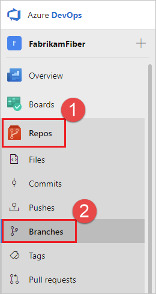
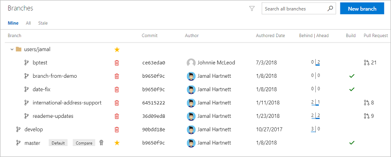
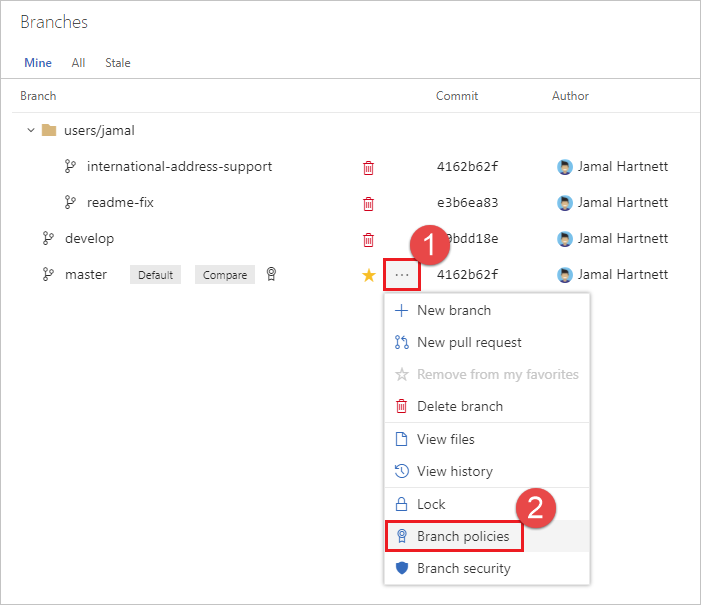
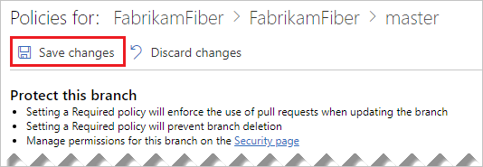
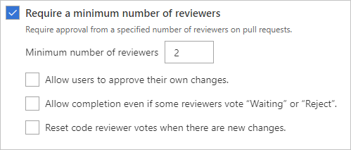
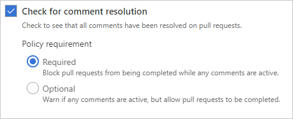
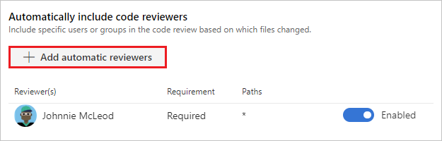
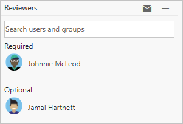

# Improve code quality with branch policies

#### Azure Repos | TFS 2018 | TFS 2017 | TFS 2015

Branch policies help teams protect their important [branches](branches.md) of development. 
Policies enforce your team's code quality and change management standards.

## Configure branch policies

1. Open the **Branches** page by navigating to your project in the web portal and selecting **Repos**, **Branches**.

  

  If you're not using the new navigation preview, select **Code**, **Branches**.

  

1. Locate your branch in the page. You can browse the list or you can search for your branch using the **Search all branches** box in the upper right.

  

1. Open the context menu for the branch by selecting the **...** icon. Select **Branch policies** from the context menu.

  

1. Configure your desired policies in the **Policies** page. See the following sections in this article for descriptions for each policy type. Once your policies are configured, select **Save changes** to apply your new policy configuration.

    

   
## Require a minimum number of reviewers

Code reviews are a best practice for most software development projects. 
To require teams to review their changes before completing a pull request, check **Require a minimum number of reviewers**.

The basic policy requires that a certain number of reviewers approve the code with no rejections.

  

- If **Allow users to approve their own changes** is not selected, the creator of the pull request can still vote **Approve** on their pull request, but their vote won't count toward the **Require a minimum number of reviewers** policy.
- If any reviewer rejects the changes, the pull request cannot be completed unless the **Allow completion even if some reviewers vote "Waiting" or "Reject"** is selected.
- To reset code reviewer votes when new changes are pushed to the source branch, check **Reset code reviewer votes when there are new changes.**

When the required number of reviewers approve the pull request, it can be completed.

>[!NOTE]
> The **Allow users to approve their own changes** setting only applies to the **Require a minimum number of reviewers** policy, and doesn't affect other policies such as [Automatically include code reviewers](#automatically-include-code-reviewers). For example, Jamal Hartnett creates a pull request with the following policies configured:
>
> - **Require a minimum number of reviewers** is configured with two required reviewers.
> - **Allow users to approve their own changes** is not set. 
> - The **Fabrikam Team** group is a required reviewer, and Jamal is a member of that group.
>
>In this example, since Jamal is part of the **Fabrikam Team** group, his **Approve** vote satisfies the required reviewer policy, but the pull request still requires two additional **Approve** votes to satisfy the **Require a minimum number of reviewers** policy, since his vote doesn't count toward that policy because **Allow users to approve their own changes** is not set. 

## Check for linked work items

Require associations between pull requests and a work item to ensure that changes to your branch have [work item management tracking](../../boards/backlogs/connect-work-items-to-git-dev-ops.md).
Linking work items provides additional context for your changes and ensures that updates go through your work item tracking process.

::: moniker range=">= tfs-2017" 

## Check for comment resolution

Configure a comment resolution policy for your branch by selecting **Check for comment resolution**.

For more information on working with pull request comments, see [Pull requests - leave comments](pull-requests.md#leave-comments).

## Enforce a merge strategy

Maintain a consistent branch history by enforcing a merge strategy when a pull request is completed. 
Select **Enforce a merge strategy** and pick an option to require that pull requests merge using that strategy.

- **No fast-forward merge** - This merges the commit history of the source branch when the pull request closes and creates a merge commit in the target branch. 
- **Squash merge** - Complete all pull requests with a squash merge, creating a single commit in the target branch with the changes from the source branch. [Learn more about squash merging](merging-with-squash.md) and how it affects your branch history.

  
::: moniker-end 
 
::: moniker range=">= tfs-2015" 

## Build validation

Set a policy requiring changes in a pull request to build successfully with the protected branch before the pull request can be completed.
Even if you're using [continuous integration](/azure/devops/learn/what-is-continuous-integration) (CI) on your development branches to catch problems early, build policies reduce 
build breaks and keep your tests results passing. 

When a build validation policy is enabled, a new build is queued when a new pull request is created or when changes are pushed to an existing pull request targeting this branch. The build policy then evaluates the results of the build to determine whether the pull request can be completed.

>[!IMPORTANT]
>Before specifying a build validation policy, you must have a build definition. If you don't have one, see [Create a build definition](../../pipelines/apps/index.md) and choose the type of build that matches your project type.

Choose **Add build policy** and configure the desired options in the **Add build policy** window.

- Select the build definition from the **Build definition** drop-down. 
- Choose the type of **Trigger** - either **Automatic (whenever the source branch is updated)** or **Manual**.
- Configure the **Policy requirement**. If set to **Required**, builds must complete successfully in order to complete pull requests. Choose **Optional** to provide a notification of the build failure but still allow pull requests to complete.
- Set a build expiration to make sure that updates to your protected branch don't break changes in open pull requests.
  - **Immediately when `branch name` is updated**: This option sets the build policy status in a pull request to failed when the protected branch is updated. You must requeue a build to refresh the build status. This setting ensures that the changes in pull requests build successfully even as the protected branch changes. This option is best for teams that have important branches with a lower volume of changes. Teams working in busy development branches may find it disruptive to wait for a build to complete every time the protected branch is updated.
  - **After `n` hours if `branch name` has been updated**: This option expires the current policy status when the protected branch updates if the passing build is older than the threshold entered. This option is a compromise between always requiring a build when the protected branch updates and never requiring one. This choice is excellent for reducing the number of builds when your protected branch has frequent updates. 
  - **Never**: Updates to the protected branch do not change the policy status. This reduces the number of builds for your branch, but can cause problems when closing pull requests that haven't been updated recently.
- Choose an optional **Display name** for this build policy which is used to identify the policy on the **Branch policies** page. If you don't specify a display name, the build definition name is used.

When the owner pushes changes that build successfully, the policy status is updated. If you have an **Immediately when `branch name` is updated** or **After `n` hours if `branch name` has been updated** build policy chosen, the policy status updates when the protected branch is updated if the most recent build is no longer valid.

::: moniker-end 

::: moniker range="azure-devops" 

## Require approval from external services

External services can use the PR [Status API](https://go.microsoft.com/fwlink/?linkid=854107) to post detailed status to your PRs. The branch policy for external services brings the ability for those 3rd party services to participate in the PR workflow and establish policy requirements.

For instructions on configuring this policy, see [Configure a branch policy for an external service](pr-status-policy.md).

::: moniker-end 

## Automatically include code reviewers

Designate reviewers for specific directories and files in your repo.

These reviewers are automatically added to pull requests that change files along those paths. 

If you select **Required** next to a path entry, then the pull request cannot be completed until:

* Every user added as a reviewer for the path approves the changes.
* At least one person in every group added to the path approves the changes.

Select **Optional** if you want to add reviewers automatically, but not require their approval to complete the pull request.

When the required reviewers approve the code, you can complete the pull request.

   

::: moniker range=">= tfs-2015" 

## Bypass branch policies

>[!NOTE]
>There are several permissions that allow users to bypass branch policy. In TFS 2015 through TFS 2018 Update 2, the **Exempt from policy enforcement** permission allows users with this permission to perform the following actions:
>
>- When completing a pull request, opt-in to override policies and complete a pull request even if the current set of branch policies is not satisfied.
>- Push directly to a branch even if that branch has branch policies set. Note that when a user with this permission makes a push that would override branch policy, the push automatically bypasses branch policy with no opt-in step or warning.
>
>[In Azure DevOps Services](/azure/devops/release-notes/2018/jul-10-vsts#allow-bypassing-branch-policies-without-giving-up-push-protection), the **Exempt from policy enforcement** permission is removed and its functionality divided into the following two new permissions:
>
>- **Bypass policies when completing pull requests**
>- **Bypass policies when pushing**
>
>Users that previously had **Exempt from policy enforcement** enabled now have the two new permissions enabled instead.

In some cases, you need to bypass policy requirements so you can push changes to the branch directly or complete a pull request even if branch policies are not satisfied. For these situations, grant the desired permission from the previous list to a user or group. You can scope this permission to an entire project, a repo, or a single branch. Manage this permission along the with other [Git permissions](../../organizations/security/permissions.md#git-repository-permissions-object-level).  

>[!IMPORTANT]
> Use caution when granting these permissions, especially
> at the repo and project level.

::: moniker-end 

::: moniker range=">= tfs-2015" 

## Q & A

- [Can I push changes directly to a branch after a branch policy is configured?](#can-i-push-changes-directly-to-a-branch-after-a-branch-policy-is-configured)
- [What is auto-complete?](#what-is-auto-complete)
- [When are the conditions set in branch policies checked?](#when-are-the-conditions-set-in-branch-policies-checked)
- [Can I use XAML build definitions in branch policies?](#can-i-use-xaml-build-definitions-in-branch-policies)
- [What type of wildcard characters are supported when configuring required code reviewers?](#what-type-of-wildcard-characters-are-supported-when-configuring-required-code-reviewers)
- [Are the required code reviewer paths case-sensitive?](#are-the-required-code-reviewer-paths-case-sensitive)
- [How can I configure multiple users as required reviewers, but only require that one of them approve?](#how-can-i-configure-multiple-users-as-required-reviewers-but-only-require-that-one-of-them-approve)
- [I have the exempt from policy permission set, why am I still seeing policy failures in the pull request status?](#i-have-the-exempt-from-policy-permission-set-why-am-i-still-seeing-policy-failures-in-the-pull-request-status)
- [Where can I get more information on advanced policy configurations?](#where-can-i-get-more-information-on-advanced-policy-configurations)

#### Can I push changes directly to a branch after a branch policy is configured?

No. After you set up a branch policy, you cannot directly push changes to the branch. Changes to the branch are only made through [pull requests](pull-requests-overview.md).

>[!NOTE]
>If you have permissions that allow you to [bypass branch policies](#bypass-branch-policies) you can push directly to a branch after branch policy is configured.

#### What is auto-complete?

When a pull request is made into a branch with branch policies configured, the **Set auto-complete** button is enabled for the pull request. If you don't expect any problems with your changes and you want your pull request to complete once all policies are met, you can set the pull request to [automatically complete](pull-requests.md#complete-the-pull-request). 

#### When are the conditions set in branch policies checked?

Branch policies are re-evaluated on the server as changes are pushed and reviewers vote.
If there is a build triggered by the policy, the build status is set to waiting until the build completes.

#### Can I use XAML build definitions in branch policies?
You cannot use [XAML build definitions](https://msdn.microsoft.com/library/ms181715%28v=vs.120%29.aspx) in branch policies.

#### What type of wildcard characters are supported when configuring required code reviewers?
Single asterisks (`*`) are supported, and will match any number of characters, including both forward-slashes (`/`) and back-slashes (`\`).  Question marks (`?`) will match any single character.  

Examples:

* `*.sql` will match all files with the .sql extension
* `/ConsoleApplication/*` will match all files under the folder named ConsoleApplication
* `/.gitattributes` will match the .gitattributes file in the root of the repo
* `*/.gitignore` will match any .gitignore file in the repo

#### Are the required code reviewer paths case-sensitive?
No, branch policies are not case-sensitive at this time.

#### How can I configure multiple users as required reviewers, but only require that one of them approve?
You can [add the users to a group](../../organizations/accounts/add-team-members.md), and then add the group as a reviewer.  Any member of the group can then approve on behalf of the group to meet the policy requirement.

#### I have the exempt from policy permission set, why am I still seeing policy failures in the pull request status?
Even for users that are exempt from policy enforcement, the configured policies are still evaluated when changes are added to a pull request.  For exempt users, policy status is advisory only and will not block completion of the pull request.

#### Where can I get more information on advanced policy configurations?
Check out the [REST API documentation](http://go.microsoft.com/fwlink/?LinkId=526702) for more details.    

::: moniker-end 
