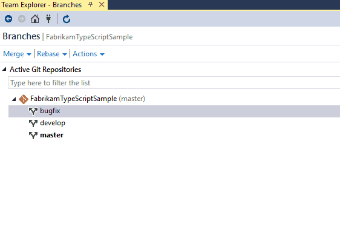

# Copy changes with cherry-pick

[!INCLUDE [version-gt-eq-2015](../../includes/version-gt-eq-2015.md)]
[!INCLUDE [version-vs-gt-2015](../../includes/version-vs-gt-2015.md)]

Copy commits from one branch to another using cherry-pick. Unlike a merge or rebase, cherry-pick only brings the changes from the commits you select, instead of all the changes in a branch.

Cherry-pick is a great way to tackle these common problems:

- Accidentally committing on the wrong branch. Cherry-pick the change(s) over to the correct branch and then reset the original branch to the previous commit.
- Pulling out a set of commits made in a feature branch so you merge them back to your `master` branch sooner.
- Porting in specific commits from the `master` branch without rebasing your branch.   

In this tutorial you learn how to:

> [!div class="checklist"]
> * Cherry-pick a commit

## Cherry-pick a commit

#### [Browser](#tab/browser/)

1. In a completed PR in your Azure DevOps project, select **Cherry-pick**. In an active PR, select **Cherry-pick** from the **...** menu. This action creates a new branch with the copied changes.

1. In the **Cherry-pick pull request** pane:

   1. Under **Target branch**, select the branch where you want to copy the PR changes.
   1. Under **Topic branch name required**, change the cherry-pick PR branch name if you want.
   1. Choose whether to **Cherry-pick as a single commit**.
   1. Select **Cherry-pick**.

1. On the **New pull request** screen, select **Create**.

1. Merge the new PR to complete the cherry-pick.

#### [Visual Studio](#tab/visual-studio/)

[!INCLUDE [temp](includes/note-new-git-tool.md)]

1. Open up Team Explorer and check out the branch you want to cherry-pick changes into using the **Branches** view.
2. Right-click the branch containing the changes you want and select **View History...**. 
3. Right-click the commit you want to cherry-pick and select **Cherry-pick**.    

    Visual Studio copies the changes made in that commit into a new one on your current branch.
    

Repeat this process for each commit you need to bring over to your current branch.

#### [Git Command Line](#tab/git-command-line/)

Use `git log` to find the commit ID of the commit whose changes you want to copy.

> [!div class="tabbedCodeSnippets"]
```Git CLI
> git log app.ts
commit d34bcef232f6cf033e1252b7300465d3e561b2ee
Date:   Wed May 18 21:10:39 2016 +0000

add complex query parsing logic
```

Once you have the commit ID, you pass it to `git cherry-pick` to copy the changed into your current branch.

> [!div class="tabbedCodeSnippets"]
```Git CLI
> git cherry-pick d34bcef232f6c  

[featurebranch a343e2c] add complex query parsing logic
 Date: Thu May 19 19:07:26 2016 -0400
 1 file changed, 67 insertions(+), 6 deletions(-)
```

If you need to cherry-pick a range of commits, you can use two commit IDs separated by `...` to specify a range in your history.

> [!div class="tabbedCodeSnippets"]
```Git CLI
> git cherry-pick 34bcef...86d2aec

[featurebranch a343e2c] add complex query parsing logic
 Date: Thu May 19 19:07:26 2016 -0400
 1 file changed, 67 insertions(+), 6 deletions(-)
 [featurebranch 3065fc7] fix regression in error handling
 Date: Mon May 23 09:23:45 2016 -0400
 1 file changed, 32 insertions(+), 15 deletions(-)
```

* * *

## Next steps

> [!div class="nextstepaction"]
> [Resolve merge conflicts](merging.md)
