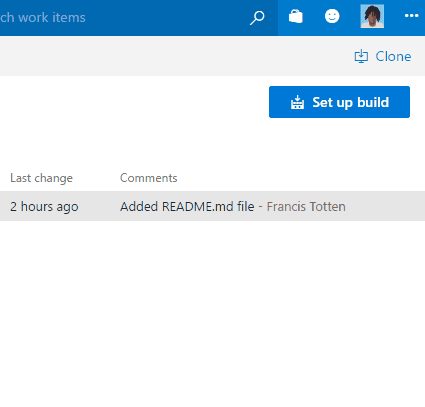
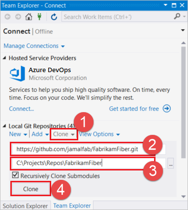
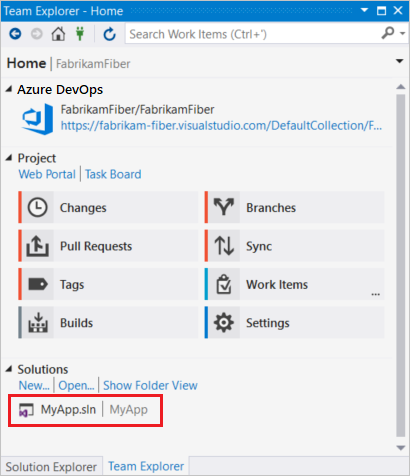

# Clone an existing Git repo

**Azure Repos | Azure DevOps Server 2020 | Azure DevOps Server 2019 | TFS 2018 | TFS 2017 | TFS 2015 | VS 2017 | VS 2015**

Create a complete local copy of an existing Git repository by cloning it.
Cloning a repo downloads all [commits](commits.md) and [branches](./create-branch.md) in the repo.
Cloning sets up a named relationship with the existing repo you cloned.
Use this relationship to interact with the existing repo, [pushing](pushing.md) and [pulling](pulling.md) changes to share code with your team.

>[!NOTE]
> By default, Git assigns the `origin` to the remote repo you clone from. Most users don't need more than one remote, so the tutorial uses `origin` in its steps.
> [Learn more](creatingrepo.md#remotes) about setting up remotes to your Git repo.

In this tutorial you learn how to:

> [!div class="checklist"]
> * Get the clone URL to your repo
> * Clone a repo

## Video tutorial

<iframe src="https://channel9.msdn.com/series/Team-Services-Git-Tutorial/Git-Tutorial-Create-a-Git-repo-in-Visual-Studio-2015/player" width="560" height="315" allowFullScreen frameBorder="0"></iframe>

>[!TIP]
> Working from the command line? You can view our video tutorial using command line steps on [Channel9](https://channel9.msdn.com/series/Team-Services-Git-Tutorial/Git-Tutorial-Create-a-repo-from-the-command-line).

<a name="clone_url"></a>

## Get the clone URL to your repo

Before you can clone an existing repo, you'll need a URL that points to the existing repo.
This URL represents the source of the repo you're going to copy.

If you're using Azure Repos, Azure DevOps Server 2019, or Team Foundation Server, you can find this clone URL in the web portal.

1. From your web browser, open the team project for your Azure DevOps organization and choose **Repos**, then **Files**.

   

1. Select **Clone** in the upper right.

   

If you need to clone a GitHub repo, you'll need to get the clone URL. Use the **Clone or download** button while viewing the repo on the web in GitHub.

Other Git providers have similar buttons in their user interface to get the clone URL.

Copy this URL into the clipboard or store it in a place where you can find it easily. You can't clone a repo without a clone URL.

## Clone a repo 

#### [Visual Studio](#tab/visual-studio/)

[!INCLUDE [temp](includes/note-new-git-tool.md)]  

* [Clone from Azure Repos / Azure DevOps Server](#clone-from-azure-repos--azure-devops-server)
* [Clone from another Git provider](#clone-from-another-git-provider)
* [Open a solution in Visual Studio from a cloned repo](#open-a-solution-in-visual-studio-from-a-cloned-repo)

### Clone from Azure Repos / Azure DevOps Server

1. In Team Explorer, open the **Connect** page by selecting the **Connect** button. Choose **Manage Connections** then **Connect to Project**.

   

1. In **Connect to a Project**, select the repo you want to clone from the list and select **Clone**.

   

   If you don't see your repo listed, filter the list to find it.
   You may need to add an Azure DevOps Server where the repo is hosted.
   Select the **Add Azure DevOps Server** link.

   [!INCLUDE [project-urls](../../includes/project-urls.md)]

1. Verify the location of the cloned repo on your PC and select **Clone**.

### Clone from another Git provider

If you aren't using Azure Repos, you can still clone your repo in Team Explorer and work with your code in Visual Studio.

1. In Team Explorer, open the **Connect** view, as explained above.
1. Select **Clone** under **Local Git Repositories** and enter the URL for your Git repo. Your team or Git hosting provider gives you this URL.
1. Select a folder where you want your cloned repo.
1. Select **Clone** to clone the repo.

   

### Open a solution in Visual Studio from a cloned repo

1. Right-click on a repository in the Team Explorer **Connect** view and select **Open**.

   

In the **Home** view in Team Explorer, double-click your project solution file in the **Solutions** area. The solution opens in **Solution Explorer**.

   

#### [Command Line](#tab/command-line/)

### Prerequisites

* Ensure you've installed the [Git command line package](http://git-scm.com/download) for your platform. Be sure you have the [Git Credential Manager](set-up-credential-managers.md) or have [configured SSH authentication](use-ssh-keys-to-authenticate.md) before you continue.

You'll need a clone URL to tell Git what repository you want to clone to your computer. Use the URL you copied earlier during the [previous step](#clone_url) in this article.

Use this clone URL with `git clone` to make a local copy of the repo:

```cmd
git clone https://dev.azure.com/fabrikam/DefaultCollection/_git/Fabrikam
```

`git clone` clones the repository from the URL in a folder under the current one. You can specify a folder name after the URL to create the repo in a specific location, for example:

```cmd
git clone https://dev.azure.com/fabrikam/DefaultCollection/_git/Fabrikam C:\Repos\FabrikamFiber
```

* * *


## Next steps

> [!div class="nextstepaction"]
> [Save work with commits](commits.md)